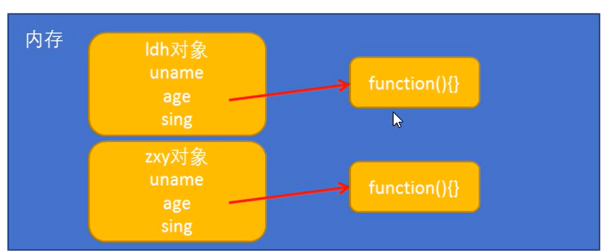
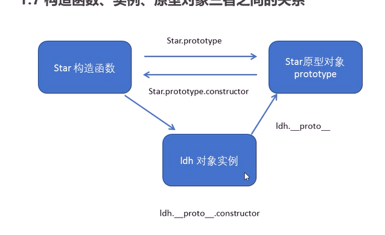
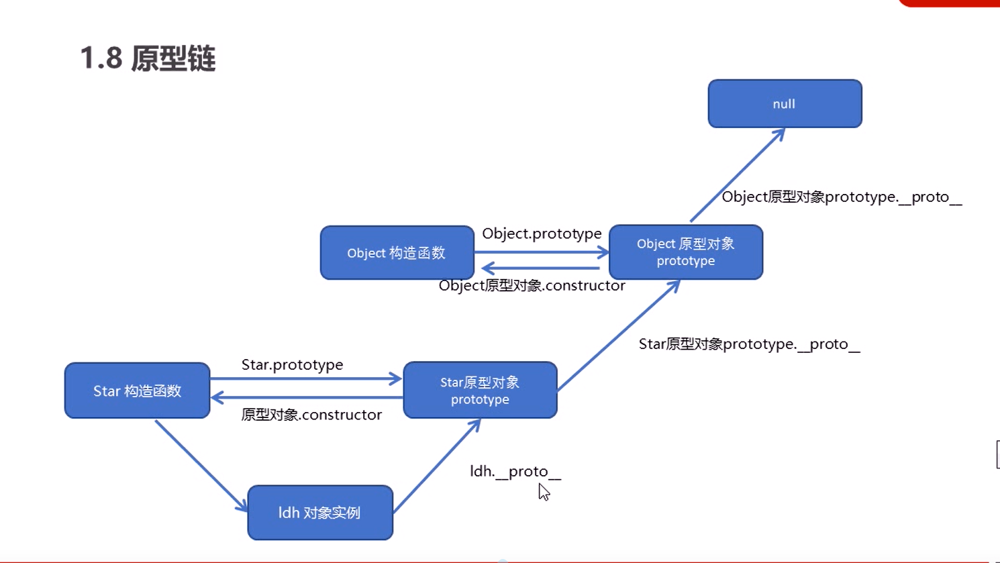
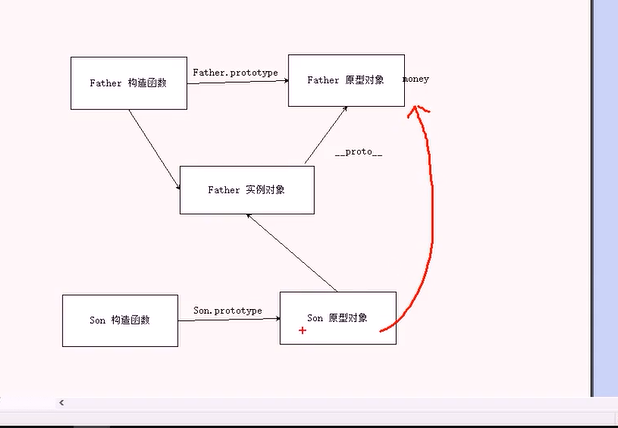

## 3.构造函数和原型

在ES6（ECMAScript6.0）之前，JavaScript没有类的概念，在ES6之前，对象不是基于类创建的，而是用一种称为构造函数的特殊函数来定义对象和他们的特征的。

#### 创建对象：(JavaScript基础也有做过笔记)

1.对象字面量 `var obj = {}`

2.new Object() `var obj = new Object()`

3.自定义构造函数

```js
function name1(){
    this.属性=值;
    this.方法=function (){}
}
let obj = new name1();


```

**注意：**

> 1.使用构造函数，**构造函数名字首字母最好大写**
> 如 function Star()
>
> 2.构造函数不需要return
>
> 3.使用函数
> new 构造函数名();即构造一个对象，如new Array()，创建一个数组对象
> 4.属性方法前必须加this
> 如this.name=传参name `this.song = function（传参）{}`
>


 构造函数中属性和方法我们称之为成员，成员可以添加

**实例成员**：实例成员就是构造函数内部通过 **this** 添加的成员 ，实例成员只能通过实例化的对象来访问，不可以通过构造函数访问实例成员，如

```js
function Star(uname){
    this.uname = uname;
}
let star = new Star('xxx');
console.log(star.uname);
```

**静态成员**：在构造函数本身上添加的成员，**静态成员只能通过构造函数来访问，不能通过对象来访问**，如

```js
function Star() {};
Star.sex = 'male';
console.log(Star.sex);
```

构造函数虽然好用，但是存在**浪费内存的**问题





#### 构造函数原型对象prototype

```构造函数通过原型分配的函数是所有对象所共享的```


JavaScript规定，每个构造函数都有一个**prototype**属性，指向另一个对象，注意这个prototype（原型）就是一个对象，这个对象的所有属性和方法，都会被构造函数所拥有

因此，我们把那些不变的方法，直接定义在prototype对象上，这样所有对象的实例就可以共享这个方法

使用方法：

```js

function Star(uname){
    this.uname = uname;
}
//第一种写法： Star.prototype.sing = function() {}
//           Star.prototype.sex = 'male'; 
//第二种写法：
Star.prototype = {
    constructor: Star,    //不可省略，因为这种写法覆盖掉原来的constructor方法
    sing: function() {},
    movie: function() {}
}
```

所以一般情况，我们的公共属性定义到构造函数里面，公共的方法我们放到原型对象的身上


#### 原型对象的this指向

> **谁调用，指向谁**
>
> 1.在构造函数中，this指向的是对象实例
>
> 2.原型对象里面的this指向的**也是**调用它的实例对象


#### 对象原型: `__proto__`

对象都会有一个属性 `__proto__` 指向构造函数的prototype原型对象，之所以我们对象可以使用构造函数prototype原型对象的属性和方法，就是因为 `__proto__` 的存在

`实例化的对象.__proto__ === 构造函数名.prototype` 返回true


#### constructor构造函数

对象原型（`__proto__`）和构造函数原型对象（`prototype`）里面都有一个`constructor`属性，constructor我们称为构造函数，因为它指回构造函数本身

主要目的：用于记录该对象引用于哪个构造函数（很多情况下我们需要用它来指回原来的构造函数）



#### 原型链

任何构造函数原型对象`prototype`，它作为一个对象，也有它自己的对象原型 `__proto__` ，而此时原型对象的 `__proto__` 指向的是`Object.prototype`， 即`某构造函数名.prototype.__proto__ === Object.prototype`

而我们Object也有prototype原型对象，而它作为一个对象，也有它自己的对象原型 `__proto__` ，而此时指向null（到达了终点）

即`Object.prototype.__proto__ === null`


#### **JavaScript成员查找机制**：

所以在成员查找时，先查找最底层，没有则根据它 的`__proto__`查找至他的原型对象，看看有没有该成员，没有的话继续一层一层往上查找，如果找不到该成员 ，最后返回undefined (undefined是由null派生而来的)

而根据查找规则，使用就近原则来处理重复成员定义问题（即先找到，先使用）





#### 拓展内置对象

可以通过原型对象，对原来的内置对象进行拓展自定义的方法，比如给数组增加自定义求偶数和的功能

```js
//在Array原型对象上追加函数，不能采取Array.prototype = {}形式
Array.prototype.sum = function() {
    let sum = 0;
    for(let i = 0; i < this.length; i++){
        sum+=this[i];
    }
    return sum;
}
```


## 4.继承

在ES6之前没有给我们提供extends，我们可以通过**构造函数+原型对象**模拟实现继承，被称为**组合继承**


#### call()

`fun.call(thisArg, arg1, arg2....)` （arg n那些指的是传递的其他参数）

**功能：调用这个函数，并且修改函数运行时this的指向**

thisArg: 当前调用函数的this的指向对象（一般在**JavaScript中直接调用函数时**，**函数的this指向window**）


#### ES5继承的两大步

**借用构造函数继承父类型的属性**

核心原理：通过`call()` 把父类型的this指向子类型的this，这样就实现了**子类型继承父类型的属性**

**利用原型对象继承父类型的方法**

实现如下：


```js
 // 借用父构造函数继承属性
    function Father(uname, age) {
        this.uname = uname;
        this.age = age;
    }
    //接用父构造函数继承方法
    Father.prototype.teach = function () {
        console('father')
    }
    function Son(uname, age) {
        Father.call(this, uname, age);//改变父构造方法的this指向。
    }
    // 这样直接赋值会出问题，因为是赋值父原型对象的地址，如果修改了子原型对象，父原型对象也会随之改变
    // Son.prototype = Father.prototype;  ×
    // 正确方法：
	//让子原型对象指向父亲的一个实例，通过实例的__proto__指向父亲的原型对象就能拿到方法。
    Son.prototype = new Father();
    // 如果利用了对象形式修改了原型对象，别忘了利用constructor指回原来的构造函数
    Son.prototype.constructor = Son;

    Son.prototype.exam = function () {
        console('son')
    }
    let son = new Son('xxx', 18);
    console.log(son);
```




#### 类的本质

class本质还是function（用typeof查看），所以我们可以认为类就是构造函数的另一种写法

但是新的class写法只是让对象原型的写法更加清晰，更像面向对象编程的语法

和**构造函数相同点：**

> 1.类也有原型对象prototype，而prototype里的constructor也是指回类的本身
>
> 2.类也可以利用原型对象添加方法
>
> 3.类创建的实例对象中的 `__proto__` 原型指向类的原型对象

## 5.ES5新增的方法

#### 数组方法

##### 1.`forEach()` ：

 `arr.forEach(function(vlaue, index, [array]))` 分别对应数组的value（值）、index（索引号）、数组本身

遍历数组的全部元素，即使return true也不会终止迭代，因为forEach本质是一个函数，参数是一个回调函数，回调函数的return只是终止了回调函数而已，不是终止forEach，而forEach内部应该是多次调用了那个函数

```js
   var arr = [1, 2, 3];
        var s = 0;
        arr.forEach(function (value, index, arr) {
            s += value;
        })
        console.log(s);
```

##### 2.`filter()`: 

filter() 方法创建一个新数组，新数组中的元素是通过检查指定数组中符合条件的所有元素，主**要用于筛选数组**（注意它直接**返回一个新数组**）

`array.filter(function(currentValue, index, [arr]))` 分别对应currentValue（数组当前项的值），index（索引号），arr（数组本身），它的回调函数返回的必须是一个Boolean值，返回true自动将value加入新数组中，false则过滤掉，最后整体返回一个新数组


```js
var newArr = arr.filter(function(value, index) {
    return value >= 20;
})
```

##### 3.`some()` ：

some()方法用于检测数组中的元素是否 **存在** 满足指定条件，通俗点就是查找数组中是否有满足条件的元素，**找到第一个满足条件的元素则停止**

（注意它**返回的是布尔值**）在`some`里设置`return true` 以终止遍历

`array.some(function(currentValue, index, [arr]))` 分别对应currentValue（数组当前项的值），index（索引号），arr（数组本身）

```js
    var arr = ['pink', 'red', 'green'];
        var flag=arr.some(function (value, index, arr) {
           return value == 'pink';
        })
        console.log(flag);
```

##### 4.`map()` 

方法返回一个新数组，数组中的元素为原始数组元素调用函数处理后的值。和forEach相似，不同在于：

 如果更改数组内的值，`forEach` 不能确保数组的不变性。这个方法只有在你不接触里面的任何值时，才能保证不变性。由于它们之间的主要区别在于是否有返回值

`map会制作一个新的数组，而forEach只会映射到原数组，所以可能改变原数组的值。`

```js
let newarr = arr.map(function(value, index) {
    return value * 2;
})
```

**map的不变性：当数组为基础类型时原数组不变**

```js
let array=[1,2,3,4,5]
let newArray=array.map((item) => item*2)
console.log(array); // [1,2,3,4,5]
console.log(newArray);//[2, 4, 6, 8, 10]
```

**当数组为引用类型时原数组发生改变：** `map是浅拷贝`

```js
let array = [{ name: 'Anna', age: 16 }, { name: 'James', age: 18 }]
let newArray=array.map((item) => {
    item.like='eat';
    return item;
})
console.log(array); // [{ name: 'Anna', age: 16,like: "eat"},{ name: 'James', age: 18,like: "eat"}]
console.log(newArray);//[{ name: 'Anna', age: 16,like: "eat"},{ name: 'James', age: 18,like: "eat"}]
```

##### 5.`every()` 

方法用于检测数组**所有元素是否都符合**指定条件

##### 6.reduce

`arr.reduce(callback(accumulator, currentValue[, index[, array]])[, initialValue])`

参数分别对应回调函数(callback)和初始值(initialValue)对数组中所有内容进行汇总,有点像递归

```js
let total = a.reduce(function (preValue, currValue) {
  return preValue + currValue;
}, 0);
// 遍历到第一次时，preValue为初始值，currValue为数组里的第一个值
// 遍历到第二次时，preValue为第一次返回的值，currValue为数组里第二个数
```

**以上ES5数组方法有助于链式编程（函数式编程）**，比如：

```js
//this.$store.state.cartList 是一个数组
this.$store.state.cartList
    .filter((item) => item.checked === true)
    .reduce((preValue, item) => {
    return preValue + item.count * item.price;
}, 0)
    .toFixed(2);
```


##### forEach、some和filter区别

```js
  var arr = ['pink', 'red', 'green'];

        arr.forEach(element => {
            if (element == 'pink') {
                return true; //不会终止迭代
            }

        });
        arr.some(e => {
            if (e == 'pink') {
                return true; //终止迭代，效率更高，适合查找唯一性元素。
            }

        });
        arr.filter(e => {
            if (e == 'pink') {
                return true; //也不会停止迭代
            }
        });
     
```


#### 字符串方法

##### trim()

`方法会从一个字符串的两端删除空白字符，它并不影响本身的字符串，它返回的是一个新的字符串 `str.trim()

#### 对象方法

##### `Object.defineProperty()` 

定义对象中新属性或修改原有的属性（应用于vue响应式双向绑定，还有es5实现const的原理）

```js
Object.defineProperty(obj, prop,desciptor)
```

`obj`：必须，目标对象

`prop`： 必需，需定义或修改的属性名

`descriptor`： 必须，目标属性所拥有的特性，一对象的形式{ }进行书写，

- `value`设置属性的值，默认undefined；
- `writable`值能否重写（修改），默认为false；
- `enumerable`：目标属性是否可以被枚举(是否可以被遍历，显示出来)，默认false；
- `configurable`目标属性是否可以被删除，或者再次修改特性（是否可以再次更改这个descriptor），默认false；
- 除此外还具有以下可选键值：
  - `get`：当访问该属性时，会调用此函数。执行时不传入任何参数，但是会传入 `this` 对象（由于继承关系，这里的`this`并不一定是定义该属性的对象）。该函数的返回值会被用作属性的值。
  - `set`：当属性值被修改时，会调用此函数。该方法接受一个参数（也就是被赋予的新值），会传入赋值时的 this 对象(修改后的值)。

```js
var obj = {
    id: 1,
    pname: '小米',
    price: 1999
}
//以前的对象添加修改方式
//obj.num = 1000;
//obj.price = 99;
Object.defineProperty(obj, 'num', {
    value : 999,
    enumerable : true
})
```

##### `Object.keys(obj)` 

方法会返回一个由一个给定对象的自身可枚举属性组成的数组，数组中属性名的排列顺序和使用 for…in 循环遍历该对象时返回的顺序一致 。如果对象的键-值都不可枚举，那么将返回由键组成的数组。


## 6.函数进阶

### 函数定义和调用

#### 函数定义：

1.自定义函数：`function fn() {};`

2.匿名函数： `var fun = function() {};`

3.`new Function('参数1', '参数2', '函数体')`形式调用 像构造函数, Function里面的参数都必须是字符串格式（**了解）**

```js
var f = new Function('a', 'b', 'console.log(a + b)');
```

**`实际上所有的函数都是Function的实例，函数也属于对象`**

#### 函数调用：

##### 1.普通函数调用

```js
function fn() { 
    //something
}
fn();
```

##### 2.对象方法

```js
var o = {
    say: function() {
        //something
    }
}
o.say();
```

##### 3.构造函数

```js
function Star() {};
new Star();
```

##### 4.绑定事件函数

`btn.onclick = function() {}`

##### 5.定时器函数 

`setInterval(function() {}, 1000);`

##### 6.立即执行函数（自动调用） 

`(function() {} )();`


## 7.this的指向

#### 函数内this的指向

是当我们调用函数时确定的，调用方式不同导致this指向不同

1.`普通函数调用：window`

2.`构造函数调用：实例对象，原型对象也是指向实例对象`

3.`对象方法：该方法所属对象`

4.`事件绑定：绑定事件对象`

5 .`定时器函数：window`

6.`立即执行函数：window`

但是立即执行函数还得看这时this是否在对象方法或者构造函数中，第二个虽然是立即执行函数，但是它先找的是全局变量foo，再找到foo.bar，所以this返回的是foo作用域的a


```js
var a = 1;
var foo = {
    a: 2,
    bar: function () {
        return this.a;
    }
};
console.log(foo.bar());            //2
console.log((foo.bar)());          //2
console.log((foo.bar=foo.bar)());  //1
```

“匿名函数的执行环境具有全局性”，所以最里层那个函数中this指向全局环境，全局环境没有定义foo变量所以输出undefined。在匿名函数外部将this保存到一个内部函数可以访问的变量self中，可以通过self访问这个对象，所以self.foo为bar


javascript

```javascript
var myobject = {
    foo: "bar",
    func: function () {
        var self = this;
        console.log(this.foo);
        console.log(self.foo);

        (function () {
            console.log(this.foo);//undefined
            console.log(self.foo);//bar
        })();
    }
};
myobject.func();
```

#### 改变this指向

JavaScript为我们专门提供了一些函数方法来帮助我们处理函数内部this指向问题，常用的有**bind()、call()、apply()**三种方法

##### 1.`call()`

前面讲过，call的主要作用可以实现继承

```js
var obj = {
    a:1
}
function f(){
console.log(this);
}
f.call(obj)
//call 第一个可以调用函数，还可以改变函数类this指向
//call 主要作用可以实现继承
```

##### 2.`apply()`

方法调用一个函数，简单理解为调用函数的方式，但是它可以改变this的指向

```js
fun.apply(thisArg, [argsArray])
```

thisArg：在函数执行时指定的this对象

argsArray: 传递的值，**`必须包含在数组（伪数组）里面`**

返回值为函数的返回值，因为它就是调用函数

应用方面：apply传递数组参数，所以可以借助数学内置对象求最大值 `Math.max.apply(Math,arr)`

```js
var arr = [1,66,199,5,6]

//console.log(Math.max.apply(null,arr));
//严格模式，最好让thisArg指向Math
console.log(Math.max.apply(Math,arr));

//求数组最大值的其他方法
var ma = Math.max(...arr);

```

（es6拓展运算符…`Math.max(...arr)`也可以，但是不能 `MAth.max(arr)`，因为max不接受数组，只接受一个一个的参数）

##### 3.`bind()`

方法`不会调用函数`，但是能改变函数内部this指向

```
fun.bind(thisArg, arg1, arg2....)
```

**返回指定this值和初始化参数改造的原函数拷贝**

即创造新的函数 `var f = fn.bind(xx)`

应用方面：定时器等**不想立即调用的函数**（或者处理其他只能用that来暂时储存对象的情况）

```js
//场景：点击按钮后，禁用按钮。3秒后恢复
btn.onclick = function() {
    this.disabled = true;
    
//old way:
    var that = this;
    setTimeout(function() {
      that.disabled = false;
    }, 3000)
    
//new way:
    setTimeout(function() {
         this.disabled = false;
    }.bind(this), 3000)       //这个this指向btn
}
```

**`巧妙运用： 传参的时候可以传递其他对象过来`**

##### call、apply、bind总结

相同：改变函数内部的this指向。

区别： 

1. call和apply会调用函数，bind不调用但返回一个改造过this的函数。
2. call和bind传参为aru1,aru2...形式，apply必须数组形式[arg]

应用：

1. call经常做继承
2. apply经常与数组有关系，比如借助数学对象求数组的最大值
3. bind不调用函数，但想改变this指向，如定时器的内部this指向


## 8.严格模式

ie10以上版本才支持 它是让JavaScript以严格的条件下运行代码

1. 消除了JavaScript一些语法不严谨的地方，减少怪异行为

2. 消除代码一些不安全之处，保证代码运行的安全

3. 提高编译器效率，增加运行速度

4. 禁用了ECMAscript在未来版本中可能会定义的一些语法，为未来JavaScript做好铺垫，比如class、enum、super等

#### 开启严格模式

应用到整个到整个脚本或个别函数中，因此，我们可以讲严格模式分`为脚本开启严格模式`和`为函数开启严格模式`两种情况

##### 为脚本开启严格模式：

```js
<script>
    'use strict';
   	...
</script>
```

方法二：（写在立即执行函数里的都要按照严格模式）

```js
<script>
    (function()    {
        'use strict';
        /xxxx
    })();
</script>
```

##### 为函数开启严格模式：(只在此函数内部有严格模式)

```js
<script>
    function fn(){
        'use strict';
        /xxxx
    }
</script>
```

#### 变化

1. 严格模式禁止变量为声明就赋值
2. 严禁删除已声明的变量，比如`delete x;` 是错误的

3. 在严格模式下，**全局作用域中函数中的this不再是window，而是`undefined`**（但是定时器之类的还是指向window）
4. 严格模式下，如果构造函数不配合new来使用，this就会报错

5. 函数不能有重名参数

6. 函数必须声明在顶层，因为新版本的JavaScript引入了块级作用域，所以不允许在非函数代码块内声明函数


## 9.高阶函数

高阶函数是对其它函数进行操作的函数，它`接收函数作为参数`或将`函数作为返回值`输出，最典型的就是作为回调函数

```js
  function fn(a, b, callback) {
            console.log(a + b);
            callback && callback();
        }
fn(1, 2, function(){
            console.log('我是callback');
        })
```


## 10.闭包

`闭包指有权访问另外一个函数作用域中变量的`**函数**，简单理解就是一个作用域可以访问另外一个函数内部的局部变量

（**被访问作用域的函数就是闭包函数**）

```js
//在此处fun函数作用域访问了另外一个函数fn里面的局部变量num，形成了闭包，此时fn就是一个闭包函数 
function fn() {
        var num = 10;
        function fun() {
            console.log(num);
        }
        fun();
    }
    fn();
```

在fn外部作用域访问fn内部局部变量（它返回了当时的作用域）：

```js
//所以闭包就是典型的高阶函数
function fn() {
        var num = 10;
        return function() {
            console.log(num)
        }
    }
var f = fn();
f();
```

**闭包的主要作用：延伸了变量的作用范围**


### **利用闭包解决异步问题**：

（因为函数是一个作用域）

```html
场景：打印li当前索引（面试可能问）
立即执行函数也成为了小闭包，因为立即执行函数里面任何一个函数都可以使用它的i变量
<body>
    <ul class="nav">
        <li>55</li>
        <li>66</li>
        <li>77</li>
        <li>88</li>
    </ul>

    <script>
        var lis = document.querySelector('.nav').querySelectorAll('li')
        for (var i = 0; i < lis.length; i++) {
            (function (i) {
                lis[i].onclick = function () {
                    console.log(i)
                }
            })(i);
        }
    </script>
</body>

```

`回调函数：获取异步操作的`**`结果`**

一般情况下，把函数作为参数的目的就是为了获取函数内部的异步操作的结果

```js

//如果需要获取一个函数中异步操作的结果，则必须通过回调函数来获取
function fn(callback) {
    setTimeout(function () {
        var data = 'hello';
        callback(data);
    }, 1000)
}
fn(function (data) {
    console.log(data);
})
```


## 11.递归

如果一个`函数在内部可以调用其本身`，则这个函数是`递归`（俄罗斯套娃）

但是容易发生“**栈溢出**”错误，所以必须加退出条件“return”

#### 浅拷贝和深拷贝

（jQuery篇目有提及到（`$.extend([deep], target, object1, [objectN])`））

1. 浅拷贝只是拷贝一层，更深层次对象级别的只拷贝引用

2. 深拷贝拷贝多层，每一级别的数据都会拷贝

   ES6中浅拷贝的语法糖：`Object.assign(target, ...source)`（把source拷贝给target）


##### 利用循环写浅拷贝

```js
var obj = {
        id: 1,
        name: 'andy',
        msg: {
            age: 18
        }
    };
    var o = {};
    for (var k in obj) {
        // k是属性名， obj[k]是属性值
        o[k] = obj[k];
    }
//使用assign拷贝
Object.assign(o,obj); 把obj拷贝给o
```

##### 利用递归写深拷贝

```js
var obj = {
        id: 1,
        name: 'andy',
        msg: {
            age: 18
        }
    };
    var o = {};
    function deepcopy(newobj, oldobj) {
        for(var k in oldobj) {
            // 获取属性值
            var item = oldobj[k];
            // 判断该值是否属于数组(数组也属于object，所以要先写)
            if(item instanceof Array) {
                newobj[k] = [];
                deepcopy(newobj[k], item);
            } else if(item instanceof Object) {
                // 判断该值是否为对象
                newobj[k] = {};
                deepcopy(newobj[k], item);
            } else {
                // 所以剩下的属于简单数据类型
                newobj[k] = item;
            }
        }
    }
    deepcopy(o, obj);
    console.log(o);
```


## 12.正则表达式

#### 概述

正则表达式（regular expression）是用于匹配字符串中字符组合的模式，在JavaScript中，`正则表达式也是对象`

1. 正则表达式通常用来做检索，替换那些符合某个模式（规则）的文本，例如昵称输入框里的对中文的**匹配**；
2. 此外，正则表达式还常用于过滤掉页面一些敏感（**替换**），或者从字符串获取我们想要的特定部分（**提取**）等

特点：

1. 灵活性、逻辑性、功能性非常强
2. 可以迅速用极简的形式达到对字符串复杂的控制
3. 对刚接触的人来说，比较晦涩难懂

4. 一般实际开发，都是直接复制写好的正则表达式，但是要求会使用正则表达式且根据实际情况修改正则表达式

#### 应用

1.通过调用RegExp对象的构造函数创建 `var 变量名 = new RegExp(/表达式/)`

2.通过字面量创建 `var 变量名 = /表达式/`（正则表达式不需要加引号，不管是数字型还是字符串型）

测试正则表达式是否符合语法规范：

test() 正则对象方法，用于检测字符串是否符合该规则，该对象会返回true或false，

其参数是测试字符串 `regexObj.test(str)` （**只要包含有str这个字符串，返回的都是true**）

```js
var rg = /123/;
console.log(rg.test(123));   //true
console.log(rg.test(12123));   //true
```

#### 特殊字符

一个正则表达式可以由简单的字符构成，比如/abc/， 也可以是简单和特殊字符串的组合，比如/ab*c/。其中特殊字符也被称为元字符，在正则表达式中具有特殊意义的专用符号，如^ 、$ 、+ 等

（匹配特殊字符前面增加 `\`就可以了）

正则表达式速查表：https://www.runoob.com/regexp/regexp-metachar.html

边界符：`^` 表示匹配行首的文本（以谁开始） `$` 表示匹配行尾的文本（以谁结束）

```js
var rg = /^abc/;
console.log(rg.test('abcd'));  //true
console.log(rg.test('babc'));  //false
//必须是abc,类似全等
var rg2 = /^abc$/;
console.log(rg.test('abcd'));  //false
console.log(rg.test('abcabc'));  //false
```

字符类：`[]`表示有一系列字符可供选择，只要匹配到其中一个就可以了

```js
var rg = /[abc]/;    //只要包含有a或者b或者c就返回true
console.log(rg.test('andy'));  //返回true
//var rg = /^[abc]$/ 是三选一，只有是单个a或者b或者c才返回true
```
[]`使用范围符号 `-

```js
var rg = /^[a-z]$/;   //26个英文小写字母任何一个字母都返回true
var rg1 = /^[a-zA-Z]$/;  //26个英文字母任何一个字母都返回true
var rg2 = /^[a-z0-9_-]$/; //任何单个26小写字母，0-9数字，_, -,都返回true
```

`[]`里使用^：如果中括号里有`^`表示**取反**的意思，千万别和边界符`^`混淆，要区分开来

```js
var rg = /^[^a-z]$/;  //26个英文小写字母任何一个字母都返回false
```

量词符：用来设定某个模式出现的次数，有`*`、 `+`、 `？`、 `{}`，**`{}`的量词间不要有空格**，可以用test来检测下方正则表达式

```js
var rg = /^a*$/;  //a可以出现0-n次，n>=0 
var rg1 = /^a+$/; //a可以出现1-n次，n>=1
var rg2 = /^a?$/; //a可以出现1或0次 
var rg3 = /^a{3}$/; //a只能可以出现3次
var rg4 = /^a{3,}$/; //a只可以出现3-n次 n>=3 
var rg5 = /^a{3,16}$/; //a只可以出现3-16次
//普遍的用户名规定：
var name = /^[a-zA-Z0-9_-]{6, 16}$/
```

括号总结

`[]`中括号：字符集合，匹配方括号中的任意字符

`{}` 大括号：量词符，里面表示重复次数，但只让大括号前面一个字符重复 （注意：`/^abc{3}$/`，只让c重复三次，即abccc）

`()` 小括号：表示优先级 可以用来：`/^(abc){3}$/`，表示让abc重复三次，即abcabc

#### 预定义类
```js
`\d` 匹配到0-9任意一数字，相当于`[0-9]` (`var rg = /\d/;`)
`\D` 匹配到0-9以外的数字，相当于`[^0-9]
`\w` 匹配任意字母、数字、下划线，相当于`[A-Za-z0-9_]
`\W`匹配除字母数字下划线以外的字符，相当于`[^A-Za-z0-9_]
`\s` 匹配空格（包括换行符、制表符、空格符等），相当于`[\t\r\n\v\f]
`\S`匹配非空格字符，相当于`[^\t\r\n\v\f]
```

正则里的或者符号：`|` (`var rg = /^\d{3}-\d{8}|\d{4}-\d{7}$/;`)

#### 正则替换

replace()方法可以实现替换字符串的操作，用来替换的参数可以是一个字符串或者是一个字符表达式 `stringObject.replace(regexp/substr, replacement)`

```js
var str = 'red and blue and red';
var newstr = str.replace('red', 'yellow');   //结果为yellow and blue and red  
//var newstr = str.replace(/red/, 'yellow'); 同理
```

但是replace只能替换掉第一个匹配的字符/正则表达式，无法满足替换掉多个敏感词

可以使用: `/表达式/[switch]` swtich也成为修饰符，即按照什么样的模式来匹配

g: 全局匹配

i: 忽略大小写

gi: 全局匹配+忽略大小写

```js
var str = 'red and blue and red';
var newstr = str.replace(/red/g, 'yellow'); //结果为yellow and blue and yellow
```