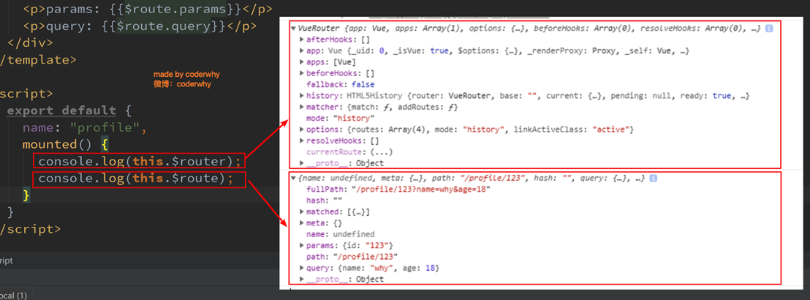

#### 前言

> 我们在组件切换时经常会有传递一些数据的需求，这样就涉及到了路由传参的问题。

**vue-router传递参数有两个大类：①编程式的导航` router.push`。②声明式的导航 `<router-link>`**

#### 编程式导航router.push

##### 通过params属性传值-name

```js
//路由配置文件中
{
     path: '/detail',
     name: 'Detail',
     component: Detail
   }
//跳转时页面
this.$router.push({
  name: 'Detail',
  params: {
    name: '张三'，
    id: 1,
  }
})
//跳转后页面获取参数对象
this.$route.params 
```

注：命名路由传递参数需要使用params来传递，这里一定要注意使用params不是query。目标 页面接收传递参数时使用params

##### 通过query属性传值-path

```js
//路由配置文件中
{
     path: '/detail',
     name: 'Detail',
     component: Detail
   }
//跳转时页面
this.$router.push({
  path: '/detail',
  query: {
    name: '张三'，
    id: 1,
  }
})
 
//跳转后页面获取参数对象
this.$route.query 
```

##### 通过动态路由方式

```js
//路由配置文件中 配置动态路由
{
     path: '/detail/:id',
     name: 'Detail',
     component: Detail
   }
//跳转时页面
var id = 1;
this.$router.push('/detail/' + id)
 
//跳转后页面获取参数
this.$route.params.id
```


#### 声明式的导航

声明式的导航和编程式的用法基本一样。

##### 通过params属性传值-name

```html
<router-link :to="{ name: 'news', params: { userId: 1111}}">click to news page</router-link>
```

##### 通过query属性传值-path

```html
<router-link :to="{ path: '/news', query: { userId: 1111}}">click to news page</router-link>
```

##### 通过动态路由方式

```html
 <router-link :to="'/user/'+userid" tag="button">用户</router-link>
```


#### $route和$router的区别

- $router为VueRouter实例，想要导航到不同URL，则使用$router.push方法

- $route为当前router跳转对象里面可以获取name、path、query、params等 

  


#### 小总结

- 动态路由和query属性传值 页面刷新参数不会丢失， params会丢失 
- 动态路由一般用来传一个参数时居多(如详情页的id), query、params可以传递一个也可以传递多个参数 。
- 获取参数通过$route对象，`$route.query`和`$route.parmas`

