#### **什么是路由？**

- 说起路由你想起了什么？

  - 路由是一个网络工程里面的术语。
  - `路由（routing）`就是通过互联的网络把信息从源地址传输到目的地址的活动. --- 维基百科

- 额, 啥玩意? 没听懂

  - 在生活中, 我们有没有听说过路由的概念呢? 当然了, 路由器嘛.

  

  - 路由器是做什么的? 你有想过吗?
  - 路由器提供了两种机制: 路由和转送.
    - 路由是决定数据包从来`源到目的地`的路径.
    - 转送将`输入端`的数据转移到合适的`输出端.`
  - 路由中有一个非常重要的概念叫`路由表.`
    - 路由表本质上就是一个`映射表, 决定了数据包的指向.`

#### **前端路由和后端路由**

##### **后端路由阶段**

- 早期的网站开发整个HTML页面是由服务器来渲染的.
  - 服务器直接生产渲染好对应的HTML页面, 返回给客户端进行展示.
- 但是, 一个网站, 这么多页面服务器如何处理呢?
  - 一个页面有自己对应的网址, 也就是URL.
  - URL会发送到服务器, 服务器会通过正则对该URL进行匹配, 并且最后交给一个Controller进行处理.
  - Controller进行各种处理, 最终生成HTML或者数据, 返回给前端.
  - 这就完成了一个IO操作.
- 上面的这种操作, 就是后端路由.
  - 当我们页面中需要请求不同的路径内容时, 交给服务器来进行处理, 服务器渲染好整个页面, 并且将页面返回给客户顿.
  - 这种情况下渲染好的页面, 不需要单独加载任何的js和css, 可以直接交给浏览器展示, 这样也有利于SEO的优化.
- 后端路由的缺点:
  - 一种情况是整个页面的模块由后端人员来编写和维护的.
  - 另一种情况是前端开发人员如果要开发页面, 需要通过PHP和Java等语言来编写页面代码.
  - 而且通常情况下HTML代码和数据以及对应的逻辑会混在一起, 编写和维护都是非常糟糕的事情.

##### **前端路由阶段**

- 前后端分离阶段：
  - 随着Ajax的出现, 有了前后端分离的开发模式.
  - 后端只提供API来返回数据, 前端通过Ajax获取数据, 并且可以通过JavaScript将数据渲染到页面中.
  - 这样做最大的优点就是前后端责任的清晰, 后端专注于数据上, 前端专注于交互和可视化上.
  - 并且当移动端(iOS/Android)出现后, 后端不需要进行任何处理, 依然使用之前的一套API即可.
  - 目前很多的网站依然采用这种模式开发.
- 单页面富应用阶段:
  - 其实SPA最主要的特点就是在前后端分离的基础上加了一层前端路由.
  - 也就是前端来维护一套路由规则.
- 前端路由的核心是什么呢？
  - 改变URL，但是页面不进行整体的刷新。
  - 如何实现呢？

#### URL的hash和HTML5的history

**前端路由的核心：改变url，但是页面不进行整体的刷新**

- ##### URL的hash
  
  - URL的hash也就是锚点(#), 本质上是改变window.location的href属性.
  - 我们可以通过直接赋值location.hash来改变href, 但是页面不发生刷新
  
  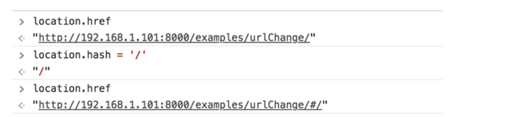
  
- ##### HTML5的history模式

  - history.pushState（）实现

    ```
     history.pushState({},'','home')
    ```

  - history.replaceState（）实现

    由于是替换，所以，无法再浏览器中返回

  - histoty.go(n)
  
  - history.back（）：等价于history.go（-1）
  
  - history.forward（）：等价于history.go（1）


#### 认识vue-router

- 目前前端流行的三大框架, 都有自己的路由实现:
  - Angular的ngRouter
  - React的ReactRouter
  - Vue的vue-router
- 当然, 我们的重点是vue-router
  - vue-router是Vue.js官方的路由插件，它和vue.js`是深度集成`的，适合用于构建`单页面应用`。
  - 我们可以访问其官方网站对其进行学习: https://router.vuejs.org/zh/
- vue-router是基于路由和组件的
  - 路由用于设定访问路径, 将路径和组件映射起来.
  - 在vue-router的单页面应用中, 页面的`路径的改变就是组件的切换.`

#### 安装和使用vue-router

- 如果已经学习了webpack, 对这里就会比较熟悉.以下我们主要是通过工程化的方式进行开发的.

- **安装**

  - npm安装vue-router

    ```
    npm install vue-router --save
    ```

  - 在模块化工程中使用(因为vue-rooter是一个插件，所以可以通过Vue.use（）来安装路由功能)

    - 第一步：导入路由对象，并调用Vue.use（VueRouter）

      ```js
      import Vue from 'vue' 
      import VueRouter from 'vue-router' 
      Vue.use(VueRouter)
      ```

    - 第二步：创建路由实例，并且传入路由映射配置

    - 第三步：在Vue实例中挂载创建的路由实例

-   **使用vue-router的步骤**

  - 第一步: 创建路由组件

    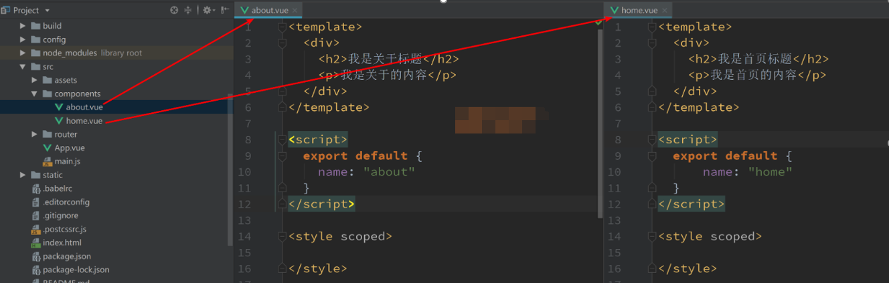

  - 第二步: 配置路由映射: 组件和路径映射关系

    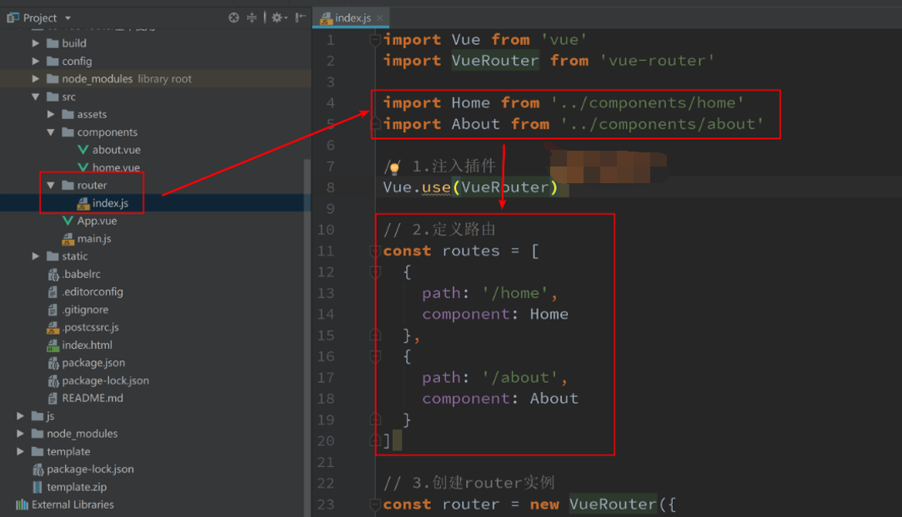

  - 第三步: 使用路由: 通过`<router-link>`和`<router-view>`

    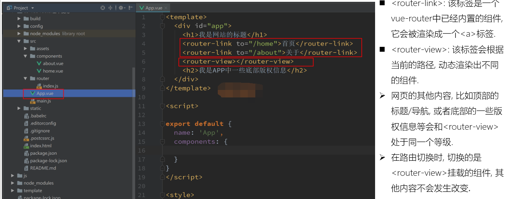

效果：

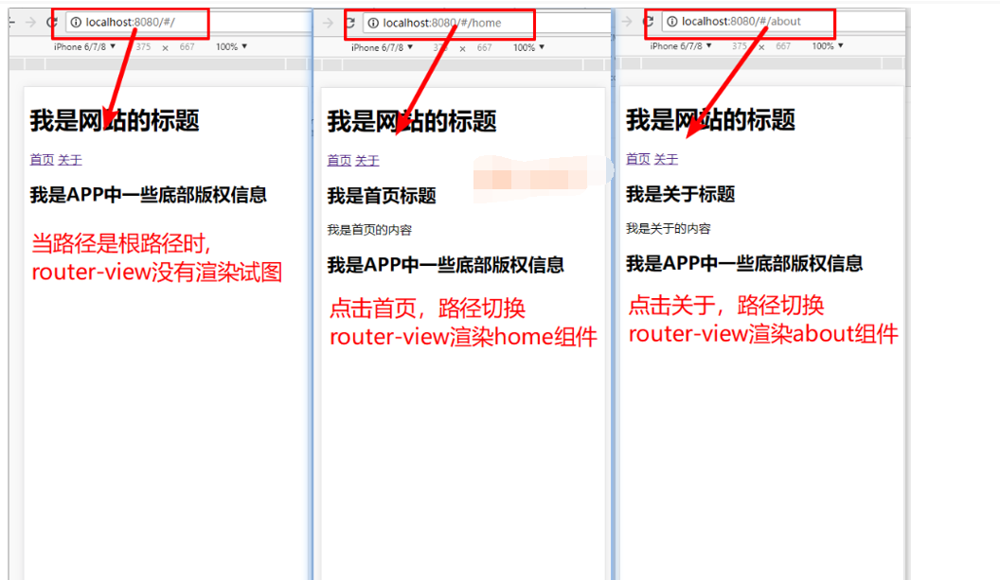

#### 路由的默认路径

- 我们这里还有一个不太好的实现:

  - 默认情况下, 进入网站的首页, 我们希望`<router-view>`渲染首页的内容.
  - 但是我们的实现中, 默认没有显示首页组件, 必须让用户点击才可以.

- 如何可以让路径`默认跳到到首页`, 并且`<router-view>`渲染首页组件呢?

  - 非常简单, 我们只需要配置多配置一个映射就可以了.

    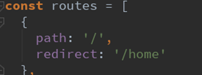

- 配置解析:

  - 我们在routes中又配置了一个映射. 
  - path配置的是根路径: /
  - `redirect是重定向`, 也就是我们将根路径重定向到/home的路径下, 这样就可以得到我们想要的结果了.

#### History模式

- 上面说过改变路径的方式有两种:
  - URL的hash
  - HTML5的history
  - `默认情况下, 路径的改变使用的URL的hash.`
- 如果希望使用HTML5的history模式, 非常简单, 进行如下配置即可:

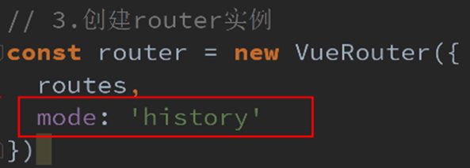

#### router-link补充

- to：指定跳转的路径

- tag：指定router-link之后渲染成什么组件，如是渲染成 li 还是 a 标签

  ```html
  <router-link to='/home' tag='li'>
  ```

- active-class:当<router-link>对应的路由匹配成功时, 会自动给当前元素设置一个router-link-active的class, 设置active-class可以修改默认的名称.

  - 在进行高亮显示的导航菜单或者底部tabbar时, 会使用到该类.
  - 但是通常不会修改类的属性, 会直接使用默认的router-link-active即可. 

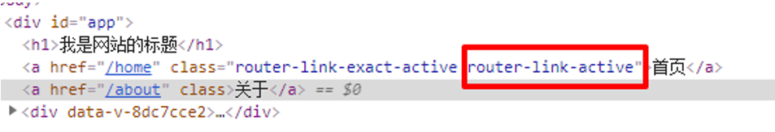

**修改方式**

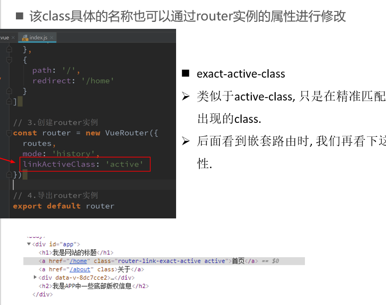

**路由代码跳转**

有时候, 页面的跳转可能需要执行对应的JavaScript代码, 这个时候, 就可以使用第二种跳转方式了
比如, 我们将代码修改如下: 

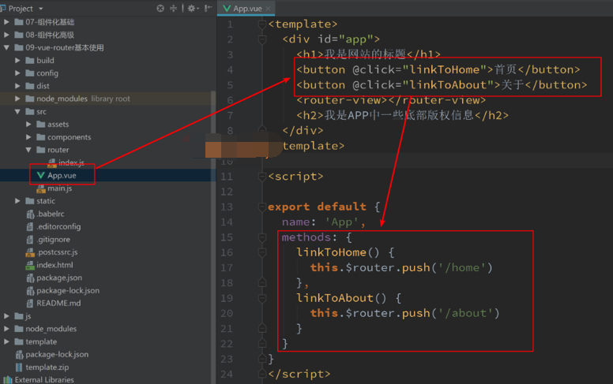

#### 动态路由

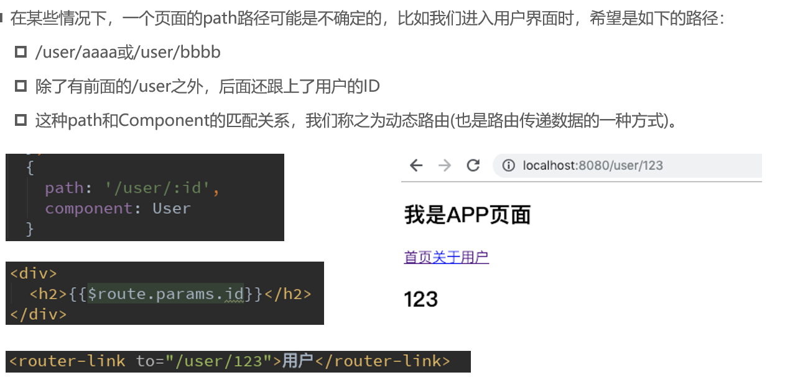

#### 路由懒加载

https://blog.csdn.net/weixin_43745075/article/details/115422035

#### 路由嵌套

##### 概念

- 嵌套路由是一个很常见的功能
  - 比如在home页面中, 我们希望通过/home/news和/home/message访问一些内容.
  - 一个路径映射一个组件, 访问这两个路径也会分别渲染两个组件.
- 路径和组件的关系如下:

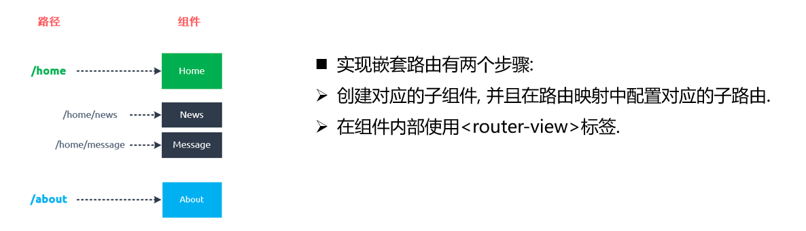

##### 简单实现

- 在主路由index.jx中导入模板对象并在路由对象中添加子路由（嵌套添加）通过添加children数组的形式添加子路由。同时可以设置默认子路由的显示

```js
const routes = [
  //一个对象就是一个映射关系
  {
    path: '/home',//路径对应根/home
    component: Home,
    //添加嵌套子路由
    children: [
      {
        path: 'news',//由于是子路由，不用再加斜杠/了，会自动加
        component:HomeNews
      },
      {
        path: 'message',//由于是子路由，不用再加斜杠/了
        component:HomeMessage
      },
      //设置默认首页
      {
        path: '',
        redirect:'/home/news'
      }
      
    ]
  },
  {
    path: '/about',//路径对应根/about
    component:About
  },
  {
    path: '/user/:userid',//路径对应根/user
    component:User
  },
  //设置默认首页
  {
    path: '/',
    redirect:'/home'
  }
];

```

- 在父路由组件内部使用<router-view>标签，由于子路由是在Home路由模板中应用，所以，应当在Home路由模板上添加子<router-link>和<router-view>

#### vue-router参数传递

https://blog.csdn.net/weixin_43745075/article/details/115423746