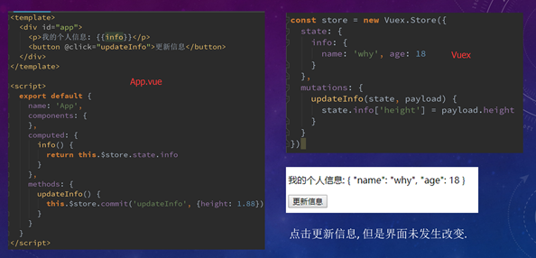
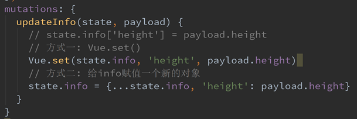

#### 前言

> ​		我们都知道，Vuex的store中的state是响应式的，当state中的数据发生改变时，Vue组件会自动更新。但是是不是任何情况都会自动更新的呢？显示不是的。那什么情况下才能响应呢，那我们的先知道它响应的原理。

#### 响应原理

> ​		当我们在state里添加属性时，都会被添加到响应式系统中，响应式系统会监听属性的变化，当属性发生变化时，会通知所有页面中用到该属性的地方，让界面发生刷新。后添加的属性由于之前没有在store里初始化，我们就无法监听该属性，界面不能刷新。

#### 响应规则

**这就要求我们必须遵守一些Vuex对应的规则:**

- 提前在store中初始化好所需的属性.



`分析`：在store中的state里的info中添加好这些属性（name，age，height等），如果添加属性，则无法即时响应，因为无法监听没有被实现设定好的属性。


- 当给state中的对象添加新属性时, 使用下面的方式:

  - 方式一: 使用Vue.set(obj, 'newProp', 123)

  ```js
  updateInfo(state) { 
        //state.info.name='lisi'
        //添加新的属性,添加一个address属性
        Vue.set(state.info, 'address','beijing');
       //删除一个属性
        Vue.delete(state.info, 'age');
      
  }
  ```

  

  - 方式二: 用心对象给旧对象重新赋值

  

`分析`：info对象被重新赋值，info=info+新的一个属性。`...拓展符`将对象拆成序列拼接上新属性,在用字面符包装成对象复制给info。