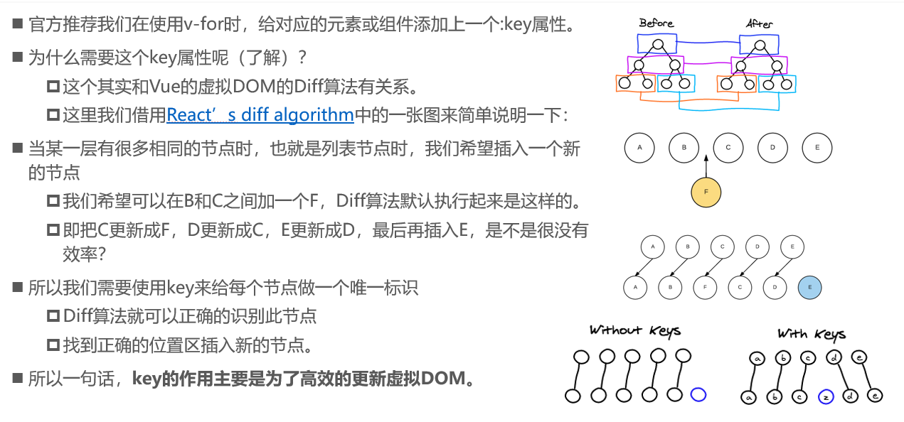
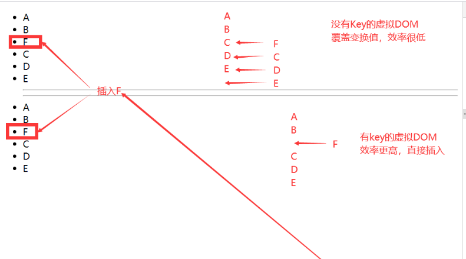

#### 场景

> 当我们有一组数据需要进行渲染时，我们就可以使用v-for来完成。
> 

- v-for的语法类似于JavaScript中的for循环。
- 格式：v-for = "item in items"

#### 数组数据

`情况1`: 不需要使用索引值

- `格式：``v-for=" item in items "`

- 依次从items 中取出item，并且在元素的内容中，我们可以使用`Mustache语法(插值{{item}})`，来使用item

  ```html
  <!--  1.在遍历的过程中，没有使用索引值（下标值）-->
    <ul>
      <li v-for="item in items">{{item}}</li>
    </ul>
  ```
  
  

`情况2`我们需要拿到元素在数组中的索引值

 - `格式`：`v-for="(item, index) in items"`
 - 其中的index就代表了取出的item在原数组的索引值。

```html
<!--  2.在遍历的过程中，获取索引值-->
  <ul>
    <li v-for="(item,index) in names">{{index+1}}.{{item}}</li>
  </ul>
```


----------------------------


#### 对象数据

> 我们都知道对象的属性是键值对的形式，即key->value


##### 数据

```js
info :{
        name:'PJ',
        age:20,
        height:1.83,
        weight:68.5,
      },
```

##### 一个参数时（value）

```html
<!--  1.在遍历对象的过程中，如果只是获取一个值，那么获取到的是value-->
  <ul>
    <li v-for="item in info">{{item}}</li>
  </ul>
//结果 pj 20 1.83 68.5
```

##### 两个参数时（value，key）

```html
<!--  2.获取key和value 前面为value，后面为key (value,key)-->
  <ul>
    <li v-for="(value,key) in info">{{key}}:{{value}}</li>
  </ul>
```

##### 三个参数时（value，key，index）

```html
<!--  3.获取key和value，index  格式：(value,key,index)-->
  <ul>
    <li v-for="(value,key,index) in info">[{{index}}]{{key}}:{{value}}</li>
  </ul>

```

#### 组件的key属性



##### 有没有key的区别



`解析`:<small>

当没有key时，往序列中插入F，底层是将F赋值给C，C->D，D->E、E指向一个新的内存。这样会执行很多次操作。

而当有key时，F直接赋给新的内存，F直接插入，就没有后面的循环赋值的操作了。

**key**的作用主要是为了`高效的更新虚拟DOM`


</small>