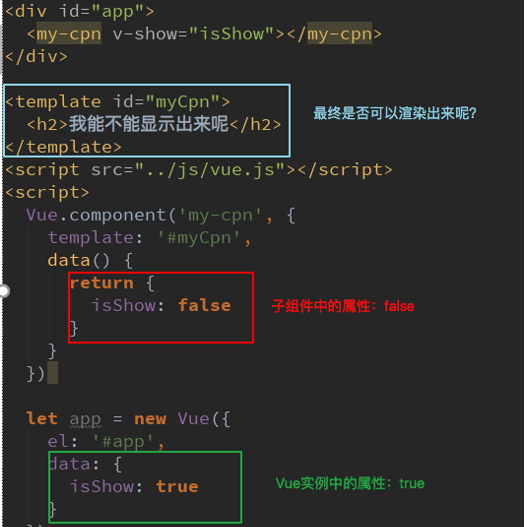
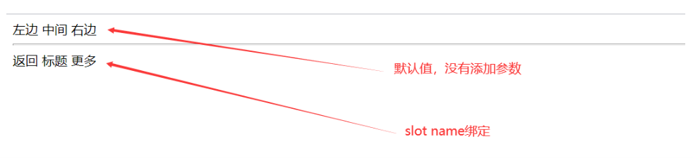

#### 编译作用域

- 在理解插槽前，不得不先理解一个概念：编译作用域。
- 官方对于编译的作用域解析比较简单，我们自己来通过一个例子来理解这个概念：
- 我们来考虑下面的代码是否最终是可以渲染出来的：
  - `<my-cpn v-show="isShow"></my-cpn>`中，我们使用了isShow属性。
  - isShow属性包含在组件中，也包含在Vue实例中。
- 答案：最终可以渲染出来，也就是使用的是Vue实例的属性。



##### 原因分析

- 官方给出了一条准则：`父组件模板的所有东西都会在父级作用域内编译；子组件模板的所有东西都会在子级作用域内编译。`
- 而我们在使用`<my-cpn v-show="isShow"></my-cpn>`的时候，整个组件的使用过程是相当于在父组件中出现的。
- 那么他的作用域就是父组件，使用的属性也是属于父组件的属性。
- 因此，isShow使用的是Vue实例中的属性，而不是子组件的属性。


#### 为什么使用slot

- slot翻译为插槽
  - 在生活中很多地方都有插槽，电脑的USB插槽，插板当中的电源插槽
  - 插槽的目的是让我们原来的设备具有更多的扩展性
  - 比如`电脑的USB我们可以插入U盘，硬盘，手机，音响，键盘，鼠标等`

- 组件的插槽

  - 组件的插槽也是为了让我们封装的组件更具有扩展性

  - 让使用者可以决定组件内部的一些内容到底展示什么

- 例子：移动网站中的导航栏

  - 移动开发中，几乎每个页面都有导航栏

  - 导航栏我们必然会封装成一个插件，比如nav-bar组件

  - 一旦有了这个组件，我们就可以在多个页面中复用

#### **如何封装这类组件呢？**slot

- 如何去封装这类的组件呢？
  - 它们也很多区别，但是也有很多共性。
  - 如果，我们每一个单独去封装一个组件，显然不合适：比如每个页面都返回，这部分内容我们就要重复去封装。
  - 但是，如果我们封装成一个，好像也不合理：有些左侧是菜单，有些是返回，有些中间是搜索，有些是文字，等等。
- 如何封装合适呢？抽取共性，保留不同。
  - 最好的封装方式就是将共性抽取到组件中，将不同暴露为插槽。
  - 一旦我们预留了插槽，就可以让使用者根据自己的需求，决定插槽中插入什么内容。
  - 是搜索框，还是文字，还是菜单。由调用者自己来决定。

#### slot的基本使用

- 了解了为什么用slot，我们再来谈谈如何使用slot？
  - 在子组件中，使用特殊的元素<slot>就可以为子组件开启一个插槽。
  - 该插槽插入什么内容取决于父组件如何使用。
- 我们通过一个简单的例子，来给子组件定义一个插槽：
  - `<slot>`中的内容表示，如果没有在该组件中插入任何其他内容，就默认显示该内容


```html
<div id="app">
  <cpn>
    <button>按钮</button>
  </cpn>
  <cpn>
    <i>呵呵呵</i>
    <div>我是DIV元素</div>
    <p>我是段落</p>
  </cpn>
  <cpn></cpn>
</div>

<template id="cpn">
  <div>
    <h2>我是key</h2>
    <p>我是内容</p>
    <slot>我是默认内容，如果没有插入东西，就会显示我</slot>
    <hr>
  </div>
</template>

```

#### **具名插槽**slot

- 当子组件的功能复杂时，子组件的插槽可能并非是一个。

  - 比如我们封装一个导航栏的子组件，可能就需要三个插槽，分别代表左边、中间、右边。
  - 那么，外面在给插槽插入内容时，如何区分插入的是哪一个呢？
    这个时候，我们就需要给插槽起一个名字

- 如何使用具名插槽呢？

  - 非常简单，只要给slot元素一个name属性即可

    ```html
    <slot name='myslot'></slot>
    ```

##### 演示

```html
<div id="app">
  <cpn>

  </cpn>
  <hr>
  <cpn>
<!--    取名name 调用slot-->
    <span slot="center">标题</span>
    <span slot="left">返回</span>
    <span slot="right">更多</span>
  </cpn>
</div>

<template id="cpn">
  <div>
<!--    slot中间均是默认值-->
  <slot name="left"><span>左边</span></slot>
  <slot name="center"><span>中间</span></slot>
  <slot name="right"><span>右边</span></slot>
  </div>
</template>

```



#### **作用域插槽**

- 作用域插槽是slot一个比较难理解的点，而且官方文档说的又有点不清晰。
- 这里，我们用一句话对其做一个总结，然后我们在后续的案例中来体会：
  - `父组件替换插槽的标签，但是内容由子组件来提供。`

##### 样例需求

- 子组件中包含一组数据，比如：pLanguages：[‘JavaScript’,‘Python’,‘Swift’,‘Go’,‘C++’]
- 需要在多个页面进行展示
  - 某些页面是以水平方向一一展示的
  - 某些界面是以列表形式展示的
  - 某些界面直接展开一个数组
- 内容在子组件，希望父组件告诉我们如何展示，怎么办呢？
  - 利用slot作用域插槽
    

```html

<div id="app">
<!--  列表形式展示-->
  <cpn></cpn>
<!--  水平形式展示-->
  <cpn>
<!--    目的是获得子组件中的pLanguages-->
<!--    Vue2.5.x以下必须使用template模板-->
    <template slot-scope="slot"> //这里的solt只是一个名字
      <span v-for="item in slot.data">{{item}}——</span>
      <br>
      <span>{{slot.data.join('——')}}</span>
    </template>
  </cpn>
</div>

<template id="cpn">
  <div>
    <slot :data="pLanguages"> //把子组件的数据绑在slot上
      <ul>
        <li v-for="item in pLanguages">{{item}}</li>
      </ul>
    </slot>
    <hr>
  </div>
</template>
<script src="https://cdn.jsdelivr.net/npm/vue/dist/vue.js"></script>
<script>
  const app = new Vue({
    el:"#app",
    data:{

    },
    components:{
      cpn:{
        template:"#cpn",
        data(){
          return{
            pLanguages:['JavaScript','C++','Java','Python','Go','Solidity']
          }
        }
      },
    }
  })
</script>

```

