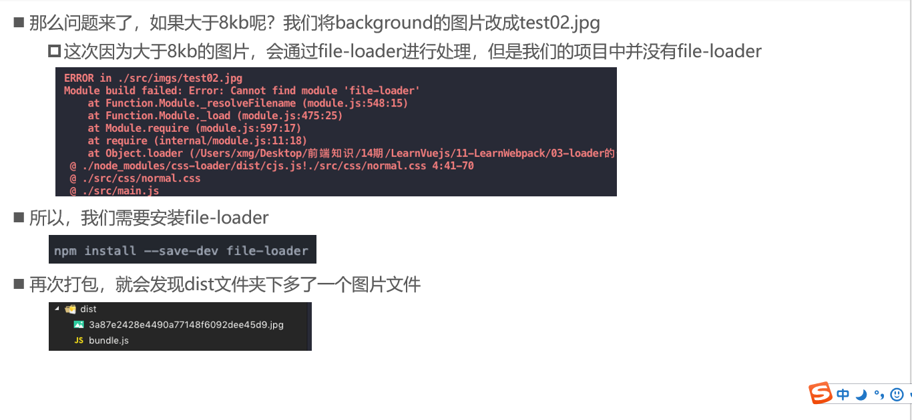
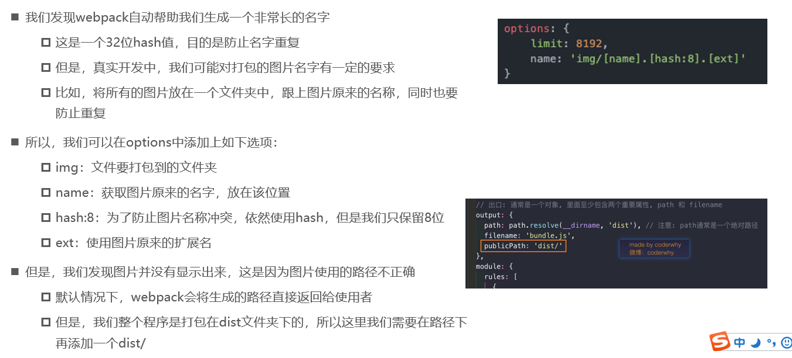
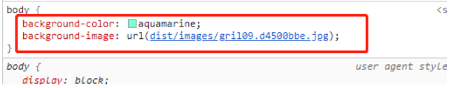

#### **资源准备阶段**






#### 示例

##### 1.安装依赖

```
npm install --save-dev url-loader
npm install --save-dev file-loader
```

##### 2.配置webpack.config.js

```js
//导入path模块
const path = require('path');

module.exports = {
  entry: './src/main.js',
  output: {
    //path是通过node模块的path.resolve函数拿到，第一个参数是内置的文件夹名，第二个是目标文件夹，两个字符串进行了拼接
    path: path.resolve(__dirname,'dist'),
    filename: 'bundle.js',
    publicPath:'dist/'
  },
  //导入cssloader
  module: {
    rules: [
      {
        test: /\.css$/,
        use:['style-loader','css-loader']
      },
      {
        test: /\.less$/,
        use: [
          {
            loader:"style-loader"
          },
          {
            loader:"css-loader"
          },
          {
            loader:"less-loader"
          },
        ]
      },
      {
        test: /\.(png|jpg|jpeg|gif)$/,
        use: [
          {
            loader: 'url-loader',
            options: {
            //当加载的图片小于limit时会将图片编译base64字符串相识
			//当加载的图片大于limit时会将图片用fileloader模块进行加载
              limit:10192,
              //设置图片命名规范
              name:'images/[name].[hash:8].[ext]'
            }
          }
        ]
      },
    ]
  }
}

```


##### 3.css文件引用文件

```css
body{ background-color: aquamarine; background-image: url("../images/gril09.jpg");

```

##### 4.打包结果



