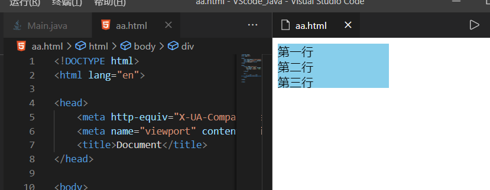
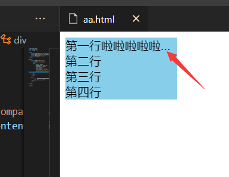
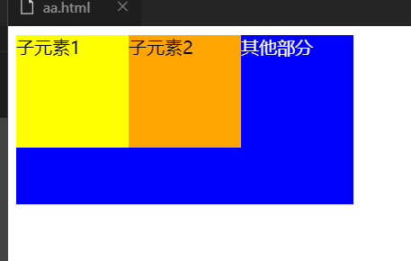
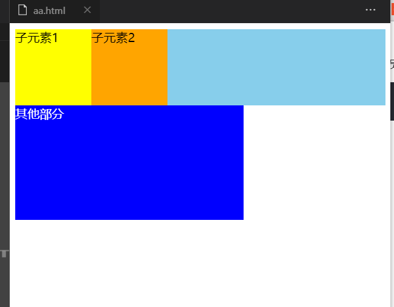
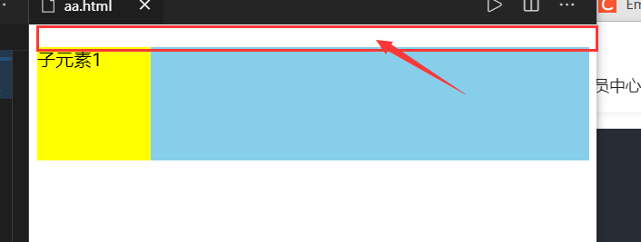
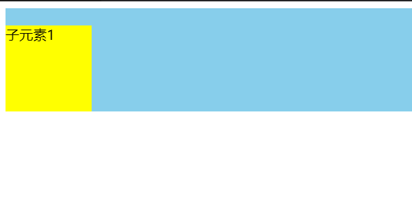

`overflow:hidden主要有三大作用：溢出隐藏、清除浮动、解决外边距塌陷`

#### 溢出隐藏

给一个元素中设置overflow:hidden，那么该元素的内容若超出了给定的宽度和高度属性，那么超出的部分将会被隐藏，不占位。

```html
<!DOCTYPE html>
<html lang="en">
<head>
    <meta http-equiv="X-UA-Compatible" content="IE=edge">
    <meta name="viewport" content="width=device-width, initial-scale=1.0">
    <title>Document</title>
</head>
<body>
    <style type="text/css">
        div{ width: 150px; height: 60px; background: skyblue;
         overflow: hidden;  /*溢出隐藏*/
           }
    </style>
  
    <div >
        第一行<br>第二行<br>
        第三行<br>第四行<br>
    </div>
</body>
</html>
```





> 一般情况下，在页面中，`一般溢出后会显示省略号`，比如，当一行文本超出固定宽度就隐藏超出的内容显示省略号。

```html
<!DOCTYPE html>
<html lang="en">

<head>
    <meta http-equiv="X-UA-Compatible" content="IE=edge">
    <meta name="viewport" content="width=device-width, initial-scale=1.0">
    <title>Document</title>
</head>

<body>
    <style type="text/css">
        /*只适用于单行文本*/
        div {
            width: 150px;
            background: skyblue;
            overflow: hidden;
            /*溢出隐藏*/
            white-space: nowrap;
            /*规定文本不进行换行*/
            text-overflow: ellipsis;
            /*当对象内文本溢出时显示省略标记（...）*/
        }
    </style>

    <div>
        第一行啦啦啦啦啦啦啦啦啦啦啦啦啦啦<br>第二行<br>
        第三行<br>第四行<br>
    </div>

</body>

</html>
```



#### 清除浮动

> 一般而言，父级元素不设置高度时，高度由随内容增加自适应高度。当父级元素内部的子元素全部都设置浮动float之后，子元素会脱离标准流，不占位，父级元素检测不到子元素的高度，父级元素高度为0。那么问题来了，如下：

##### 原代码

```html
<!DOCTYPE html>
<html lang="en">

<head>
    <meta http-equiv="X-UA-Compatible" content="IE=edge">
    <meta name="viewport" content="width=device-width, initial-scale=1.0">
    <title>Document</title>
</head>

<style type="text/css">
    .box {
        background: skyblue;
    }
    .kid {
        width: 100px;
        height: 100px;
        float: left;
    }
    .kid1 {
        background: yellow;
    }
    .kid2 {
        background: orange;
    }
    .wrap {
        width: 300px;
        height: 150px;
        background: blue;
        color: white;
    }
</style>

<body>
    <div class="box">
        <div class="kid kid1">子元素1</div>
        <div class="kid kid2">子元素2</div>
    </div>
    <div class="wrap">其他部分</div>
</body>

</html>
```





如上，`由于父级元素没有高度，下面的元素会顶上去，造成页面的塌陷`。因此，需要给父级加个overflow:hidden属性，这样父级的高度就随子级容器及子级内容的高度而自适应。如下：

由于在IE比较低版本的浏览器中使用overflow：hidden；是不能达到这样的效果，因此需要加上 zoom:1;

所以为了让兼容性更好的话，如果需要使用overflow:hidden来清除浮动，那么最好加上zoom:1;

##### 预期效果



##### 实现代码

```html
<!DOCTYPE html>
<html lang="en">

<head>
    <meta http-equiv="X-UA-Compatible" content="IE=edge">
    <meta name="viewport" content="width=device-width, initial-scale=1.0">
    <title>Document</title>
</head>
<style type="text/css">
    .box {
        background: skyblue;
        /*清除浮动*/
        overflow: hidden;
        /*IE兼容问题*/
        zoom: 1;
    }

    .kid {
        width: 100px;
        height: 100px;
        float: left;
    }

    .kid1 {
        background: yellow;
    }

    .kid2 {
        background: orange;
    }

    .wrap {
        width: 300px;
        height: 150px;
        background: blue;
        color: white;
    }
</style>
<body>
    <div class="box">
        <div class="kid kid1">子元素1</div>
        <div class="kid kid2">子元素2</div>
    </div>
    <div class="wrap">其他部分</div>
</body>

</html>
```


#### 解决外边距塌陷

父级元素内部有子元素，如果给子元素添加margin-top样式，那么父级元素也会跟着下来，造成外边距塌陷，如下：

##### 原代码

```html
<!DOCTYPE html>
<html lang="en">

<head>
    <meta http-equiv="X-UA-Compatible" content="IE=edge">
    <meta name="viewport" content="width=device-width, initial-scale=1.0">
    <title>Document</title>
</head>
<style type="text/css">
    .box {
        background: skyblue;
    }

    .kid {
        width: 100px;
        height: 100px;
        background: yellow;
        margin-top: 20px
    }
</style>
<body>
    <div class="box">
        <div class="kid">子元素1</div>
    </div>
</body>

</html>
```



红色方框本应该是天蓝色的，但出现了外面局塌陷，因此，给`父级元素添加overflow:hidden`


##### 预期效果



##### 实现代码

```html
<!DOCTYPE html>
<html lang="en">

<head>
    <meta http-equiv="X-UA-Compatible" content="IE=edge">
    <meta name="viewport" content="width=device-width, initial-scale=1.0">
    <title>Document</title>
</head>
<style type="text/css">
    .box {
        background: skyblue;
        overflow: hidden;
        /*解决外边距塌陷*/
    }

    .kid {
        width: 100px;
        height: 100px;
        background: yellow;
        margin-top: 20px
    }
</style>

<body>
    <div class="box">
        <div class="kid">子元素1</div>
    </div>
</body>

</html>
```

