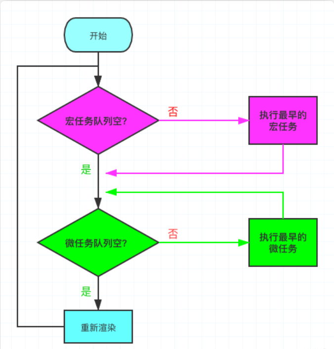
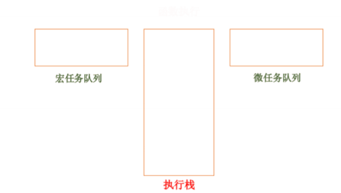

#### 前言

> `面试官：说说异步代码的执行顺序？Event Loop 的运行机制是如何的运行的？`

#### 什么是 EventLoop ？

先看这张图，先不管宏任务，微任务是什么，先看整个流程。



分析：

1. 判断宏任务队列是否为空

   - 不空 --> 执行最早进入队列的任务 --> 执行下一步
   - 空 --> 执行下一步

2. 判断微任务队列是否为空

   - 不空 --> 执行最早进入队列的任务 --> **继续检查微任务队列空不空**
   - 空 --> 执行下一步

> 因为首次执行宏队列中会有 script（整体代码块）任务，所以实际上就是 Js 解析完成后，在异步任务中，会先执行完所有的微任务，这里也是很多`面试题喜欢考察的。`需要注意的是，新创建的微任务会立即进入微任务队列排队执行，不需要等待下一次轮回。
>


主线程从任务队列读取事件，这个过程是循环不断的，所以整个运行机制又称为 `Event Loop(事件循环)。` 

在深入事件循环机制之前，需要弄懂一下几个概念：

- `执行上下文( Execution context ) `
- `执行栈（ Execution stack ） `
- `微任务（ micro-task ）`
-  `宏任务（ macro-task ）`


#### `执行上下文( Execution context )`

> 执行上下文是一个抽象的概念，可以理解为是代码执行的一个环境。JS 的执行上下文分为三种，`全局执 行上下文、函数(局部)执行上下文、Eval 执行上下文。 `

- `全局执行上下文`：全局执行上下文指的是全局 this 指向的 window ，可以是外部加载的 JS 文件 或者本地  标签中的代码。 
- `函数执行上下文`：函数上下文也称为局部上下文，每个函数被调用的时候，都会创建一个新的局部 上下文。 
- Eval 执行上下文： 这个不常用，这里不说。


####  `执行栈（ Execution stack )`

执行栈，就是我们数据结构中的“栈”，它具有“先进后出”的特点，正是因为这种特点，在我们代码进行 执行的时候，遇到一个执行上下文就将其依次压入执行栈中。 

当代码执行的时候，先执行位于栈顶的执行上下文中的代码，当栈顶的执行上下文代码执行完毕就会出 栈，继续执行下一个位于栈顶的执行上下文。

```js
function foo() {
    console.log('a');
    bar();
    console.log('b');
}
function bar() {
    console.log('c');
}
foo();
```

1. 初始化状态，执行栈任务为空。
2.  foo 函数执行， foo 进入执行栈，输出 a ，碰到函数 bar 。 
3. 然后 bar 再进入执行栈，开始执行 bar 函数，输出 c 。 
4. bar 函数执行完出栈，继续执行执行栈顶端的函数 foo ，最后输出 b 。 
5. foo 出栈，所有执行栈内任务执行完毕。


#### 什么是宏任务与微任务？

> 我们都知道 Js 是单线程都，但是一些高耗时操作就带来了进程阻塞问题。为了解决这个问题，Js 有两种任务的执行模式：**`同步模式（Synchronous）和异步模式（Asynchronous）`**。

在异步模式下，创建**异步任务主要分为宏任务与微任务两种**。ES6 规范中，

- 宏任务（Macrotask） 称为 Task， 微任务（Microtask） 称为 Jobs。
- 宏任务是由宿主（浏览器、Node）发起的，而微任务由 JS 自身发起。

##### **宏任务与微任务的几种创建方式** 👇

<table><thead><tr><th>宏任务（Macrotask）</th><th>微任务（Microtask）</th></tr></thead><tbody><tr><td>setTimeout</td><td>requestAnimationFrame（有争议）</td></tr><tr><td>setInterval</td><td>MutationObserver（浏览器环境）</td></tr><tr><td>MessageChannel</td><td>Promise.[ then/catch/finally ]</td></tr><tr><td>I/O，事件队列</td><td>process.nextTick（Node环境）</td></tr><tr><td>setImmediate（Node环境）</td><td>queueMicrotask</td></tr><tr><td>script（整体代码块）</td><td></td></tr></tbody></table>

`注意：nextTick 队列会比 Promie 队列先执行。`

**如何理解 script（整体代码块）是个宏任务呢** 🤔

> 实际上如果同时存在两个 script 代码块，会首先在执行第一个 script 代码块中的同步代码，如果这个过程中创建了微任务并进入了微任务队列，第一个 script 同步代码执行完之后，会首先去清空微任务队列，再去开启第二个 script 代码块的执行。
>
> 所以这里应该就可以理解 script（整体代码块）为什么会是宏任务。


以上概念弄明白之后，再来看循环机制是如何运行的呢？以下涉及到的任务执行顺序都是靠函数调用栈 来实现的。

1. 首先，事件循环机制的是从` script `标签内的代码开始的，上边我们提到过，整个` script `标签 作为一个宏任务处理的。
2.  在代码执行的过程中，如果遇到宏任务，如：` setTimeout `，就会将当前任务分发到对应的执行队 列中去。 
3. 当执行过程中，如果遇到微任务，如：` Promise` ，在创建 `Promise `实例对象时,代码顺序执行，如果 到了执行`· then` 操作，该任务就会被分发到微任务队列中去。 
4. `script `标签内的代码执行完毕，同时执行过程中所涉及到的宏任务也和微任务也分配到相应的队 列中去。 
5. 此时宏任务执行完毕，然后去微任务队列执行所有的存在的微任务。
6. 微任务执行完毕，第一轮的消息循环执行完毕，页面进行一次渲染。 
7. 然后开始第二轮的消息循环，从宏任务队列中取出任务执行。 
8. 如果两个任务队列没有任务可执行了，此时所有任务执行完毕。


#### 定时器 `setTimeout`

任务队列除此之外，还可以放定时器的回调函数，需要指定某些代码多少时间之后执行。 

定时器主要包括两种， `setTimeout 和 setInterval 两个函数`。 当我们设置定时器的时间，执行某个特定的任务，如下：

```js
  // 1 秒后执行
  setTimeout(function () {
    console.log(2);
  }, 1000);
  console.log(1)


```

上述的输出结果为 1, 2，执行完同步代码后，就会执行定时器中的任务事件

```js
  // 同步执行完立即执行
  setTimeout(function () {
    console.log(2);
  }, 0);
  console.log(1)
```

当我们执行 `setTimeout（fn,0）` 定时器时，会将这个定时任务回调放在任务队列的尾部，代表的含 义就是尽早的执行。

 也就是等到主线程同步任务和"任务队列"现有的事件都处理完，然后才会立即执行这个定时器的任务。 

`上述的前提是，等到同步任务和任务队列的代码执行完毕后，如果当前代码执行很长时间，定时器并没 办法保证一定在指定时间执行。`

> `注:HTML5 标准规定了setTimeout() 的第二个参数的最小值（最短间隔），不得低于4毫秒， 如果低于这个值，就会自动增加。`

如果涉及到页面的改动，这个定时器任务通常不会立即执行，而是 16 毫秒执行一次，我们通常使用` requestAnimationFrame() 。`


#### 小实战

```html
<!DOCTYPE html>
<html lang="en">

<head>
  <meta charset="UTF-8">
  <meta name="viewport" content="width=device-width, initial-scale=1.0">
  <meta http-equiv="X-UA-Compatible" content="ie=edge">
  <title>消息运行机制</title>
</head>

<body>
  
</body>
<script>
  console.log('1');
  setTimeout(() => {
    console.log('2')
  }, 1000);
  new Promise((resolve, reject) => {
    console.log('3');
    resolve();
    console.log('4');
  }).then(() => {
    console.log('5');
  });
  console.log('6');// 1,3,4,6,5,2
</script>

</html>
```

分析：

- 初始化状态，执行栈为空。
- 首先执行` <script> `标签内的同步代码，此时全局的代码进入执行栈中，同步顺序执行代码，输出 1。
- 执行过程中遇到异步代码 `setTimeout （宏任务）`，将其分配到宏任务异步队列中。
- 同步代码继续执行，遇到一个` promise 异步代码（微任务）`。但是构造函数中的代码为同步代码，依次输出3、4，则` then `之后的任务加入到微任务队列中去。
- 最后执行同步代码，输出 6。
- 因为 `script `内的代码作为宏任务处理，所以此次循环进行到处理微任务队列中的所有异步任务，直达微任务队列中的所有任务执行完成为止，微任务队列中只有一个微任务，所以输出 5。
- 此时页面要进行一次页面渲染，渲染完成之后，进行下一次循环。
- 在宏任务队列中取出一个宏任务，也就是之前的` setTimeout`，最后输出 2。
- 此时任务队列为空，执行栈中为空，整个程序执行完毕。



以上难免有些啰嗦，所以简化整理如下步骤：

-  一开始执行宏任务（ script 中同步代码），执行完毕，调用栈为空。
- 然后检查微任务队列是否有可执行任务，执行完所有微任务。 
- 进行页面渲染。
-  第二轮从宏任务队列取出一个宏任务执行，重复以上循环。