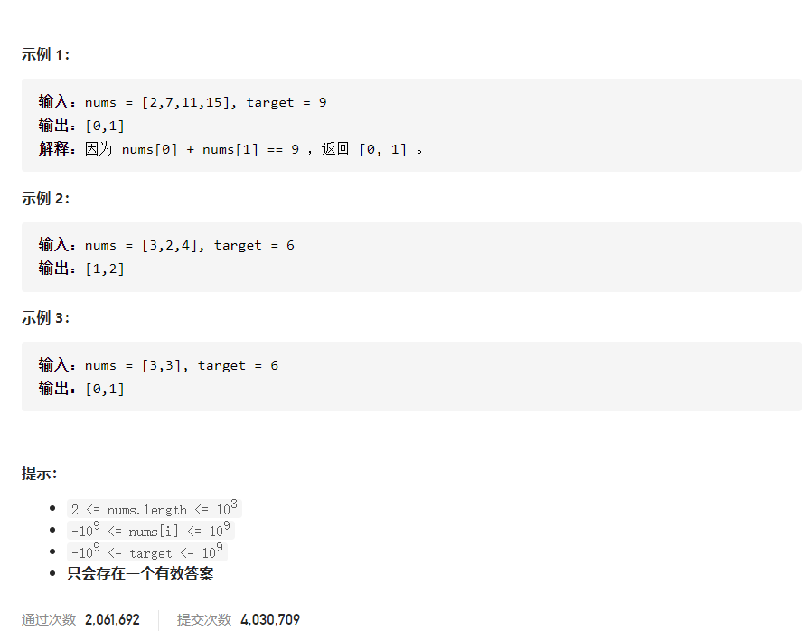

[原题](https://leetcode-cn.com/problems/two-sum/)

#### 思路

- 用 hashMap 存储遍历过的元素和对应的索引。

- 每遍历一个元素，看看 hashMap 中是否存在满足要求的目标数字。

- 所有事情在一次遍历中完成（用了空间换取时间）。

  ```js
  /**
   * @param {number[]} nums
   * @param {number} target
   * @return {number[]}
   */
  var twoSum = function(nums, target) {
        const mp = {};                    // 存储出现过的数字，和对应的索引               
      for (let i = 0; i < nums.length; i++) {       // 遍历元素   
          const targetNum = target - nums[i];          // 满足要求的目标元素   
          const targetIndex = mp[targetNum]; // 在mp中获取目标元素的索引
          if (targetIndex !== undefined) {         // 如果存在，直接返回 [目标元素的索引,当前索引]
              return [targetIndex, i];
          } else {                                    // 如果不存在，说明之前没出现过目标元素
              mp[nums[i]] = i;                     // 存入当前的元素和对应的索引
          }
      }
      return [];
  };
  
  或者
  
  /**
   * @param {number[]} nums
   * @param {number} target
   * @return {number[]}
   */
  var twoSum = function(nums, target) {
      const mp = new Map();
      for(let i = 0;i<nums.length;i++){
          let res = target-nums[i];
          if(mp.has(res)){
               return [i,mp.get(res)];
           }
              mp.set(nums[i],i);
      }
      return [];
  };
  ```

  

