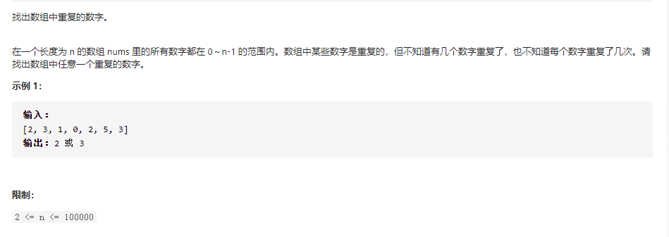

🧠 解题思路

- `哈希表`

  通过题意，我们可以使用哈希表来实现，分析如下：

  遍历数组，若当前数字不存在与哈希表，则添加到哈希表即可。

  若当前数字哈希表中已存在，则返回结果。

  ```js
  var findRepeatNumber = function(nums) {
      var map = new Map();
      for(let i of nums){
          if(map.has(i))
          return i;
          map.set(i,1);
      }
      return null;
  };
  
  var findRepeatNumber = function(nums) {
      const map = {};
      for (const num of nums) {
          if (!map[num]) {
              map[num] = true;
          } else {
              return num;
          }
      }
  };
  
  
  ```

  

- `原地哈希（推荐）`
  从题目描述可以知道，所有数字都在 0 ～ n-1 的范围内。因此不需要额外开辟空间，每次遍历时，检查当前元素是否放在了正确位置上（`例如元素 i 应该放在下标为 i 的位置上`）。如果放在了正确位置上，那么继续循环。否则：

  下标为 num 的元素 === num，说明当前元素 num 是重复的，直接返回
  下标为 num 的元素 !== num，交换当前元素和下标为 num 的元素，将当前元素放入到正确位置上

  ```js
  var findRepeatNumber = function(nums) {
      const len = nums.length;
      for(let i = 0;i<len;++i){
          while((num = nums[i]) !== i){
              if(num === nums[num]) {
                  return num;
                  }
              [nums[i],nums[num]]=[nums[num],nums[i]];
          }
      }
  };
  ```

  

- `排序+遍历`

  数组先排个序，然后每个位置和它相邻位置比较

  相同就返回

  ```js
  var findRepeatNumber = function(nums) {
      nums = nums.sort();
      for(let i=0; i<nums.length-1; i++) {
          if(nums[i] == nums[i+1]) return nums[i];
      }
      return null;
  };
  ```

  

