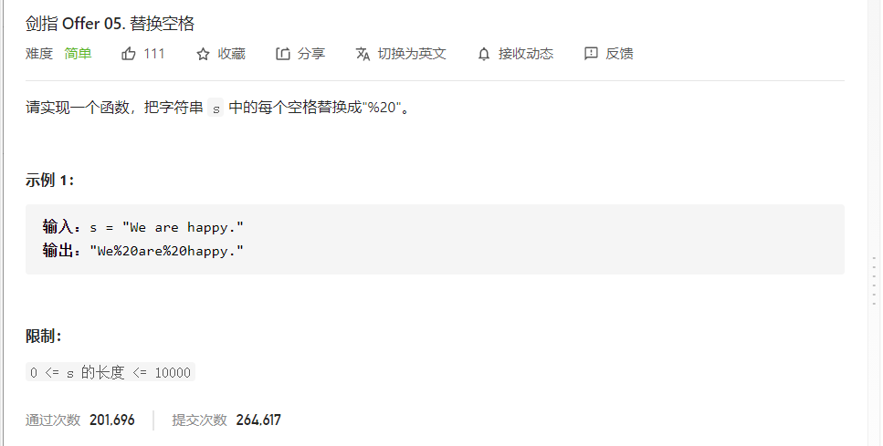

[题目地址](https://leetcode-cn.com/problems/ti-huan-kong-ge-lcof/)

这道题的解法非常多，利用很多原生 api 就能轻松解决，例如：

- `repleace/replaceAll`

  - 解法 1：正则表达式
    第一反应肯定正则表达式，在真正项目中，肯定也会选用`正则来做匹配和替换。`

    ```js
    var replaceSpace = function(s) {
        return s.replace(/ /g, "%20");
    };
    ```

  - replaceAll

    ```js
    var replaceSpace = function(s) {
        return s.replaceAll(' ','%20');
    };
    ```

- encodeURIComponent

- `split/join`

  首先判断输入是否合法，参数是字符串类型，字符串长度不能太长。
   再通过split(' ')将空格隔开的单词变为字符串数组中的数组项
   最后通过join('%20')将各个数组项，也就是单词，连接起来完成空格的替换。

  ```js
  var replaceSpace = function(s) {
        if (typeof s == "string" && s.length >= 0 && s.length <= 10000) {
          return s.split(' ').join('%20');
        }
        return '';
  };
  
  ```

- 亦或者直接暴破求解等等...

但是我们清楚，这些肯定都不是被考察的目的，我们需要做的，就是如何在手动实现的过程中，尽量的减少复杂度！

因为` JS 中字符串无法被修改`，一旦给字符串变量重新赋值，就要花费时间和空间去`重新新建一个字符串`，从而增加了复杂度！


- `双指针法`

  所以我们这里采用数组来进行操作，流程如下：

  - 将字符串转换为数组，然后统计其中的空格数量。
  - 根据空格数量和原有字符串有效字符长度，计算出刚好存放替换后的字符长度的数组。
  - 创建两个指针，一个指数组末尾，一个指字符串有效位的末尾，实现原地修改。
  - 值得注意的是：数组遍历，一定要从后往前遍历，避免从前往后，造成字符被修改，导致错误！

```js
var replaceSpace = function(s) {
    const len = s.length;
    s=s.split('');
    let numSpaces=0;
    for(let i = 0;i < len; ++i){
        if(s[i]===' ')
        numSpaces++;
    }
    s.length +=numSpaces*2;
    var newLen = s.length;
    for(let i = len-1,j=newLen-1;i>=0;i--,j--){
        if(s[i]!==' ')
        s[j]=s[i];
        else{
            s[j]='0',
            s[j-1]='2',
            s[j-2]='%',
            j-=2;
        }
    }
    return s.join('');
};
```

