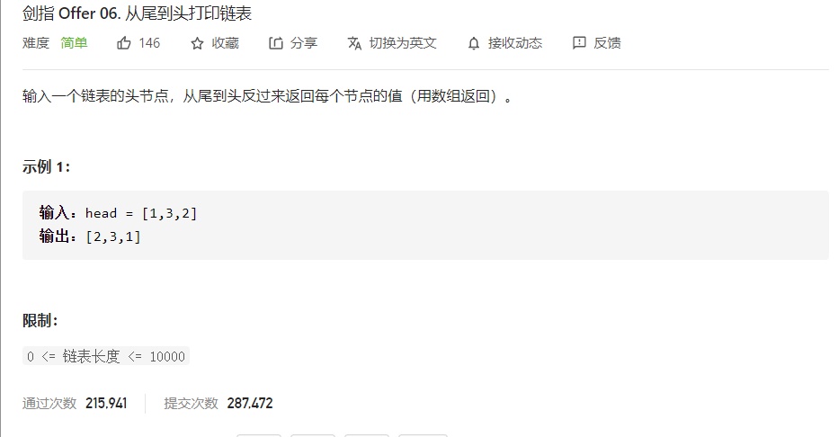

#### 注意，结构数据结构是一个链表

```js
/**
 * Definition for singly-linked list.
 * function ListNode(val) {
 *     this.val = val;
 *     this.next = null;
 * }
 */
/**
 * @param {ListNode} head
 * @return {number[]}
 */
```


#### `reverse() `/unshift()懒蛋法

```js
var reversePrint = function (head) {
  if (head === null) return []
  const res = []
  while (head) {
    res.push(head.val)
    head = head.next
  }
  return res.reverse();
    
   //或者利用unshift前插
    
    while (head) {
        res.unshift(head.val)
        head = head.next
    }
    return res
}


```

#### `反转链表`

```js
// 首先将链表反转
function reverseLink(head) {
    if (head === null || head.next === null) return head
    let p = head.next
    head.next = null
    let tmp = null
    while (p !== null) {
        tmp = p.next // tmp 指针前进（保存下一个指针信息）
        p.next = head // 指针反转
        head = p // head 指针前进
        p = tmp // p 指针前进
    }
    return head
}

```

#### `递归反转链表`

```js
function reverseLink(head) {
    if (head === null || head.next === null) return head
    const p = reverseLink(head.next)
    head.next.next = head // 指针反转
    head.next = null
    return p // 返回真正的表头
}
```

