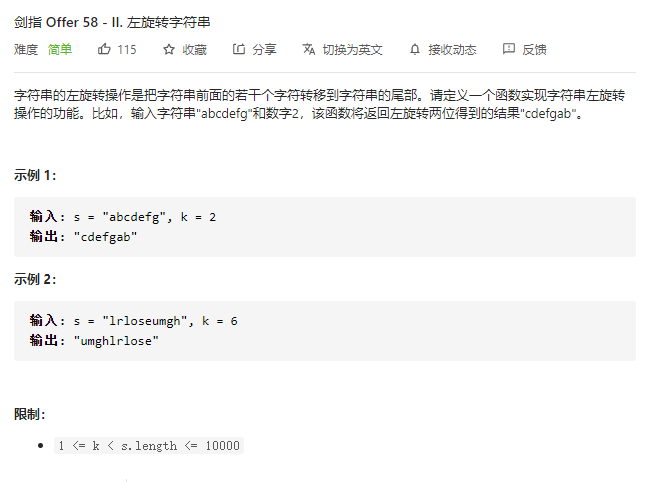

思路1：懒蛋法

- `slice`——`string.slice(start, end) end省略时代表到尾部`

  ```js
  var reverseLeftWords = function(s, n) {
       return s.slice(n) + s.slice(0, n);
  };
  ```

- `substring`——`string.substring(start, end)提取一个字符串,end不支持负数`

  ```javascript
  var reverseLeftWords = function(s, n) {
       return s.substring(n) + s.substring(n, 0);
  };
  ```

- `substr`——`string.substr(start, len)提取一个长度为len的字符串`

  ```js
  var reverseLeftWords = function(s, n) {
       return s.substr(n) + s.substr(0, n);
  };
  ```

  `以上三种方法并不会修改原数组，只是提取，如果要删除，是splice()方法。`

  从代码上来看，这三种方法都可以实现，且基本上相同。那他们区别在哪呢？

  `当传入负数时三种方法才会有所不同`，以上方法都接受两个参数，

  - slice方法会将负数与字符串长度相加，
  - substr的第一个参数为负数会与字符串长度相加，第二个为0，
  - substring只要参数为负数都会转为0

思路2：通过截取拼接实现（字符串具有length属性）

.png)

本题的目的是得到每个节点正确的下标。由于递增循环的特性，考虑用取余的操作。
每个原下标到目标下标都多了3，这个3是怎么来的呢？不难发现，3= len - k。也就是说，对于每一个下标i，目标下标=i + len - k。然后只要根据新的下标放置各个元素即可。

```js
var reverseLeftWords = function(s, n) {
    let len = s.length;
    let news = new Array(len); //待返回的新数组
    [...s].forEach((e,i)=>{
        news[(i + len - n) % len] = e;
    });
    return news.join("");
};
```

