#### **Vuex**是做什么的?

- **官方解释**：Vuex 是一个专为 Vue.js 应用程序开发的`状态管理模式`。
  - 它采用 `集中式存储管理` 应用的所有组件的状态，并以相应的规则保证状态以一种可预测的方式发生变化。
  - Vuex 也集成到 Vue 的官方调试工具` devtools extension`，提供了诸如零配置的 time-travel 调试、状态快照导入导出等高级调试功能

- **状态管理到底是什么？**
  - 状态管理模式、集中式存储管理这些名词听起来就非常高大上，让人捉摸不透。
  - 其实，你可以简单的将其看成把需要多个组件共享的变量全部存储在一个对象里面。
  - 然后，将这个对象放在顶层的Vue实例中，让其他组件可以使用。
  - 那么，多个组件是不是就可以共享这个对象中的所有变量属性了呢？
- 等等，如果是这样的话，为什么官方还要专门出一个插件Vuex呢？难道我们不能自己封装一个对象来管理吗？
  - 当然可以，只是我们要先想想Vue.js带给我们最大的便利是什么呢？没错，就是`响应式`。
  - 如果你自己封装实现一个对象能不能保证它里面所有的属性做到响应式呢？当然也可以，只是自己封装可能稍微麻烦一些。
  - 不用怀疑，Vuex就是为了提供这样一个在`多个组件间共享状态的插件`，用它就可以了。

- **管理什么状态呢**?
  - 如果你做过大型开放，你一定遇到过多个状态，在多个界面间的共享问题。
  - 比如用户的登录状态、用户名称、头像、地理位置信息等等。
  - 比如商品的收藏、购物车中的物品等等。
  - 这些状态信息，我们都可以放在统一的地方，对它进行保存和管理，而且它们还是响应式的（待会儿我们就可以看到代码了，莫着急）。

- OK，从理论上理解了状态管理之后，让我们从实际的代码再来看看状态管理。
  - 毕竟，Talk is cheap, Show me the code.(来自Linus)


我们先来看看单界面的状态管理吧.


#### **单界面的状态管理**

- 我们知道，要在单个组件中进行状态管理是一件非常简单的事情
  - 什么意思呢？我们来看下面的图片。
- 这图片中的三种东西，怎么理解呢？
  - State：不用多说，就是我们的状态。（你姑且可以当做就是data中的属性）
  - View：视图层，可以针对State的变化，显示不同的信息。（这个好理解吧？）
  - Actions：这里的Actions主要是用户的各种操作：点击、输入等等，会导致状态的改变。


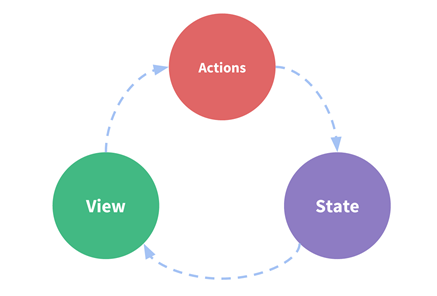

- 写点代码，加深理解：

  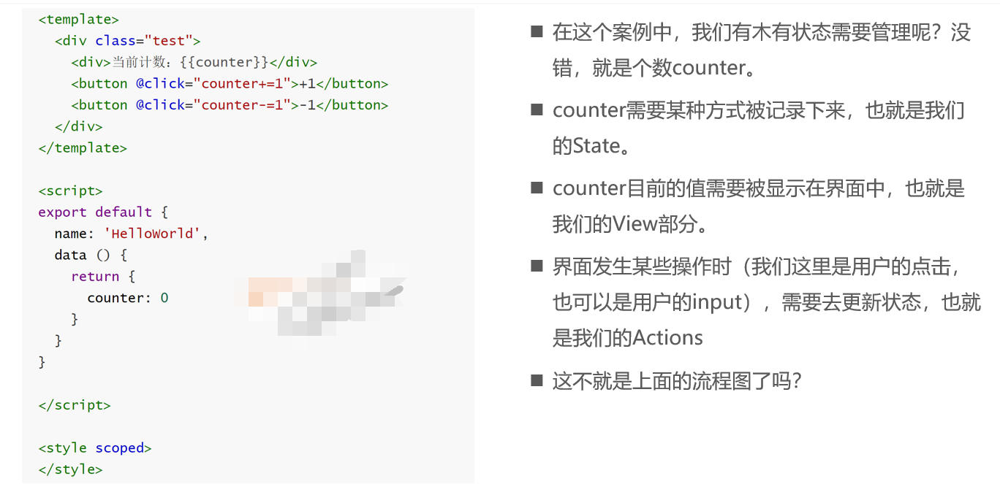

#### **多界面状态管理**

- Vue已经帮我们做好了单个界面的状态管理，但是如果是多个界面呢？
  - 多个试图都依赖同一个状态（一个状态改了，多个界面需要进行更新）
  - 不同界面的Actions都想修改同一个状态（Home.vue需要修改，Profile.vue也需要修改这个状态）
- 也就是说对于某些状态(状态1/状态2/状态3)来说只属于我们某一个试图，但是也有一些状态(状态a/状态b/状态c)属于多个试图共同想要维护的
  - 状态1/状态2/状态3你放在自己的房间中，你自己管理自己用，没问题。
  - 但是状态a/状态b/状态c我们希望交给一个大管家来统一帮助我们管理！！！
  - 没错，Vuex就是为我们提供这个大管家的工具。
- **全局单例模式**（`大管家`）
  - 我们现在要做的就是将共享的状态抽取出来，交给我们的大管家，统一进行管理。
  - 之后，你们每个试图，按照我`规定好的`规定，进行访问和修改等操作。
  - 这就是Vuex背后的基本思想。

#### Vuex状态管理图例

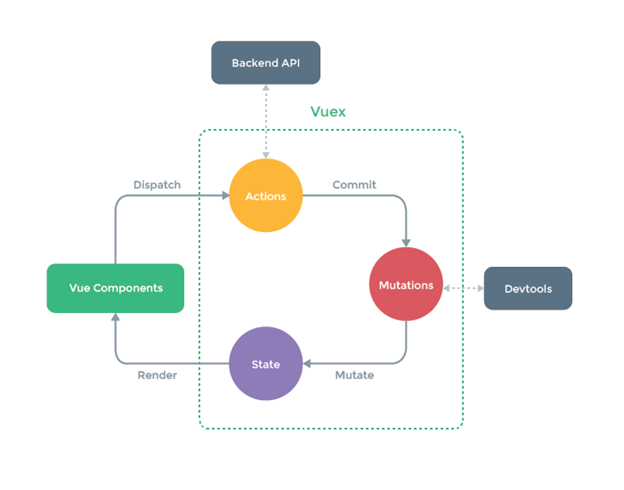

#### 基本使用

-  **安装vuex**


   ```
   npm install vuex --save
   ```

- 在路由中创建新的路由并use这个插件。
  - 创建一个新的文件夹store，并在store里创建index.js
  - 在index.js文件中创建store对象

```js
import Vue from 'vue'
import Vuex from 'vuex'

//1、使用插件
Vue.use(Vuex);

//2、创建vuex对象
const store = new Vuex.Store({
  //在store里面放置的对象
  //状态
  state: {
    counter:1000//数据实际存放在这个state对象的counter里
  },
  mutations: {
  },
  actions: {
  },
  getters: {
  },
  modules: {
  }
})

//3、导出store对象
export default store;

```

- 在main.js里`将store挂载到Vue实例中`，这样才能个在各个页面中拿到这个对象
  - 来到main.js文件，导入store对象，并且放在new Vue中
  - 这样，在其他Vue组件中，我们就可以通过this.$store的方式，获取到这个store对象了

```js
import Vue from 'vue'
import App from './App'
import store from './store'   //如果不指定具体文件名则默认导入store目录下的
new Vue({
  el: '#app',
  store,
  render: h => h(App)
})

```

- 使用Vuex的count

  - 调用公共变量使用`$store.state.counter`

  ```html
  <template>
    <div>
      <h2>{{$store.state.counter}}</h2>
    </div>
  </template>
  <script>
  export default {
    name:'App',
   
  }
  </script>
  <style scoped>
  
  </style>
  
  ```

  注意：`$store.state.counter`是可访问的也是可读的，但是我们`不能直接修改它来更新值`，虽然有效，但不符合规定

  - **通过mutation管理状态（state）**：在store模块中会 有一个mutations对象，在里面可以放置一些修改state对象内容的方法，这些方法都会包含一个state的参数以后只要是修改state的内容都必须通过`mutation来进行管理`。修改mutation的内容需要使用`commit方法`，commit带俩参数.具体见下文


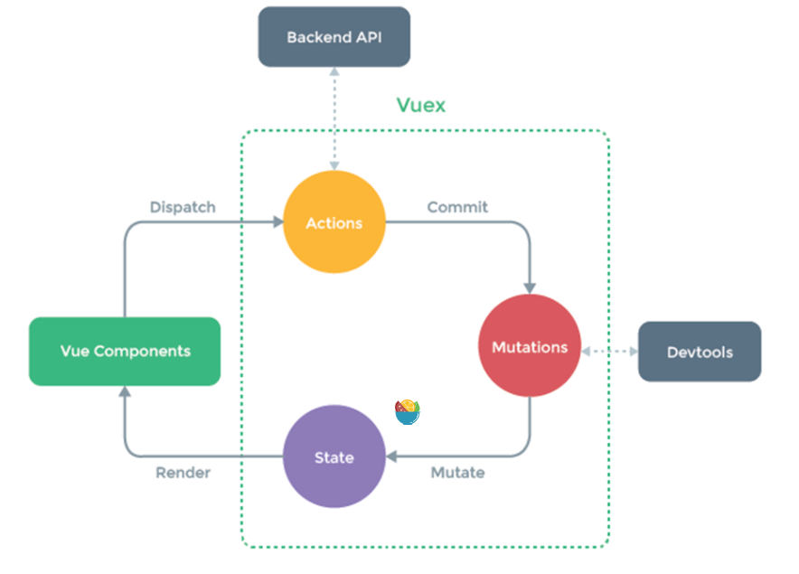

#### Vuex核心概念

- Vuex有几个比较核心的概念:
  - State
  - Getters
  - Mutation
  - Action
  - Module
- 我们对它进行一一介绍.

##### State单一状态树

- Vuex提出使用单一状态树, 什么是单一状态树呢？
  - 英文名称是Single Source of Truth，也可以翻译成单一数据源。
- 但是，它是什么呢？我们来看一个生活中的例子。
  - OK，我用一个生活中的例子做一个简单的类比。
  - 我们知道，在国内我们有很多的信息需要被记录，比如上学时的个人档案，工作后的社保记录，公积金记录，结婚后的婚姻信息，以及其他相关的户口、医疗、文凭、房产记录等等（还有很多信息）。
  - 这些信息被分散在很多地方进行管理，有一天你需要办某个业务时(比如入户某个城市)，你会发现你需要到各个对应的工作地点去打印、盖章各种资料信息，最后到一个地方提交证明你的信息无误。
  - 这种保存信息的方案，不仅仅低效，而且不方便管理，以及日后的维护也是一个庞大的工作(需要大量的各个部门的人力来维护，当然国家目前已经在完善我们的这个系统了)。
- 这个和我们在应用开发中比较类似：
  - 如果你的状态信息是保存到多个Store对象中的，那么之后的管理和维护等等都会变得特别困难。
  - 所以Vuex也使用了单一状态树来管理应用层级的全部状态。
  - 单一状态树能够让我们最直接的方式找到某个状态的片段，而且在之后的维护和调试过程中，也可以非常方便的管理和维护

**其核心思想**就是不要让数据分布在各个仓库（store）里，而是`只用一个store`来存储

##### Getters基本使用

背景：有时候，我们需要从store中获取一些state变异后的状态，比如下面的Store中：

- 获取学生年龄大于20的个数

```js
const store = new Vuex.Store({
    state:{
        students:[
            {id: 110, name: 'why', age: 18},
            {id: 111, name: 'kobe', age: 24},
    		{id: 112, name: 'james', age: 30},
   			{id: 113, name: 'curry', age: 10}
        ]
    }
})
```

不用getters时

```js
commputed:{
    getGreaterAgeCount(){
        return this.$store.state.students.filter(age=> age>=20).length
    }

}
```

在Store中定义getters

```js
getters:{
    getGreaterAgeCount:state=>{
        return state.students.filter(s=> s.age>=20).length
    }
}
```

如果我们已经有了一个获取所有年龄大于20岁学生列表的getters, 那么代码可以这样来写

```js
//Getters作为参数
getters:{
    getGreaterAgeStus:state=>{
        return state.students.filter(s=> s.age>=20)
    },
    getGreaterAgeCount;(state,getters)=>{
        return getters.getGreaterAgeStus.length
    }
}
```

`getters默认是不能传递参数`的, 如果希望传递参数, 那么只能`让getters本身返回另一个函数.`

- 比如上面的案例中,我们希望根据ID获取用户的信息

```js
getters:{
    
   /* 
   	这样stuByID返回的就是一个函数fn(),即stuByID()=fn()
    而fn有一个形参id，就可以传参数了。那么stuByID(id)=fn(id)
    */
    stuByID:state=>{
        return function fn(id){
            return state.students.find(function fnn(s){
                return s.id===id
            })
        }
    }
    //简化版
  stuByID: state =>id =>state.students.find(s => s.id === id)
}
```

##### Mutation状态更新

- `Vuex的store状态的更新唯一方式：提交Mutation`
- Mutation主要包括两部分：
  - 字符串的`事件类型`（type）
  - 一个`回调函数`（handler）,该回调函数的第一个参数就是`state`。

###### mutation的定义方式：

```js
mutations:{
    //可以定义方法，方法会有一个默认的state参数
    increment() { 
      this.state.counter++
    },
    //传入一个参数
    incrementCount(state,counte) { 
        state.counter+=counte
    },
        
        
    /*
        过mutation更新数据的时候, 有可能我们希望携带一些额外的参数
		被称为是mutation的载荷(Payload)
        但是如果参数不是一个呢?
		我们有很多参数需要传递.
		这个时候, 我们通常会以对象的形式传递, 也就是payload是一个对象.
		这个时候可以再从对象中取出相关的信息.
	*/
    //更新多个参数（多个参数打包成一个对象传入）
    changeCount(state,payload) { 
		state.counter+=payload.count
    }
}
```

###### 通过mutation更新

```js
increment(){
    this.$store.commit('increment')//字符串对应mutations里面的回调函数
}
incrementCount(counte){
    this.$store.commit('incrementCount',counte)//字符串称类型，对应mutations里面的回调函数
}
changeCount(){
    this.$store.commit('changeCount',{count:4})
}
```

###### Mutation提交风格

上面的通过commit进行提交是一种普通的方式，Vue还提供了另外一种风格, 它是一个包含`type属性`的对象


Mutation中的处理方式是`将整个commit的对象作为payload使用`, 所以代码没有改变, 依然如下:


##### mutation的响应规则

##### mutation常量类型

###### 概念

- 我们来考虑下面的问题:
  - 在mutation中, 我们定义了很多事件类型(也就是其中的方法名称).
  - 当我们的项目增大时, Vuex管理的状态越来越多, 需要更新状态的情况越来越多, 那么意味着Mutation中的方法越来越多.
  - 方法过多, 使用者需要花费大量的经历去记住这些方法, 甚至是多个文件间来回切换, 查看方法名称, 甚至如果不是复制的时候, 可能还会出现写错的情况.
- 如何避免上述的问题呢?
  - 在各种Flux实现中, 一种很常见的方案就是使用`常量`替代Mutation`事件的类型`.
  - 我们可以将这些常量放在一个单独的文件中, 方便管理以及让整个app所有的事件类型一目了然.
- 具体怎么做呢?
  - 我们可以创建一个文件: mutation-types.js, 并且在其中定义我们的常量.
  - 定义常量时, 我们可以使用ES2015中的风格, 使用一个常量来作为函数的名称.

###### 示例

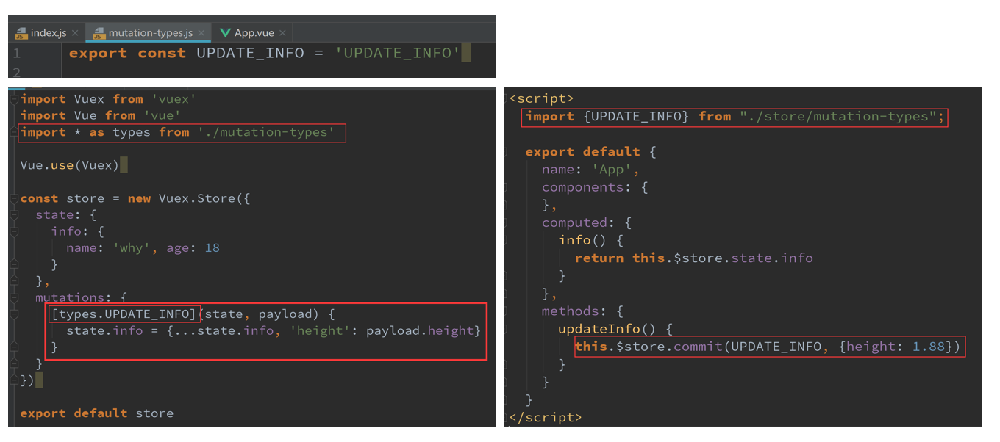

##### Mutation同步函数

- 通常情况下, Vuex要求我们Mutation中的方法必须是同步方法.

  - 主要的原因是当我们使用devtools时, 可以devtools可以帮助我们捕捉mutation的快照.
  - 但是如果是异步操作, 那么devtools将不能很好的追踪这个操作什么时候会被完成.

- 比如我们之前的代码, 当执行更新时, devtools中会有如下信息: 

  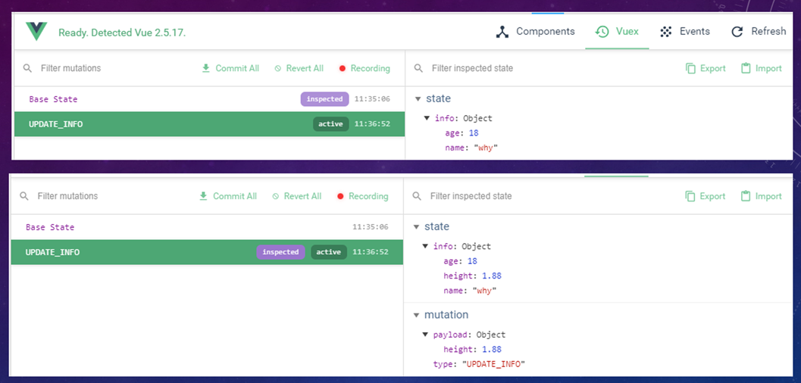

- 但是, 如果Vuex中的代码, 我们使用了异步函数: 

  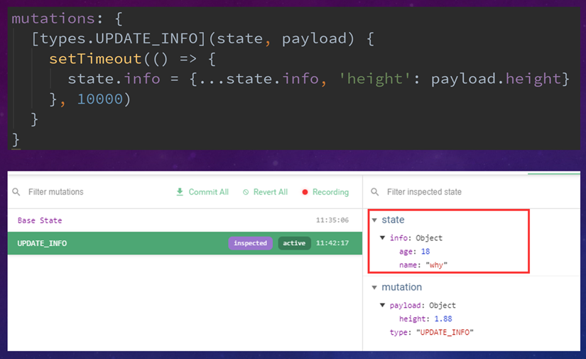

- 你会发现state中的info数据一直没有被改变, 因为他无法追踪到.
- **So, 通常情况下, 不要再mutation中进行异步的操作**

##### Action

###### **基本定义**

- 我们强调, 不要再Mutation中进行异步操作.

  - 但是某些情况, 我们确实希望在Vuex中进行一些异步操作, 比如网络请求, 必然是异步的. 这个时候怎么处理呢?
  - Action类似于Mutation, 但是是用来代替Mutation进行异步操作的.

- Action的基本使用代码如下

  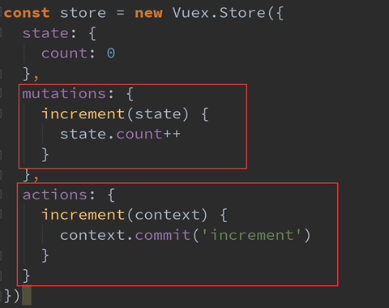

- context是什么?
  - context是和store对象具有相同方法和属性的对象.
  - 也就是说, 我们可以通过context去进行commit相关的操作, 也可以获取context.state等.
  - 但是注意, 这里它们并不是同一个对象, 为什么呢? 我们后面学习Modules的时候, 再具体说.
- 这样的代码是否多此一举呢?
  - 我们定义了actions, 然后又在actions中去进行commit, 这不是~~脱裤放屁~~吗?
  - 事实上并不是这样, 如果在Vuex中有异步操作, 那么我们就可以在actions中完成了.

###### Action的分发

- 在Vue组件中, 如果我们调用action中的方法, 那么就需要使用`dispatch`

```js
methods:{
    increment(){
        this.$store.dispatch('increment')
    }
}
```

- 同样的, 也是支持传递payload

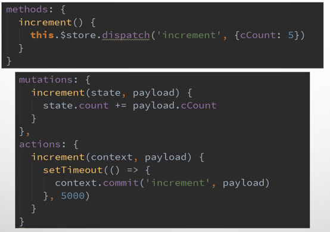

###### Action返回的Promise

我们在学ES6语法的时就知道, Promise经常用于异步操作，在Action中, 我们可以将异步操作放在一个Promise中, 并且在成功或者失败后, 调用对应的resolve或reject.

OK, 我们来看下面的代码:

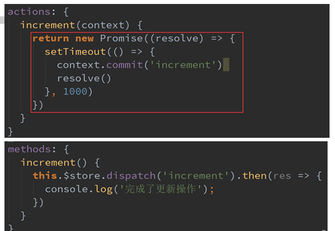

##### Modules模块

概念：就是在store里面分模块，然后在不同的模块里面再定义state，mutations,actions,getters等等

###### 为什么在Vuex中我们要使用模块呢?

- Vue使用单一状态树,那么也意味着很多状态都会交给Vuex来管理.
- 当应用变得非常复杂时,store对象就有可能变得相当臃肿.
- 为了解决这个问题, Vuex允许我们将store分割成模块(Module), 而每个模块拥有自己的state、mutations、actions、getters等

###### 我们按照什么样的方式来组织模块呢? 

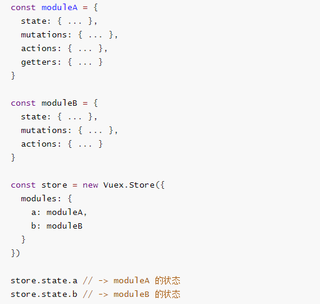


- 上面的代码中, 我们已经有了整体的组织结构, 下面我们来看看具体的局部模块中的代码如何书写.
  - 我们在moduleA中添加state、mutations、getters
  - mutation和getters接收的第一个参数是局部状态对象

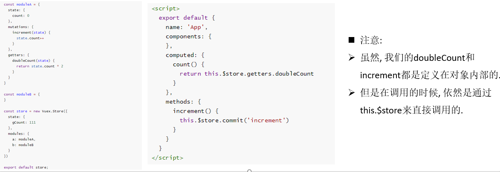

- actions的写法呢? 接收一个context参数对象

  - 局部状态通过 context.state 暴露出来，根节点状态则为 context.rootState

  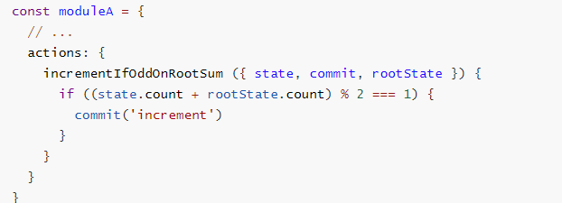

- 如果getters中也需要使用全局的状态, 可以接受更多的参数

  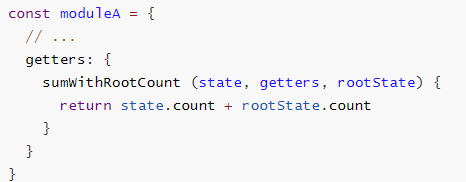


###### 获取不同模块的数据

和写一般的state没有区别，但是注意模块名称。

```html
//是state后面加模块名+数据名，不是模块state再数据名
<h2>{{$store.state.modulesA.name}}</h2>
```

###### 不同模块使用mutation

```js
 modules: {
    modulesA: {
      state: {
        name:'PJ'
      },
      mutations: {
        updteName(state,payload) { 
          state.name = payload;
        }
      },
      actions: {},
      getters:{}
    },

```

- **commit是不关心commit的方法是在哪个模块的（也就是不需要写模块名）**

```js
 modifyname(){
      this.$store.commit('updteName','PJ001')
}
```

###### 不同模块使用mutation

- **同mutation，getters是不关心getters的方法是在哪个模块的（也就是不需要写模块名）**

 

###### 不同模块使用actions处理异步操作

- **同mutation，actions是不关心actions的方法是在哪个模块的（也就是不需要写模块名）**
- 但action内的commit的提交本模块类元素。

##### 项目目录结构

> 当我们的Vuex帮助我们管理过多的内容时, 好的项目结构可以让我们的代码更加清晰.
> 核心思想就是抽离成文件，然后导入该文件，说着容易，但是做起来好像也没那么简单

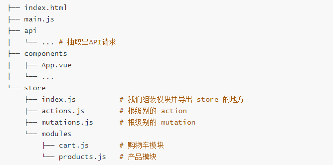