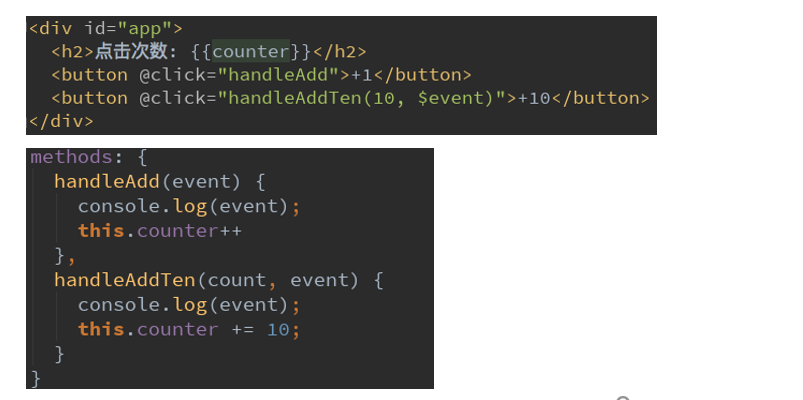
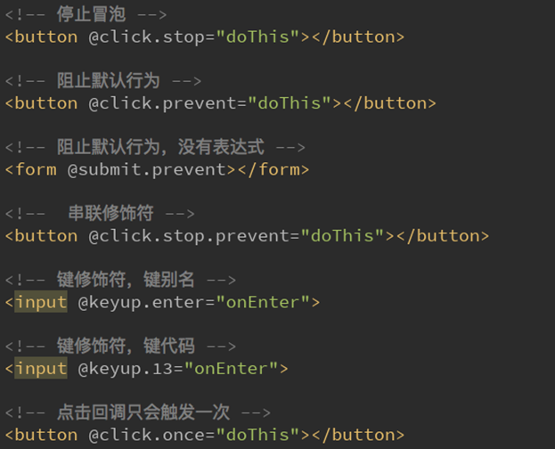

#### 简述

在前端开发中，我们需要经常和用户交互

- 这个时候，我们就必须监听用户发生的事件，比如点击，拖拽，键盘事件等等
- 在Vue中使用v-on监听事件

#### v-on介绍

- 作用：绑定事件监听器
- 缩写：@
- 预期：Function | Inline Statement | Object
- 参数：event

#### 简单使用

```html
/*这里，我们用一个监听按钮的点击事件，来简单看看v-on的使用*/
<div id="app">
  <h2>当前计数器为:{{counter}}</h2>
    
  下面的代码中，我们使用了v-on:click="counter++”
  <button v-on:click="counter++">+</button>
  <button v-on:click="counter--">-</button>
    
  另外，我们可以将事件指向一个在methods中定义的函数
  <button v-on:click="increment">+</button>
  <button v-on:click="decrement">-</button>
    
   v-on也有对应的语法糖：@click
  <button @click="increment">+</button>
  <button @click="decrement">-</button>
</div>
<script>
  const app = new Vue({
    el:"#app",
    data:{
      counter:0
    },
    methods:{
      increment(){
        this.counter++
      },
      decrement(){
        this.counter--
      }
    }
  })
</script>
```

#### v-on参数问题

- 当通过methods中定义方法，以供@click调用时，需要注意参数问题：
- `情况一`：如果该方法不需要额外参数，那么方法后的()可以不添加。
- - 但是注意：如果方法本身中有一个参数，那么会默认将原生事件event参数传递进去
- `情况二`：如果需要同时传入某个参数，`同时需要event时`，可以通过`$event`传入事件。



##### 小案例

```html

<!DOCTYPE html>
<html lang="en">
<head>
  <meta charset="UTF-8">
  <title>Title</title>
</head>
<body>
<script src="https://cdn.jsdelivr.net/npm/vue/dist/vue.js"></script>

<div id="app">
<!--  事件调用的方法没有参数-->
  <button style="color: red" @click="btn1Click()">按钮1-1</button>
  <button style="color: red" @click="btn1Click">按钮1-2</button>
    
<!--  在事件定义时，写函数省略了小括号，凡是方法本身是需要小括号的-->
<!--  这个时候，Vue会默认将浏览器生产的event事件对象作为参数传入到方法-->
  <button style="color: green" @click="btn2Click">按钮2-1</button>
    
<!--  如果函数需要参数，但是没有传入，如果有括号的话，那么函数的形参为underfined-->
  <button style="color: green" @click="btn2Click()">按钮2-2</button>
  <button style="color: green" @click="btn2Click(123)">按钮2-3</button>
    
<!--  定义方法时，我们需要event对象，同时又需要其他参数-->
<!--  在调用方式，如何手动的获取到浏览器参数的event对象:  $event-->
  <button style="color: blue" @click="btn3Click(123,$event)">按钮3</button>
</div>
<script>
  const app = new Vue({
    el:"#app",
    data:{
      message:"Hello Ting,I am Key!"
    },
    methods:{
      btn1Click(){
        console.log("btn1Click");
      },
      btn2Click(event){
        console.log("------------------",event);
      },
      btn3Click(abc,event){
        console.log("++++++++++++++++++",abc, event);
      }
    }
  })
</script>
</body>
</html>

```

#### **v-on**修饰符

- 在某些情况下，我们拿到event的目的可能是进行一些事件处理。
- Vue提供了修饰符来帮助我们方便的处理一些事件：
  - `.stop` - 调用 event.stopPropagation()。`防止冒泡`
  - `.prevent` - 调用 event.preventDefault()。`防止默认行为`
  - .{keyCode | keyAlias} - 只当事件是从特定键触发时才触发回调。
  - .native - 监听组件根元素的原生事件。
  - .once - 只触发一次回调。

##### 简单使用案例

