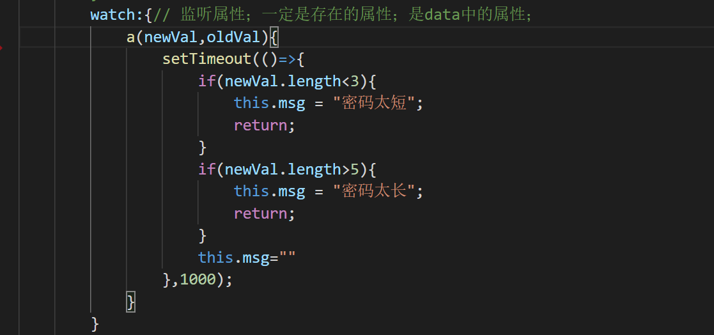

#### **计算属性computed :** 

1. ` 支持缓存`，只有`依赖数据发生改变`，才会重新进行计算
2.  `不支持异步`，当computed内有异步操作时无效，无法监听数据的变化
3. computed 属性值会`默认走缓存`，计算属性是基于它们的响应式依赖进行缓存的，也就是`基于data中`声明过或者`父组件传递的props中的数据`通过计算得到的值
4.  如果一个属性是由其他属性计算而来的，这个属性依赖其他属性，是一个多对一或者一对一，一般用computed
5. 如果computed属性属性值是函数，那么默认会走get方法；函数的`返回值就是属性的属性值`；在computed中的，属性都有一个get和一个set方法，当数据变化时，调用set方法。

#### **侦听属性watch：**

1. `不支持缓存，数据变，直接会触发`相应的操作；

2. `watch支持异步`；

3. 监听的函数接收`两个参数，第一个参数是最新的值；第二个参数是输入之前的值`；

4. 当一个属性发生变化时，需要执行对应的操作；`一对多`；

5. 监听数据必须是data中声明过或者父组件传递过来的props中的数据，当数据变化时，触发其他操作，函数有两个参数，
   1. immediate：组件加载立即触发回调函数执行，
   2. deep: 深度监听，为了发现**对象内部值**的变化，复杂类型的数据时使用，例如数组中的对象内容的改变，注意监听数组的变动不需要这么做。注意：deep无法监听到数组的变动和对象的新增，参考vue数组变异,只有以响应式的方式触发才会被监听到。

监听的对象也可以写成字符串的形式

当需要在数据变化时执行异步或开销较大的操作时，这个方式是最有用的。这是和computed最大的区别。