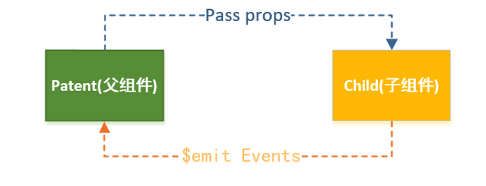

#### 简述

- 我们知道子组件是不能引用父组件或者Vue实例的数据的。
- 但是，在开发中，往往一些数据确实需要从上层传递到下层：
  - 比如在一个页面中，我们从服务器请求到了很多的数据。
  - 其中一部分数据，并非是我们整个页面的大组件来展示的，而是需要下面的子组件进行展示。
  - 这个时候，并不会让子组件再次发送一个网络请求，而是直接让大组件(父组件)将数据传递给小组件(子组件)。
- 如何进行父子组件间的通信呢？Vue官方给出以下方法
  - 通过props向子组件传递数据
  - 通过事件向父组件发送消息



> 真实的开发中，Vue实例和子组件的通信和父组件和子组件的通信过程是一样的。所以在下面的代码中，我直接将Vue实例当做父组件，并且其中包含子组件来简化代码。

#### props数据验证(父传子)

- props可以是一个数组，也可以是对象`(推荐)`
- 当需要对props进行类型验证时，就需要对象写法了
- 对象写法支持类型：String、Number、Boolean、Array、Object、Date、Function、Symbol
  当我们有自定义构造函数时，验证也支持自定义类型

- 在组件中，使用选项props来声明需要从父级接收到的数据。
- props的值有两种方式：
  - 方式一：字符串数组，数组中的字符串就是传递时的名称。
  - 方式二：对象，对象可以设置传递时的类型，也可以设置默认值等。

```html
<div id="app">
  <my_cpn :cmovies="movies" :cmessage="message"></my_cpn>
</div>

<template id="my_cpn">
  <div>
    <ul>
      <li v-for="movie in cmovies">{{movie}}</li>
    </ul>
    <p>{{cmovies}}</p>
    <p>{{cmessage}}</p>
  </div>
</template>
<script src="https://cdn.jsdelivr.net/npm/vue/dist/vue.js"></script>
<script>
  const my_cpn ={
    template:'#my_cpn',
    // 传递数组
    // props:['cmovies','cmessage'],
    // 传递对象，控制传递类型的限制
    // 传递对象，提供一些默认值
    props:{
      // cmovies:Array,
      // cmessage:String,
      cmessage:{
        type: String,     // 限制类型
        default:"full",   // 设置默认值,默认值在没有传值的情况下，会自动显示默认值
        require:false     // 如果为True，那么就是必传值，不传就会报错
      },
      cmovies:{
        type:Array,
          //当为数组对象时，如果 default:[] 报错就用以下方式
        default(){
          return []
        }
      }
    },
    data(){
      return{

      }
    }
  }
  const app = new Vue({
    el:"#app",
    data:{
      message:'hello',
      movies:['海王','海贼王','海尔兄弟'],
    },
    components:{
      my_cpn
    }
  })
</script>

```

----------------------------

#### 自定义事件（子传父）

- props用于父组件向子组件传递数据，还有一种比较常见的事子组件传递数据或事件到父组件中
- 我们需要用自定义事件来完成
- 什么时候需要自定义事件呢？
  - 当子组件需要向父组件传递数据时，就要用到自定义事件
  - v-on不仅仅可以用于监听DOM事件，也可以用于组件间的自定义
- 事件自定义事件的流程：
    - 在子组件中，通过$emit()来监听事件
    - 在父组件中，通过v-on来监听子组件事件
- 简单例子：
    - 我们之前做过两个按钮+1和-1，点击修改counter
    - 我们整个操作的过程还是在子组件中完成，但是之后的展示交给父组件
    - 这样，我们就需要将子组件中的counter，传给父组件的某个属性，比如total
        

```html

<!--1.父组件模板-->
<div id="app">
  <cpn @itemclick="cpnclick"></cpn>
</div>
<!--2.子组件模板-->
<template id="cpn">
  <div>
<!--    创建分类按钮，并监听点击-->
    <button v-for="item in categories" @click="itemclick(item)">
      {{item.name}}
    </button>
  </div>
</template>
<script src="https://cdn.jsdelivr.net/npm/vue/dist/vue.js"></script>
<script>
  // 1.子组件
  const cpn = {
    template: '#cpn',
    data(){
      return{
        categories:[
          {id:'100',name:'热门推荐'},
          {id:'101',name:'手机数码'},
          {id:'102',name:'家用电器'},
          {id:'103',name:'电脑办公'},
        ]
      }
    },
    methods:{
      itemclick(item){
        console.log(item);
        //将item传给父组件，自定义
        //this.$emit('名称'，传送参数）
        this.$emit('itemclick',item)//可以理解触发@itemclick
      }
    }
  }
  //2.父组件
  const app = new Vue({
    el:"#app",
    data:{

    },
    components:{
      cpn
    },
    methods:{
      cpnclick(item){
        console.log('cpnclick',item);
      }
    }
  })
</script>

```

