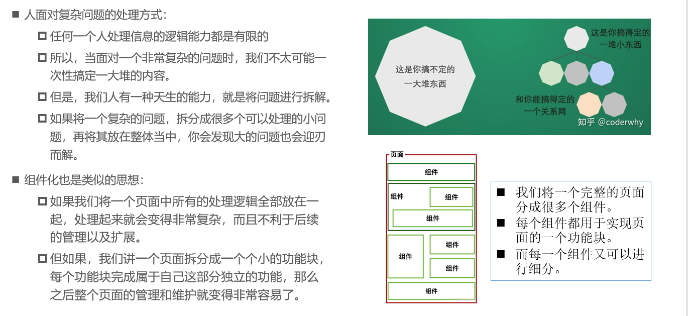
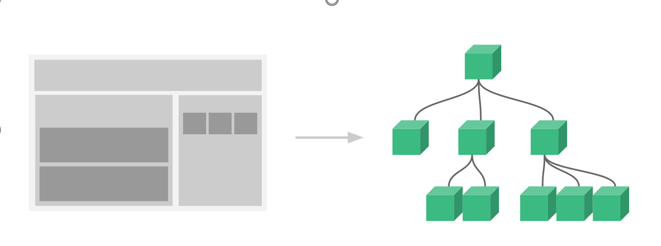
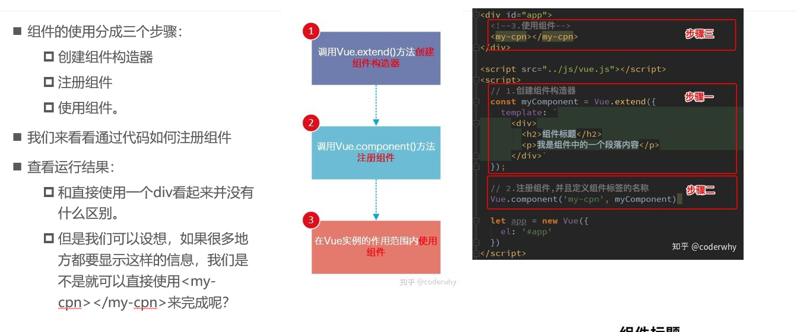
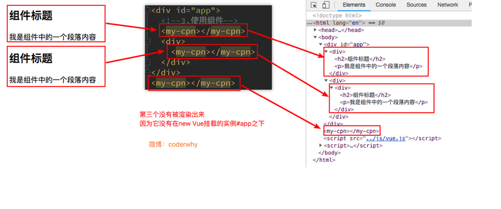

#### **什么是组件化？**



#### 组件化思想

- 组件化是Vue.js中的重要思想
  - 它提供了一种抽象，让我们可以开发出一个个`独立可复用的小组件`来构造我们的应用
  - 任何的应用都会被抽象成一颗组件树



- 组件化思想的应用：
  - 有了组件化的思想，我们在之后的开发中就要充分的利用它。
  - 尽可能的将页面拆分成一个个小的、可复用的组件。
  - 这样让我们的代码更加方便组织和管理，并且扩展性也更强。

#### **注册组件步骤**



#### **注册组件步骤解析**

- ##### 1.Vue.extend()：

  - 调用Vue.extend()创建的是一个组件构造器。 
  - 通常在创建组件构造器时，传入template代表我们自定义组件的模板。
  - 该模板就是在使用到组件的地方，要显示的HTML代码。
  - 事实上，这种写法在Vue2.x的文档中几乎已经看不到了，它会直接使用下面我们会讲到的语法糖，但是在很多资料还是会提到这种方式，而且这种方式是学习后面方式的基础。

- ##### 2.Vue.component()：

  - 调用Vue.component()是将刚才的组件构造器注册为一个组件，并且给它起一个组件的标签名称。
  - 所以需要传递两个参数：1、注册组件的标签名 2、组件构造器

- ##### 3.组件必须挂载在某个Vue实例下

  - 我们来看下面我使用了三次`<my-cpn>`
  - 第三次其实并没有生效,



#### **全局组件和局部组件**

- 当我们通过调用Vue.component()注册组件时，组件的注册是全局的。这意味着该组件可以在任意Vue示例下使用。
- 如果我们注册的组件是挂载在某个实例中, 那么就是一个局部组件

```js
  // 1.创建组件构造器
  const cpnC = Vue.extend({
    template:`
      <div>
        <h3>我是标题</h3>
        <p>我是内容，Blockchain</p>
        <p>我是内容，Key</p>
      </div>
    `
  })
  // 2.注册组件（全局组件，意味着可以在多个Vue实例中使用）
  Vue.component('my_cpn',cpnC)

  const app = new Vue({
    el:"#app",
    data:{

    },
  })

  const app2 = new Vue({
    el:'#app2',
    //局部注册 ，只有app实例用此组件
    components:{
      //cpn 定义标签
      cpn:cpnC
    }
  })


```

#### 父组件和子组件

- 在前面我们看到组件树：
  - 组件和组件之间存在层级关系
  - 而其中一种非常重要的关系就是父子组件的关系
- 父子组件错误用法：以子标签的形式在Vue实例中使用
  - 因为当子组件注册到父组件的components时，Vue会编译好父组件的模块
  - 该模块的内容已经决定了父组件将要渲染的HTML（相当于父组件中已经有了子组件中内容了）
  - 是只能在父组件中被识别的
  - 类似这种用法，是会被浏览器忽略的
    

#### 注册组件的语法糖写法

- 在上面注册组件的方式，可能会有些繁琐。
  - Vue为了简化这个过程，提供了注册的语法糖。
  - 主要是`省去了调用Vue.extend()的步骤`，而是可以直接使用一个对象来代替。

```js
 // 1.全局组件注册的语法糖
  // 1.创建组件构造器
  // 2.注册组件
  // 内部自动调用extend()
  Vue.component('my_cpn',{
    template:`<div>
      <h2>我是标题</h2>
      <p>我是内容，Blockchain</p>
      <p>我是内容，Key</p>
     </div>`
  })

  //构建局部组件的语法糖
  const app = new Vue({
    el:"#app",
    data:{

    },
    components:{
      my_cpn1:{
        template:`<div>
      <h2>我是标题</h2>
      <p>我是内容，Blockchain</p>
      <p>我是内容，Key</p>
     </div>`
      }
    }
  })


```

#### 模板分离

- 刚才，我们通过语法糖简化了Vue组件的注册过程，另外还有一个地方的写法比较麻烦，就是template模块写法。
- 如果我们能将其中的HTML分离出来写，然后挂载到对应的组件上，必然结构会变得非常清晰。
- Vue提供了两种方案来定义HTML模块内容：
  - 使用`<script>`标签
  - 使用`<template>`标签`(推荐)`

```html

<!--    1.script标签抽离,注意类型必须是text/x-template-->
<script type="text/x-template" id="cpn">
  <div>
    <h2>我是标题</h2>
    <p>我是内容，Blockchain</p>
    <p>我是内容，Key</p>
  </div>
</script>
<!--2.template标签抽离-->
<template id="cpn1">
  <div>
    <h2>我是标题</h2>
    <p>我是内容，Blockchain</p>
    <p>我是内容，Key</p>
  </div>
</template>

<script src="https://cdn.jsdelivr.net/npm/vue/dist/vue.js"></script>

<script>
  // 1.注册一个全局组件
  Vue.component('cpn',{
    template:'#cpn'
  })

  Vue.component('cpn1',{
    template:'#cpn1'
  })

  const app = new Vue({
    el:"#app",
    data:{

    }
  })
</script>

```

