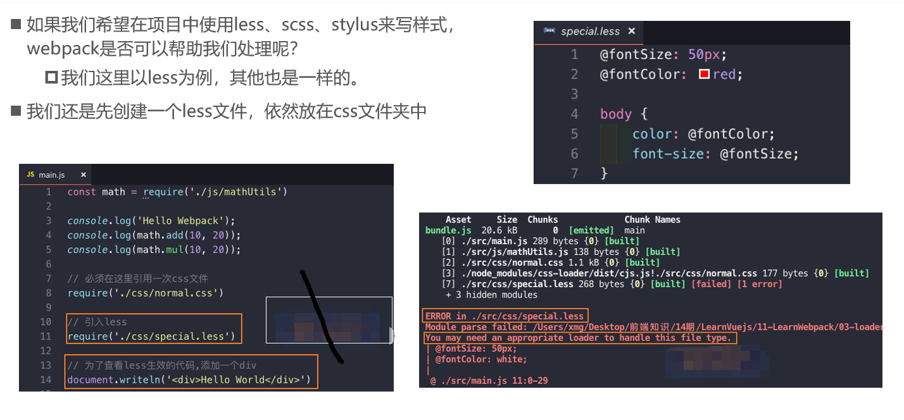

https://webpack.docschina.org/loaders/less-loader/

- 继续在官方中查找，我们会找到less-loader相关的使用说明

- 首先，还是需要安装对应的loader

  - 注意：我们这里还安装了less，因为webpack会使用less对less文件进行编译

  ```
  npm install --save-dev less less-loader
  ```

- 其次，修改对应的配置文件

  - 添加一个rules选项，用于处理.less文件

使用对象（Object）的形式传递 options 给 Less。

```js
module.exports = {
  module: {
    rules: [
      {
        test: /\.less$/i,
        use: [
          {
            loader: "style-loader",
          },
          {
            loader: "css-loader",
          },
          {
            loader: "less-loader",
            options: {
              lessOptions: {
                strictMath: true,
              },
            },
          },
        ],
      },
    ],
  },
};
```

