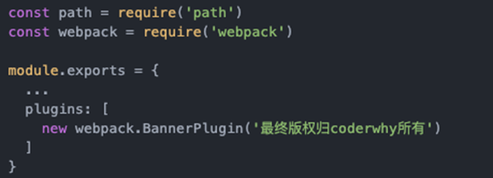
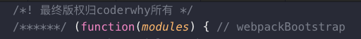
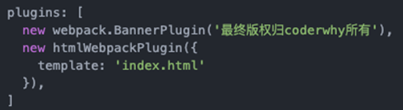

#### plugin是什么？

- plugin是插件的意思，通常是用于对某个现有的架构进行`扩展。`
- webpack中的插件，就是对webpack现有功能的各种扩展，比如打包优化，文件压缩等等。

#### loader和plugin区别

- `loader`主要用于转换某些类型的模块，它是一个`转换器`。
- `plugin是插件`，它是对webpack本身的扩展，是一个`扩展器`。

#### plugin的使用过程：

- 步骤一：通过npm安装需要使用的plugins(某些webpack已经内置的插件不需要安装)

- 步骤二：在webpack.config.js中的plugins中配置插件。

#### 应用

##### 添加版权的plugin

- 我们先来使用一个最简单的插件，为打包的文件添加版权声明
  - 该插件名字叫BannerPlugin，属于webpack自带的插件。
- 按照下面的方式来修改webpack.config.js的文件：



重新打包程序：查看bundle.js文件的头部，看到如下信息




##### 打包html的plugin

- 目前，我们的index.html文件是存放在项目的根目录下的。
  - 我们知道，在真实发布项目时，发布的是dist文件夹中的内容，但是dist文件夹中如果没有index.html文件，那么打包的js等文件也就没有意义了。
  - 所以，我们需要将index.html文件打包到dist文件夹中，这个时候就可以使用HtmlWebpackPlugin插件

- HtmlWebpackPlugin插件可以为我们做这些事情：
  - 自动生成一个index.html文件(可以指定模板来生成)
  - 将打包的js文件，自动通过script标签插入到body中

- 安装HtmlWebpackPlugin插件

  ```
  npm install html-webpack-plugin --save-dev
  ```

- 使用插件，修改webpack.config.js文件中plugins部分的内容如下：
  
  - 这里的template表示根据什么模板来生成index.html
  - 另外，我们需要删除之前在output中添加的publicPath属性
  - 否则插入的script标签中的src可能会有问题




##### js压缩(丑化)的Plugin

- 在项目发布之前，我们必然需要对js等文件进行压缩处理
  - 这里，我们就对打包的js文件进行压缩
  - 我们使用一个第三方的插件uglifyjs-webpack-plugin，并且版本号指定1.1.1，和CLI2保持一致
- 修改webpack.config.js文件，使用插件：

安装依赖:

```
npm install uglifyjs-webpack-plugin@1.1.1 --save-dev
```

webpack.config.js配置

```js
const UglifyWebpackPlugin= require('uglifyjs-webpack-plugin');

plugins: [
    new VueLoaderPlugin(),
    new webpack.BannerPlugin('版权归张三所有'), 
    new HtmlWebpackPlugin({
      template:'index.html'
    }),
    new UglifyWebpackPlugin(),
  ]
  

```

