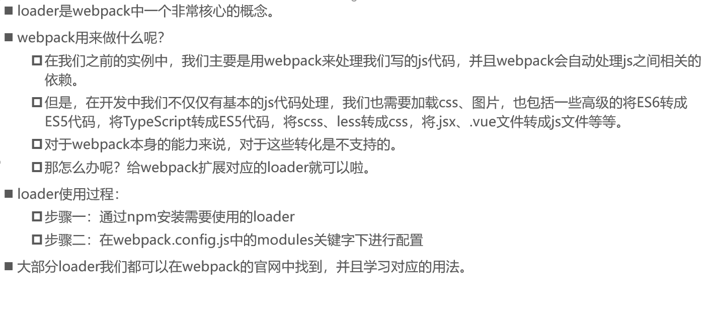
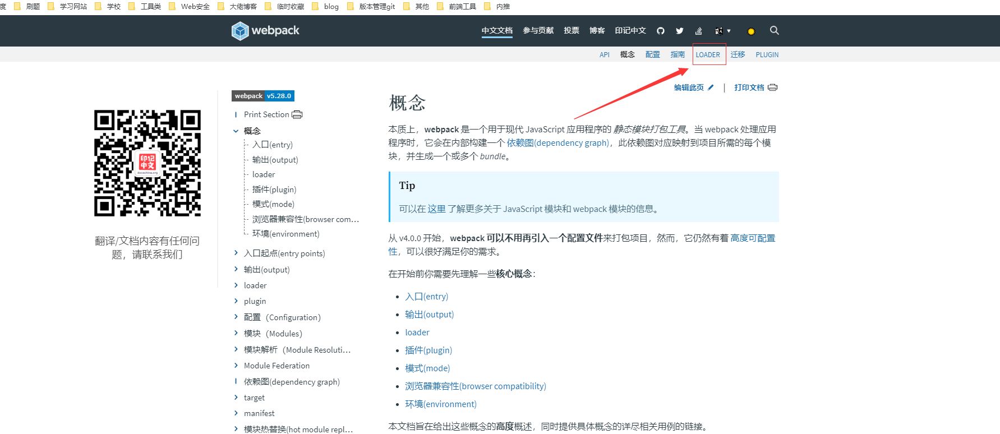
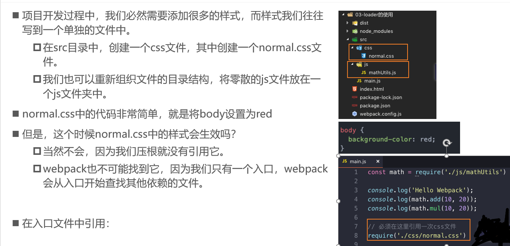
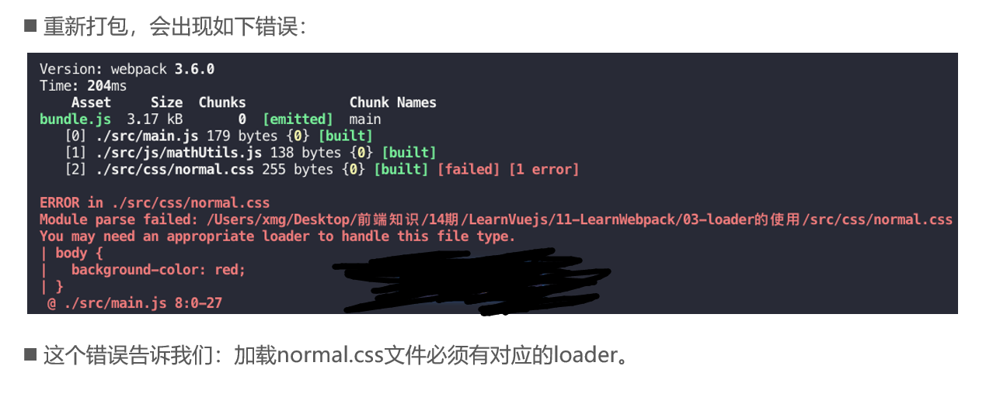
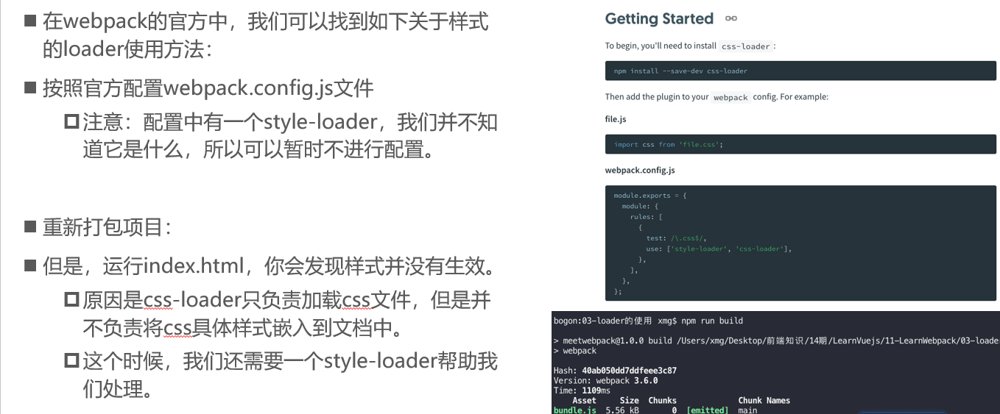

#### 什么是loader？



##### webpack关于loader的文档

https://webpack.docschina.org/loaders/#styling



#### CSS文件处理

##### 准备工作



##### 开始打包




##### css-loader

**作用：**·`载 CSS 文件并解析 import 的 CSS 文件`，最终返回 CSS 代码




```
npm install --save-dev css-loader
```


##### style-loader

**作用**：`将模块导出的内容作为样式并添加到 DOM 中`


