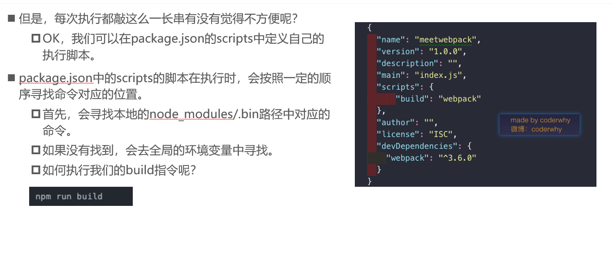

#### **什么是Webpack**？

- 什么是webpack？
  - 这个webpack还真不是一两句话可以说清楚的。
- 我们先看看官方的解释：
  - At its core, webpack is a static module bundler for modern JavaScript applications. 
  - 从本质上来讲，webpack是一个现代的JavaScript应用的`静态模块打包工具`。
- 但是它是什么呢？用概念解释概念，还是不清晰。
  - 我们从两个点来解释上面这句话：`模块 和 打包`


#### 前端模块化


#### 和grunt/gulp的对比


#### webpack安装

- 安装webpack首先需要安装Node.js，Node.js自带了软件包管理工具npm

- 查看自己的node版本

  ```js
  node -v
  ```

- 全局安装webpack(这里我先指定版本号3.6.0，因为vue cli2依赖该版本,-g是全局)

```
npm install webpack@3.6.0 -g
```

- 局部安装webpack

  - --save-dev`是开发时依赖，项目打包后不需要继续使用的。

  ```
  cd 具体目录
  npm install webpack@3.6.0 --save-dev
  ```

- 为什么全局安装后，还需要局部安装呢？

  - 在`终端直接执行webpack命令，使用的全局安装的webpack`
  - 当在package.json中定义了`scripts时，其中包含了webpack命令，那么使用的是局部webpack`


#### 简单使用

##### 准备工作


##### js文件打包


> 打包指令和格式：webpack 原路径 目的路径

##### 使用打包后的文件

- 打包后会在dist文件下，生成一个bundle.js文件
  - 文件内容有些复杂，这里暂时先不看，后续再进行分析。
  - bundle.js文件，是webpack处理了项目直接文件依赖后生成的一个js文件，我们只需要将这个js文件在index.html中引入即可


#### webpack配置

##### 出口和入口

- 我们考虑一下，如果每次使用webpack的命令都需要写上入口和出口作为参数，就非常麻烦，有没有一种方法可以将这两个参数写到配置中，在运行时，直接读取呢？
- 当然可以，就是创建一个webpack.config.js文件


##### 局部安装webpack


##### package.json中定义启动

