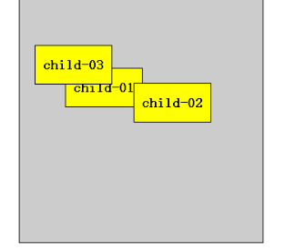

## 定位(position)

### **「1. 定位详解」**

将盒子**「定」**在某一个**「位」**置  自由的漂浮在其他盒子(包括标准流和浮动)的上面。

所以，我们脑海应该有三种布局机制的上下顺序👇👇
标准流在最底层 (海底)  -------   浮动 的盒子 在 中间层  (海面)  -------  定位的盒子 在 最上层  （天空）

**定位**是用来布局的，它有两部分组成：	`定位 = 定位模式 + 边偏移`

在 CSS 中，通过 `top`、`bottom`、`left` 和 `right` 属性定义元素的**「边偏移」**：（方位名词）

| 边偏移属性 | 示例           | 描述                                                         |
| :--------- | :------------- | :----------------------------------------------------------- |
| `top`      | `top: 80px`    | **「顶端」**偏移量，定义元素相对于其父元素**「上边线的距离」**。 |
| `bottom`   | `bottom: 80px` | **「底部」**偏移量，定义元素相对于其父元素**「下边线的距离」**。 |
| `left`     | `left: 80px`   | **「左侧」**偏移量，定义元素相对于其父元素**「左边线的距离」**。 |
| `right`    | `right: 80px`  | **「右侧」**偏移量，定义元素相对于其父元素**「右边线的距离」** |


### **「2. 定位模式(position)」**

在 CSS 中，通过 `position` 属性定义元素的**「定位模式」**，语法如下：

```
选择器 { position: 属性值; }
```

| 值         |       语义       |                                        |
| :--------- | :--------------: | -------------------------------------- |
| `static`   | **「静态」**定位 |                                        |
| `relative` | **「相对」**定位 | 相对于其原文档流的位置进行定位         |
| `absolute` | **「绝对」**定位 | 相对于其上一个已经定位的父元素进行定位 |
| `fixed`    | **「固定」**定位 | 相对于浏览器窗口进行定位               |

### **「3. 静态定位(static)」**

- 静态定位是元素的默认定位方式，无定位的意思。它相当于border里面的none，不要定位的时候用。
- 静态定位 按照标准流特性摆放位置。它没有边偏移。
- 静态定位在布局时几乎不用

### **「4. 相对定位(relative)」**

- 相对定位是元素相对于它原来在标准流中的位置来说的。
- `相对于自己原来在标准流中位置`来移动的
- 原来在`标准流的区域继续占有`，后面的盒子仍然以标准流的方式对待它。

### **「5. 绝对定位(absolute)」**

绝对定位是将元素依据最近的已经定位（绝对、固定或相对定位）的父元素（祖先）进行定位。 

- `完全脱标--完全不占位置`；
- 父元素没有定位，则以`浏览器为准定位`(Document文档)。
- 父元素有定位.`定位口诀--子绝父相`

#### 子绝父相

这个“子绝父相”太重要了，是我们学习定位的口诀，时时刻刻记住的。这句话的意思是 子级是绝对定位的话， 父级要用相对定位。

首先， 我们说下， 绝对定位是将元素依据最近的已经定位绝对、固定或相对定位）的父元素（祖先）进行定位。

就是说， 子级是绝对定位，父亲只要是定位即可（不管父亲是绝对定位还是相对定位，甚至是固定定位都可以），就是说， 子绝父绝，子绝父相都是正确的。

但是，在我们网页布局的时候， 最常说的 子绝父相是怎么来的呢？ 请看如下图：


所以，我们可以得出如下结论：

因为子级是绝对定位，不会占有位置， 可以放到父盒子里面的任何一个地方。

`父盒子布局时，需要占有位置，因此父亲只能是 相对定位`. 

这就是子绝父相的由来。

### **「6. 固定定位(fixed)」**

固定定位是绝对定位的一种特殊形式;

- `完全脱标--完全不占位置`；

- 只认**浏览器的可视窗口**--浏览器可视窗口+边偏移属性来设置元素的位置

- - 跟父元素没有任何关系；单独使用
  - 不随滚动条滚动

## 定位(position)的扩展


#### 绝对定位的盒子居中

绝对定位/固定定位的盒子不能通过设置margin: auto设置水平居中 在使用绝对定位时要向实现水平居中，可以按照下面的方法：

1. left : 50%:让盒子的左侧移动到父级元素的水平中心位置；
2. margin-left: -100px;让盒子向左移动自身宽度的一半。
3. 同理垂直居中。


#### 堆叠顺序（z-index）

在使用**「定位」**布局时，可能会**「出现盒子重叠的情况」**。

加了定位的盒子，默认**「后来者居上」**， 后面的盒子会压住前面的盒子。

应用 `z-index` 层叠等级属性可以**「调整盒子的堆叠顺序」**。如下图所示：



z-index的特性如下:

1. **属性值**：正整数、负整数或 0，默认值是 0，数值越大，盒子越靠上；
2. 如果属性值相同，则按照书写顺序，`后来居上`；
3. 数字后面不能加单位
4. z-index只能用于相对定位、绝对定位和固定定位的元素，其他标准流、浮动和静态定位无效。

#### 定位改变display属性

前面提过， display 是 显示模式， 可以通过以下方式改变显示模式:

- 可以用inline-block  转换为行内块
- 可以用浮动 float 默认转换为行内块（`类似，并不完全一样，因为浮动是脱标的`）
- 绝对定位和固定定位也和浮动类似， 默认转换的特性`转换为行内块`。

所以说， 一个行内的盒子，如果加了**「浮动」**、**「固定定位」**和**「绝对定位」**，不用转换，就可以给这个盒子直接设置宽度和高度等。

#### 定位小结

| 定位模式         | 是否脱标占有位置     | 移动位置基准           | 模式转换（行内块） | 使用情况                 |
| :--------------- | :------------------- | :--------------------- | :----------------- | :----------------------- |
| 静态static       | 不脱标，正常模式     | 正常模式               | 不能               | 几乎不用                 |
| 相对定位relative | 不脱标，占有位置     | 相对自身位置移动       | 不能               | 基本单独使用             |
| 绝对定位absolute | 完全脱标，不占有位置 | 相对于定位父级移动位置 | 能                 | 要和定位父级元素搭配使用 |
| 固定定位fixed    | 完全脱标，不占有位置 | 相对于浏览器移动位置   | 能                 | 单独使用，不需要父级     |

**注意：**

1. `边偏移` 需要和 `定位模式` 联合使用，`单独使用无效`；
2. `top` 和 `bottom` 不要同时使用；
3. `left` 和 `right` 不要同时使用。

## 元素的显示与隐藏

在CSS中有三个显示和隐藏的单词比较常见，我们要区分开，他们分别是 `display visibility 和 overflow。`

他们的主要目的是让一个元素在页面中消失，但是不在文档源码中删除。 最常见的是网站广告，当我们点击类似关闭不见了，但是我们重新刷新页面，它们又会出现和你玩躲猫猫！！

### display 显示

display 设置或检索对象是否及如何显示。

display : none 隐藏对象 与它相反的是 display:block 除了转换为块级元素之外，同时还有显示元素的意思。

特点：**`隐藏之后，不再保留位置`**。

### visibility 可见性

设置或检索是否显示对象。

visible : 　对象可视

hidden : 　对象隐藏

特点： **`隐藏之后，继续保留原有位置`**。（停职留薪）

### overflow 溢出

检索或设置当对象的内容超过其指定高度及宽度时如何管理内容。

visible : 　不剪切内容也不添加滚动条。

auto : 　 超出自动显示滚动条，不超出不显示滚动条

hidden : 　不显示超过对象尺寸的内容，超出的部分隐藏掉

scroll : 　不管超出内容否，总是显示滚动条