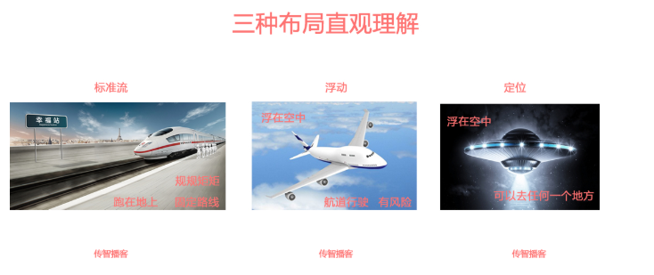
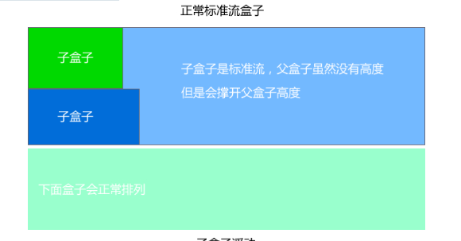

## 浮动

### 浮动

**「1. CSS布局的三种机制」**

> 网页布局的核心——就是**用CSS来摆放盒子**。

CSS 提供了3种机制来设置盒子的摆放位置，分别是`普通流（标准流）、浮动和定位`，其中：

**A. 普通流（标准流）**

- 块级元素会独占一行，从上向下顺序排列；

- - 常用元素：div、hr、p、h1~h6、ul、ol、dl、form、table

- 行内元素会按照顺序，从左到右顺序排列，碰到父元素边缘则自动换行；

- - 常用元素：span、a、i、em等

**B. 浮动**

- 让盒子从普通流中浮起来,主要作用让多个`块级盒子一行显示`。

**C. 定位**

- 将盒子定在浏览器的某一个位置——CSS 离不开定位，特别是后面的 js 特效。

**「2. 什么是浮动」**元素的浮动是指设置了浮动属性的元素会

- 脱离标准普通流的控制,不占位置，脱标
- 移动到指定位置。



##### 什么是浮动？

元素的浮动是指设置了浮动属性的元素会`脱离标准普通流的控制`，移动到其父元素中指定位置的过程。

##### 作用

1. 让`多个盒子(div)水平排列成一行`，使得浮动称为布局的重要手段。
2. 可以实现盒子的左右对齐等等。
3. 浮动最早是用来控制图片，实现文字环绕图片效果。
4. float属性会改变元素的display属性，任何元素都可以浮动。`浮动元素会生成一个块级框`，而不论它本身是何种元素。生成的块级框和我们前面的行内块极其相似。

##### 语法

```
选择器 { float: 属性值; }
```

| 属性值 | 描述                 |
| :----- | :------------------- |
| none   | 元素不浮动（默认值） |
| left   | 元素向左浮动         |
| right  | 元素向右浮动         |


> 浮动`只会影响当前的或者是后面的标准流盒子`，`不会影响前面的标准流`。
> **建议:**如果一个盒子里面有多个子盒子，如果其中一个盒子浮动了，其他兄弟也应该浮动。防止引起问题

##### 浮动详细内幕特性

浮动首先创建包含块的概念（包裹）。就是说， 浮动的元素总是找理它最近的父级元素对齐。但是不会超出内边距的范围。 


   

浮动的元素排列位置，跟上一个元素（块级）有关系。如果上一个元素有浮动，则A元素顶部会和上一个元素的顶部对齐；如果上一个元素是标准流，则A元素的顶部会和上一个元素的底部对齐。  


由2可以推断出，一个父盒子里面的子盒子，如果其中一个子级有浮动的，则其他子级都需要浮动。这样才能一行对齐显示。

浮动脱离标准流，不占位置，会影响标准流。浮动只有左右浮动。

元素添加浮动后，元素会具有行内块元素的特性。元素的大小完全取决于定义的大小或者默认的内容多少

浮动根据元素书写的位置来显示相应的浮动。

**浮动(float)小结**

| 特点 | 说明                                                         |
| :--- | :----------------------------------------------------------- |
| 浮   | 加了浮动的盒子**「是浮起来」**的，漂浮在其他标准流盒子的上面。 |
| 漏   | 加了浮动的盒子**「是不占位置的」**，它原来的位置**「漏给了标准流的盒子」**。 |
| 特   | **「特别注意」**：浮动元素会改变display属性， 类似转换为了行内块，但是元素之间没有空白缝隙 |

---------------

### 清除浮动

因为父级盒子很多情况下，不方便给高度，但是`子盒子浮动就不占有位置，最后父级盒子高度为0`，就影响了下面的标准流盒子。

**总结：**

- 由于浮动元素不再占用原文档流的位置，所以它会对后面的元素排版产生影响
- 准确地说，并不是清除浮动，而是清除浮动后造成的影响

**清除浮动本质**:清除浮动主要为了解决`父级元素因为子级浮动引起内部高度为0 `的问题。清除浮动之后， 父级就会根据浮动的子盒子自动检测高度。父级有了高度，就不会影响下面的标准流了




#### 清除浮动的方法

```css
选择器 { clear: 属性值; }   clear 清除  
```

| 属性值 | 描述                                       |
| :----- | :----------------------------------------- |
| left   | 不允许左侧有浮动元素（清除左侧浮动的影响） |
| right  | 不允许右侧有浮动元素（清除右侧浮动的影响） |
| both   | 同时清除左右两侧浮动的影响                 |

实际工作中,几乎只用clear: both

**1).额外标签法(隔墙法)**

是W3C推荐的做法是通过在浮动元素末尾添加一个空的标签例如 `<div style="clear:both"></div>`，或则其他标签br等亦可。

- 优点：通俗易懂，书写方便
- 缺点：添加许多无意义的标签，结构化较差。

**2).父级添加overflow属性方法**

```css
可以给父级添加： overflow为 hidden| auto| scroll  都可以实现。
```

- 优点： 代码简洁
- 缺点： 内容增多时候容易造成不会自动换行导致内容被隐藏掉，无法显示需要溢出的元素。

**3).使用after伪元素清除浮动**:after 方式为空元素额外标签法的升级版，好处是不用单独加标签了

```css
    .clearfix:after {
        content: "";
        display: block;
        height: 0;
        clear: both;
        visibility: hidden;
    }
  
    /* IE6、7 专有 */
    .clearfix {
        *zoom: 1;
    }
        
```

- 优点：符合闭合浮动思想  结构语义化正确
- 缺点：由于IE6-7不支持:after，使用 zoom:1触发 hasLayout。

**4).使用双伪元素清除浮动**

```css
    .clearfix:before,
    .clearfix:after {
        content: "";
        display: table;
    }

    .clearfix:after {
        clear: both;
    }

    .clearfix {
       *zoom: 1;
    }
```

- 优点： 代码更简洁
- 缺点： 由于IE6-7不支持:after，使用 zoom:1触发 hasLayout。

#### 清除浮动总结

```
什么时候用清除浮动呢？
```

1. 父级没高度
2. 子盒子浮动了
3. 影响下面布局了，我们就应该清除浮动了。


| 清除浮动的方式       | 优点               | 缺点                               |
| :------------------- | :----------------- | :--------------------------------- |
| 额外标签法（隔墙法） | 通俗易懂，书写方便 | 添加许多无意义的标签，结构化较差。 |
| 父级overflow:hidden; | 书写简单           | 溢出隐藏                           |
| 父级after伪元素      | 结构语义化正确     | 由于IE6-7不支持:after，兼容性问题  |
| 父级双伪元素         | 结构语义化正确     | 由于IE6-7不支持:after，兼容性问题  |

### CSS属性书写顺序

建议遵循以下顺序：

1. 布局定位属性：display / position / float / clear / visibility / overflow（建议 display 第一个写，毕竟关系到模式）
2. 自身属性：width / height / margin / padding / border / background
3. 文本属性：color / font / text-decoration / text-align / vertical-align / white- space / break-word
4. 其他属性（CSS3）：content / cursor / border-radius / box-shadow / text-shadow / background:linear-gradient …

```css
.jdc {
    display: block;
    position: relative;
    float: left;
    width: 100px;
    height: 100px;
    margin: 0 10px;
    padding: 20px 0;
    font-family: Arial, 'Helvetica Neue', Helvetica, sans-serif;
    color: #333;
    background: rgba(0,0,0,.5);
    -webkit-border-radius: 10px;
    -moz-border-radius: 10px;
    -o-border-radius: 10px;
    -ms-border-radius: 10px;
    border-radius: 10px;
}
```


## 