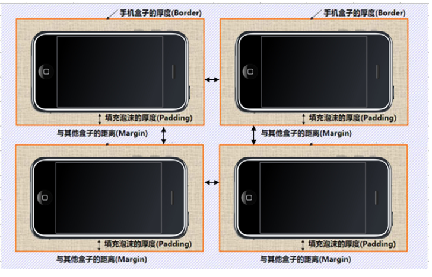
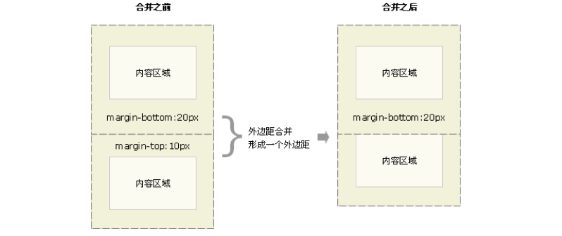
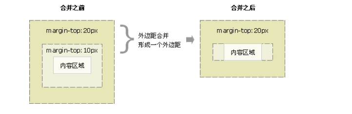

## 前言

> 其实，CSS就三个大模块：  `盒子模型 、 浮动 、 定位`，其余的都是细节。这三部分，`无论如何也要学的非常精通。  
>
> 所谓盒子模型就是把HTML页面中的元素看作是一个矩形的盒子，也就是一个盛装内容的容器。
>
> 每个矩形都由元素的`内容(content)、内边距（padding）、边框（border）和外边距（margin）`组成。


## 盒子模型

css学习三大重点： css 盒子模型 、 浮动 、 定位  

**网页布局的本质**

- 首先利用CSS设置好盒子的大小，然后摆放盒子的位置。
- 最后把网页元素比如文字图片等等，放入盒子里面。

### 1. 盒子模型(Box Model)

- 盒子模型就是把HTML页面中的布局元素看作是一个矩形的盒子，也就是一个盛装内容的容器。
- 盒子模型由`元素的内容、边框（border）、内边距（padding）、和外边距（margin）`组成。
- 盒子里面的文字和图片等元素是 内容区域
- 盒子的`厚度` 我们称为为盒子的`边框`
- 盒子内容与边框的距离是内边距
- 盒子与盒子之间的距离是外边距

所有的文档元素（标签）都会生成一个矩形框，我们成为元素框（element box），它描述了一个文档元素再网页布局汇总所占的位置大小。因此，<strong style="color: #f00;">每个盒子除了有自己大小和位置外，还影响着其他盒子的大小和位置。</strong>



**W3c标准盒子模型**

标准 w3c 盒子模型的范围包括` margin、border、padding、content`

当设置为box-sizing: content-box;时，将采用标准模式解析计算，也是默认模式；

```
内盒尺寸计算(元素实际大小)
```

- `宽度：Element Height = content height + padding + border （Height为内容高度）`
- `高度：Element  Width = content width + padding + border （Width为内容宽度）`
- 盒子的实际大小：**内容的宽度和高度 +  内边距  +  边框  **

注意：

1、宽度属性width和高度属性height仅适用于块级元素，对行内元素无效（ img 标签和 input除外）。

2、计算盒子模型的总高度时，还应考虑上下两个盒子垂直外边距合并的情况。

3、**如果一个盒子没有给定宽度/高度或者继承父亲的宽度/高度，则padding 不会影响本盒子大小**。


IE 盒子模型的 content 部分包含了 border 和 pading

当设置为box-sizing: border-box时，将采用怪异模式解析计算；

### 2. 盒子边框(border)

| 属性         |          作用          |
| :----------- | :--------------------: |
| border-width | 定义边框粗细，单位是px |
| border-style |       边框的样式       |
| border-color |        边框颜色        |

**边框的样式：**

- none：没有边框即忽略所有边框的宽度（默认值）
- solid：边框为单实线(最为常用的)
- dashed：边框为虚线
- dotted：边框为点线

```css
边框综合设置
border : border-width || border-style || border-color 

border: 1px solid red;  没有顺序要求  
```

**盒子边框写法总结表：**

很多情况下，我们不需要指定4个边框，我们是可以单独给4个边框分别指定的。

| 上边框                     | 下边框                        | 左边框                      | 右边框                       |
| :------------------------- | :---------------------------- | :-------------------------- | :--------------------------- |
| border-top-style:样式;     | border-bottom-style:样式;     | border-left-style:样式;     | border-right-style:样式;     |
| border-top-width:宽度;     | border- bottom-width:宽度;    | border-left-width:宽度;     | border-right-width:宽度;     |
| border-top-color:颜色;     | border- bottom-color:颜色;    | border-left-color:颜色;     | border-right-color:颜色;     |
| border-top:宽度 样式 颜色; | border-bottom:宽度 样式 颜色; | border-left:宽度 样式 颜色; | border-right:宽度 样式 颜色; |

**表格的细线边框：**

- 通过表格的`cellspacing="0"`,将单元格与单元格之间的距离设置为0，

- 但是两个单元格之间的边框会`出现重叠，从而使边框变粗`

- 通过css属性：table{ border-collapse:collapse; }  

- - `collapse` 单词是合并的意思,`border-collapse: collapse;`表示相邻边框合并在一起。

```css
<style>
 table {
  width: 500px;
  height: 300px;
  border: 1px solid red;
 }
 td {
  border: 1px solid red;
  text-align: center;
 }
 table, td {
  border-collapse: collapse;  /*合并相邻边框*/
 }
</style>
```

### 2. 内边距(padding)

padding属性用于设置内边距。是指`边框与内容之间的距离。`

**设置**

| 属性           | 作用     |
| :------------- | :------- |
| padding-left   | 左内边距 |
| padding-right  | 右内边距 |
| padding-top    | 上内边距 |
| padding-bottom | 下内边距 |

**padding简写**

| 值的个数 | 表达意思                                        |
| :------- | :---------------------------------------------- |
| 1个值    | padding：上下左右内边距;                        |
| 2个值    | padding: 上下内边距   左右内边距 ；             |
| 3个值    | padding：上内边距  左右内边距  下内边距；       |
| 4个值    | padding: 上内边距 右内边距 下内边距 左内边距 ； |

当我们给盒子指定padding值之后， 发生了2件事情：

1. 内容和边框 有了距离，添加了内边距。
2. `盒子会变大`

**解决措施：**通过给设置了宽高的盒子，减去相应的内边距的值，维持盒子原有的大小。

**padding不影响盒子大小情况：👉**如果没有给一个盒子指定宽度， 此时，如果给这个盒子指定padding， 则不会撑开盒子。

### 3. 外边距（margin）

margin属性用于设置外边距。margin就是控制`盒子和盒子之间的距离`

**设置**

| 属性          | 作用     |
| :------------ | :------- |
| margin-left   | 左外边距 |
| margin-right  | 右外边距 |
| margin-top    | 上外边距 |
| margin-bottom | 下外边距 |

margin值的简写 （复合写法）代表意思  跟 padding 完全相同。

**块级盒子水平居中**

- 盒子必须指定宽度（width）
- 然后就给左右的外边距都设置为auto

实际工作中常用这种方式进行网页布局，示例代码如下：

```css
.header  { width: 960px; margin: 0 auto;}
```

常见的写法，以下三种都可以👇👇。

- margin-left: auto;  margin-right: auto;
- margin: auto;
- margin: 0 auto;

**文字居中和盒子居中区别👇👇**

1. 盒子内的文字水平居中是 text-align: center; 而且还可以让 行内元素和行内块居中对齐
2. 块级盒子水平居中  左右margin 改为 auto

**插入图片和背景图片区别👇👇**

1. `插入图片`我们用的最多 比如产品展示类  移动位置只能靠盒模型 padding margin
2. `背景图片`我们一般用于小图标背景或者超大背景图片、背景图片，移动位置只能通过  background-position

**清除元素的默认内外边距👇👇**

- `行内元素为了照顾兼容性,尽量只设置左右内外边距，不要设置上下内外边距。`

```css
* {
   padding:0;         /* 清除内边距 */
   margin:0;          /* 清除外边距 */
}
```

### 4.外边距合并

使用margin定义块元素的**「垂直外边距」**时，可能会出现外边距的合并。



#### (1). 相邻块元素垂直外边距的合并

- 当上下相邻的两个块元素相遇时，如果上面的元素有下外边距margin-bottom
- 下面的元素有上外边距margin-top，则他们之间的垂直间距不是margin-bottom与margin-top之和
- **「取两个值中的较大者」**这种现象被称为相邻块元素垂直外边距的合并（也称外边距塌陷）。

**「解决方案：尽量给只给一个盒子添加margin值」**。



#### (2). 嵌套块元素垂直外边距的合并（塌陷）

- 对于两个嵌套关系的块元素，如果父元素没有上内边距及边框
- 父元素的上外边距会与子元素的上外边距发生合并
- 合并后的外边距为两者中的较大者

**「解决方案：」**

1. 可以为父元素定义上边框或者上内边距
2. 可以为`父元素添加overflow: hidden。`

还有其他方法，比如浮动、固定、绝对定位的盒子不会有问题，后面咱们再总结。。。

#### 盒子模型布局稳定性

优先使用  宽度 （width）  其次 使用内边距（padding）   再次  外边距（margin）

```
width >  padding  >   margin   
```

**原因：**

- margin 会有外边距合并 还有 ie6下面margin 加倍的bug（讨厌）所以最后使用。
- padding  会影响盒子大小， 需要进行加减计算（麻烦） 其次使用。
- width  没有问题（嗨皮）我们经常使用宽度剩余法 高度剩余法来做。

## CSS3 新增

### 圆角边框

```css
border-radius:length;
border-top-left-radius   定义了左上角的弧度
border-top-right-radius   定义了右上角的弧度
border-bottom-right-radius   定义了右下角的弧度
border-bottom-left-radius   定义了左下角的弧度
```

- 其中每一个值可以为 数值或百分比的形式。
- 技巧：让一个正方形 变成圆圈

```css
border-radius: 50%;
```

如果要在四个角上一一指定，可以使用以下规则👇👇：

```css
border-radius: 左上角 右上角  右下角  左下角;
```

1. 四个值: 第一个值为左上角，第二个值为右上角，第三个值为右下角，第四个值为左下角。
2. 三个值: 第一个值为左上角, 第二个值为右上角和左下角，第三个值为右下角
3. 两个值: 第一个值为左上角与右下角，第二个值为右上角与左下角
4. 一个值：四个圆角值相同

### 盒子阴影

```css
盒子阴影(box-shadow)：
box-shadow: offset-x offset-y [blur [spread]] [color] [inset]
box-shadow:水平阴影 垂直阴影 模糊距离 阴影尺寸（影子大小） 阴影颜色  内/外阴影；
```

| 值       | 描述                                           |
| :------- | :--------------------------------------------- |
| offset-x | 阴影的水平偏移量。正数向右偏移，负数向左偏移。 |
| offset-y | 阴影的垂直偏移量。正数向下偏移，负数向上偏移。 |
| blur     | 可选。阴影模糊距离，不能取负数。               |
| spread   | 可选。阴影大小                                 |
| color    | 可选。阴影的颜色                               |
| inset    | 可选。表示添加内阴影，默认为外阴影             |

1. 前两个属性是必须写的。其余的可以省略。
2. `外阴影 (outset) 不能写出来，是默认的`，写出来之后会报错。想要内阴影就写inset

```css

div {
   width: 200px;
   height: 200px;
   border: 10px solid red;
   /* box-shadow: 5px 5px 3px 4px rgba(0, 0, 0, .4);  */
   /* box-shadow:水平位置 垂直位置 模糊距离 阴影尺寸（影子大小） 阴影颜色  内/外阴影； */
   box-shadow: 0 15px 30px  rgba(0, 0, 0, .4);   
}
```


### 
