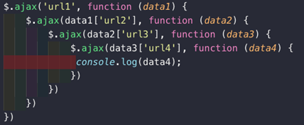
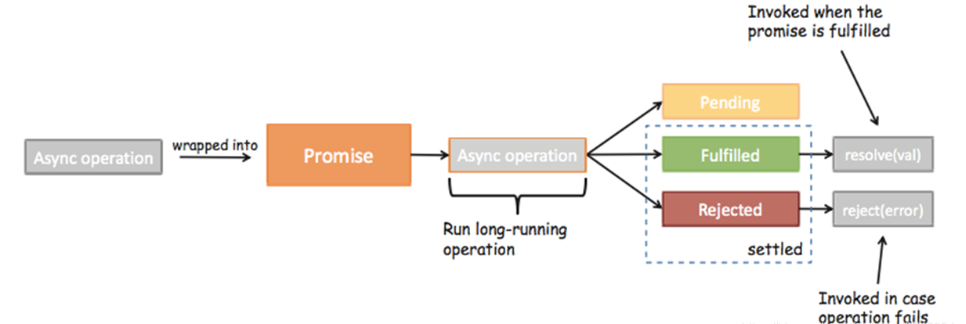
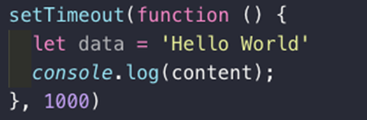
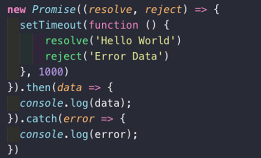
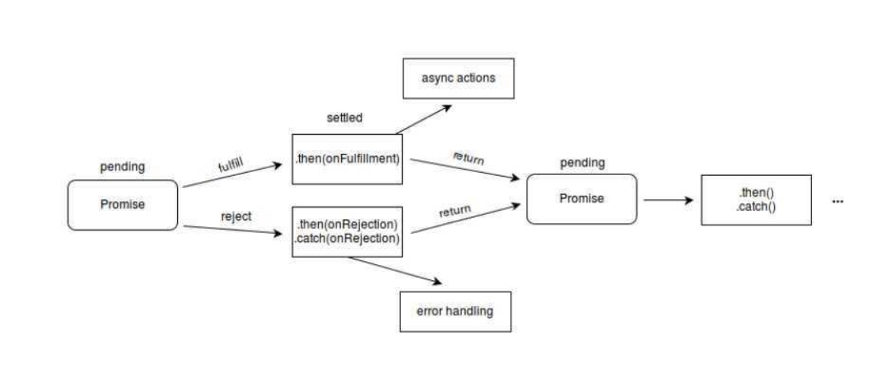
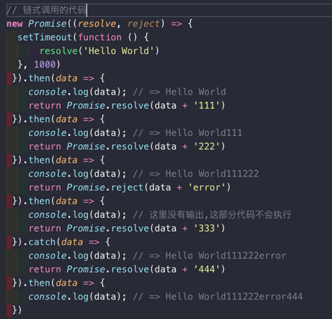
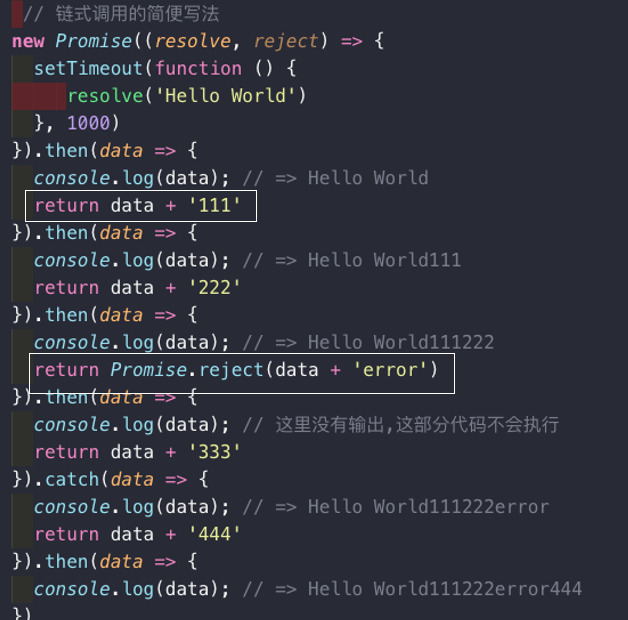

#### **什么是**Promise呢？

- ES6中一个非常重要和好用的特性就是Promise
  - 但是初次接触Promise会一脸懵逼，这TM是什么东西？
  - 看看官方或者一些文章对它的介绍和用法，也是一头雾水。
- Promise到底是做什么的呢？
  - `Promise是异步编程的一种解决方案。`
- 那什么时候我们会来处理异步事件呢？
  - 一种很常见的场景应该就是网络请求了。
  - 我们封装一个网络请求的函数，因为不能立即拿到结果，所以不能像简单的3+4=7一样将结果返回。
  - 所以往往我们会传入另外一个函数，在数据请求成功时，将数据通过传入的函数回调出去。
  - 如果只是一个简单的网络请求，那么这种方案不会给我们带来很大的麻烦。
- 但是，当网络请求非常复杂时，就会出现回调地狱。
  - OK，我以一个非常夸张的案例来说明。

#### **网络请求的回调地狱**

- 我们来考虑下面的场景(有夸张的成分)：
  - 我们需要通过一个url1从服务器加载一个数据data1，data1中包含了下一个请求的url2
  - 我们需要通过data1取出url2，从服务器加载数据data2，data2中包含了下一个请求的url3
  - 我们需要通过data2取出url3，从服务器加载数据data3，data3中包含了下一个请求的url4
  - 发送网络请求url4，获取最终的数据data4



分析：上面的代码有什么问题吗？正常情况下，不会有什么问题，可以正常运行并且获取我们想要的结果。但是，这样的`代码难看`而且`不容易维护`。我们更加期望的是一种更加`优雅的方式`来进行这种异步操作。Promise可以以一种非常优雅的方式来解决这个问题。

#### 什么情况下会用到Promise


- 一般情况下有`异步操作`时，使用promise`对异步操作进行封装`
- 执行传入的回调函数时，会传入两个参数，resolve，reject本身又是函数
- Promise将网络请求和处理代码分离


#### Promise的三种状态

异步操作之后会有三种状态

- pending：等待状态，如正在进行网络请求，或者定时器还没到点
- fulfill：满足状态，当主动回调了resolve时，就处于该状态，并且会回调.then（）
- reject：拒绝状态，当我们主动回调了reject时，就处于该状态，并且会回调catch（）
  

#### Promise的基本使用

- 我们先来看看Promise最基本的语法。

- 这里，我们用一个定时器来模拟异步事件：
  - 假设下面的data是从网络上1秒后请求的数据
  - console.log就是我们的处理方式。
  



- 上面我们过去的处理方式，我们将它换成Promise代码
  
  
  
- 这个例子会让我们感觉脱裤放屁，多此一举
  
  - 首先，下面的Promise代码明显比上面的代码看起来还要复杂。
  - 其次，下面的Promise代码中包含的resolve、reject、then、catch都是些什么东西？
  
- 我们先不管第一个复杂度的问题，因为这样的一个屁大点的程序根本看不出来Promise真正的作用。

##### 分析

我们先来认认真真的读一读这个程序到底做了什么？

- new Promise很明显是创建一个Promise对象
- 小括号中((resolve, reject) => {})也很明显就是一个函数，而且我们这里用的是之前刚刚学习过的箭头函数。
  - 但是resolve, reject它们是什么呢？
  - 我们先知道一个事实：在创建Promise时，传入的这个箭头函数是固定的（一般我们都会这样写）
  - `resolve和reject它们两个也是函数`，通常情况下，我们会根据请求数据的成功和失败来决定调用哪一个。
- 成功还是失败？
  - 如果是成功的，那么通常我们会调用resolve(messsage)，这个时候，我们后续的`then会被回调`。
  - 如果是失败的，那么通常我们会调用reject(error)，这个时候，我们后续的`catch会被回调`。 


#### Promise的链式调用

Promise流程图



分析：我们在看Promise的流程图时，发现无论是`then还是catch都可以返回一个Promise对象`。·所以，我们的代码其实是可以进行`链式调用`的：
**这里我们直接通过Promise包装了一下新的数据，将Promise对象返回了。**

- Promise.resovle()：将数据包装成Promise对象，并且在内部回调resolve()函数
- Promise.reject()：将数据包装成Promise对象，并且在内部回调reject()函数



**简化版**

- 如果我们希望数据直接包装成Promise.resolve，那么在then中可以直接返回数据

- 注意下面的代码中，我讲return Promise.resovle(data)改成了return data。结果依然是一样的



分析：其实then和catch默认返回的也就是一个promise对象。当如果直接 return data 内部会自动进行Promise包装，等效于Promise.solve(data)

当如果需要Promise.reject(data)时，我们可以throw ‘ error message’ 。throw和reject回调都会被catch捕捉。


#### Promise的all方法

需求场景：当有两个或多个网路请求的时候（需求依赖两个或多个请求才能完成）all方法里面要求传一个可迭代对象，可以是一个数组，对象

```js
Promise.all（Iterator）
```

使用的ajax的请求例子

```js
<script>
 Promise.all([
   new Promise((resolve,reject)=>{
     //ajax的第一个网络请求
     $ajax({
       url:'',
       success:function(data){
         resolve(data);
       }
     })

   }),
   new Promise((resolve,reject)=>{
    //ajax的第2个网络请求
    $ajax({
       url:'',
       success:function(data){
         resolve(data);
       }
     })
   })
 ]).then(resualts=>{
    console.log(results);
   //两个请求都成功后进行处理， results是一个数组，存的是所有请求的返回数据。顺序是代码书写顺序，非请求成功顺序
    
    
 })
//results也可以被解构。 只是数组解构不是很常用，可以作为了解
/*  then((name1,name2)=>{

})或者
then([name1,name]=>{

})


*/


</script>
```

