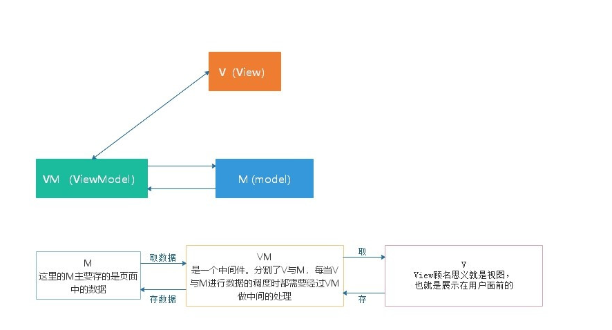
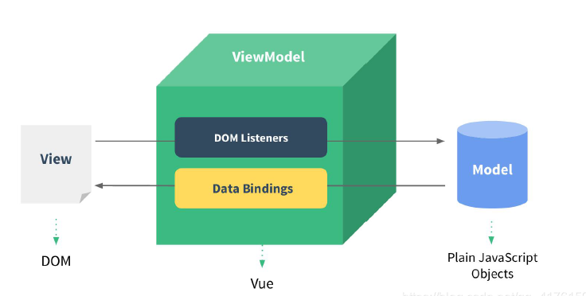
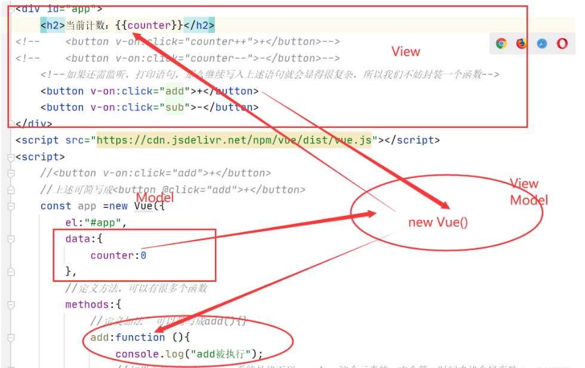

#### 简介

  MVVM 是Model-View-ViewModel 的缩写，它是一种基于前端开发的架构模式，其核心是提供对View 和 ViewModel 的双向数据绑定，这使得ViewModel 的状态改变可以自动传递给 View，即所谓的数据双向绑定。
  Vue.js 是一个提供了 MVVM 风格的双向数据绑定的 Javascript 库，专注于View 层。它的核心是 MVVM 中的 VM，也就是 ViewModel。 ViewModel负责连接 View 和 Model，保证视图和数据的一致性，这种轻量级的架构让前端开发更加高效、便捷。

#### 模型示意图

  MVVM拆开来即为Model-View-ViewModel，有`View，ViewModel，Model`三部分组成。View层代表的是视图、模版，负责将数据模型转化为UI展现出来。Model层代表的是模型、数据，可以在Model层中定义数据修改和操作的业务逻辑。ViewModel层连接Model和View。
  在MVVM的架构下，View层和Model层并没有直接联系，而是通过ViewModel层进行交互。ViewModel层通过双向数据绑定将View层和Model层连接了起来，使得`View层和Model层的同步工作完全是自动`的。因此开发者只需关注业务逻辑，无需手动操作DOM，复杂的数据状态维护交给MVVM统一来管理。

#### 结构

##### View层

1. 视图层
2. 在前端开发中，通常就是DOM层
3. 主要作用是给用户展示各种信息

##### Model层

1. 数据层
2. 数据可能使我们固定的死数据，更多的事来自我们服务器，从网络上请求下来的数据
3. 在计数器案例中，就是后面抽取出来的obj，当然，里面的数据可能没有这么简单

##### ViewModel层

1. 视图模型层
2. 视图模型层是view和Model沟通的桥梁
3. 一方面它实现Data Binding，也就是`数据绑定`，将Model的改变实时的反应到View中
4. 另一方面它实现了DOM Listener，也就是`DOM监听`，当DOM发生一些事件（点击，滚动，touch等）时，可以监听到，并在需要的情况下改变对应的Data

#### Vue.js中mvvm的体现

  Vue对数据（Model）进行`劫持`，当数据变动时，数据会出发劫持时绑定的方法，对视图进行更新。

实例分析如下：

> 由例子来分析，VM先把Model中数据counter劫持渲染上view上，当发生了点击被vm监听了执行相应操作，counter发生了改变，VM劫持数据发现counter发生了改变，又用劫持到的新的数据渲染上去。一直不断劫持监听劫持监听。

具体关于Vue双向绑定的实现原理大家可以参考这个https://juejin.cn/post/6844903630546403336#heading-8

