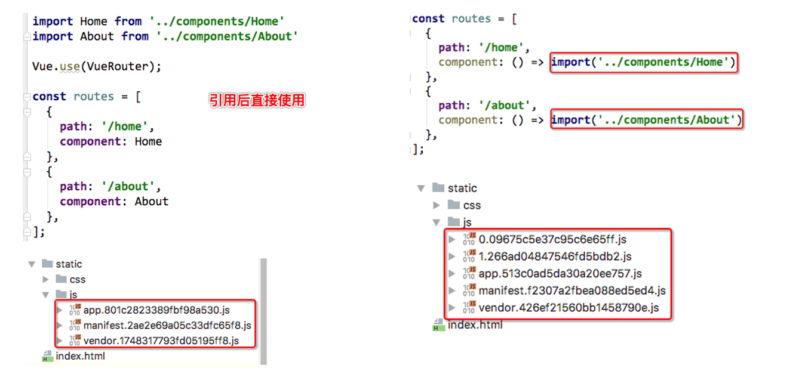

#### **认识路由的懒加载**

- 官方给出了解释:
  - 当打包构建应用时，Javascript 包会变得非常大，影响页面加载。
  - 如果我们能把不同路由对应的组件分割成不同的代码块，然后当路由被访问的时候才加载对应组件，这样就更加高效了
- 官方在说什么呢?
  - 首先, 我们知道路由中通常会定义很多不同的页面.
  - 这个页面最后被打包在哪里呢? 一般情况下, 是放在一个js文件中.
  - 但是, 页面这么多放在一个js文件中, 必然会造成这个页面非常的大.
  - 如果我们一次性从服务器请求下来这个页面, 可能需要花费一定的时间, 甚至用户的电脑上还出现了短暂空白的情况.
  - 如何避免这种情况呢? 使用路由懒加载就可以了.
- 路由懒加载做了什么?
  - 路由懒加载的主要作用就是将路由对应的组件打包成一个个的js代码块.
  - 只有在这个路由被访问到的时候, 才加载对应的组件

#### **路由懒加载的效果**



#### **懒加载的方式**

##### 方式一: 结合Vue的异步组件和Webpack的代码分析.

```js
const Home = resolve => { require.ensure(['../components/Home.vue'], () => { resolve(require('../components/Home.vue')) })};
```

##### 方式二: AMD写法

```js
const About = resolve => require(['../components/About.vue'], resolve);
```

##### 方式三: 在ES6中, 我们可以有更加简单的写法来组织Vue异步组件和Webpack的代码分割`(推荐)`

```js
const Home = () => import('../components/Home.vue')
//Router对象内
{
    path: '/home',//路径对应根/home
    component:Home//懒加载组件
},
    
//或者
{
    path: '/home',//路径对应根/home
    component:()=>import('../components/Home')//懒加载组件
},

```

