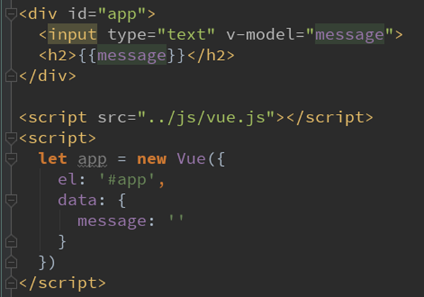

#### 简述

- 表单控件在实际开发中式非常常见的，特别是对于用户信息的提交，需要大量的表单
- Vue中使用v-model指令来实现`表单元素和数据的双向绑定`

#### 简单使用

>   - 当我们在输入框输入内容时,因为input中的v-model绑定了message，所以会实时将输入的内容传递给message,message发生改变
>
>   - 当message发生改变时，因为上面我们使用Mustache语法，将message的值插入到DOM中，所以会发生响应的改变
>

所以，通过`v-model实现双向绑定`,我们也可以将v-model用在textarea中



#### **v-model**原理

 v-model其实是一个`语法糖`，他背后的本质上是包含两个操作

-    `v-bind绑定一个value属性`
-   `  v-on指令给当前元素绑定input事件`

以下两行代码等价

```html
<input type="text" v-model="message">
<input type="text" v-bind:value="message" v-on:input="message = $event.target.value">
```


#### 应用

##### `v-model邂逅radio(单选框)`

```html
<div id="app">
  <label for="male"> <!--for的作用是为了让点击lable时会选中input -->
    <!--  如果不加name，会导致可以同时勾选男女，加上name，那么提交给数据库的时候，key是唯一的sex，所以只能选一个-->
    <!--  <input type="radio" id="male" name="sex">男-->
    <!--  当然了，如果我们加上v-model，并且绑定同一个元素的话，name就可以不添加了，因为也是互斥的-->
    <input type="radio" id="male" value="男" v-model="sex">男
  </label>
  <label for="female">
    <input type="radio" id="female" value="女" v-model="sex">女
  </label>
  <h2>您选择的性别是：{{sex}}</h2>
</div>

<script src="https://cdn.jsdelivr.net/npm/vue/dist/vue.js"></script>
<script>
  const app = new Vue({
    el:"#app",
    data:{
      //sex:''  ''为空，没有默认值
      //sex:'男' 默认为男，因为双向绑定，所以也会默认勾选男
      sex:'男'
    }
  })
</script>

```

##### v-model邂逅checkbox(复选框)

- 复选框分为两种情况：单个勾选框和多个勾选框

- 单个勾选框：

  - v-model即为布尔值。

  - 此时input的value并不影响v-model的值。

- 多个复选框：
   -  当是多个复选框时，因为可以选中多个，所以对应的data中属性是一个数组。
    - 当选中某一个时，就会将input的value添加到数组中。

```html
<body>
  <div id="app">
<!--    有label，可以点击文字，也可以直接勾选按钮-->
<!--    1.演示单选框-->
    <label for="license">
      <input type="checkbox" id="license" v-model="isAgree">同意协议
    </label>
    <h2>您选择的是：{{isAgree}}</h2>
    <button :disabled="!isAgree">下一步</button>
    <hr>
<!--  label没有id，那么点击文字，就不能达到勾选的目的，就只能去点击框勾选-->
    <label for="">
      <input type="checkbox" value="篮球" v-model="hobbies">篮球
      <input type="checkbox" value="足球" v-model="hobbies">足球
      <input type="checkbox" value="乒乓球" v-model="hobbies">乒乓球
      <input type="checkbox" value="排球" v-model="hobbies">排球
    </label>
    <h2>您选择的爱好是：{{hobbies}}</h2>
  </div>
  <script src="https://cdn.jsdelivr.net/npm/vue/dist/vue.js"></script>
  <script>
    const app = new Vue({
      el:"#app",
      data:{
        isAgree:false,//单选框
        hobbies:[] //多选框
      }
    })
  </script>

```


##### v-model邂逅select(下拉框)

- 和checkbox一样，select也分单选和多选两种情况
- 单选：只能选中一个值
  - v-model绑定的是一个值
  - 当我们选中option中的一个时，会将它对应的value赋值到mySelect中
- 多选：可以选中多个值，添加`multiple`
   -  v-model绑定的是一个数组
   -  当选中多个值时，就会将选中的option对应的value添加到数组mySelects中

```html
<div id="app">
<!--  1.选择一个-->
  <select name="fruits" id="" v-model="fruit">
    <option value="苹果">苹果</option>
    <option value="香蕉">香蕉</option>
    <option value="榴莲">榴莲</option>
    <option value="葡萄">葡萄</option>
    <option value="哈密瓜">哈密瓜</option>
  </select>
  <h2>您选择的水果是：{{fruit}}</h2>
  <hr>
<!--  2.选择多个-->
  <select name="fruits" id="" v-model="fruits" multiple>
    <option value="苹果">苹果</option>
    <option value="香蕉">香蕉</option>
    <option value="榴莲">榴莲</option>
    <option value="葡萄">葡萄</option>
    <option value="哈密瓜">哈密瓜</option>
  </select>
  <h2>您选择的水果是：{{fruits}}</h2>
</div>

<script src="https://cdn.jsdelivr.net/npm/vue/dist/vue.js"></script>
<script>
  const app = new Vue({
    el:"#app",
    data:{
      fruit:'',
      fruits:[]
    }
  })
</script>

```

#### 修饰符

- ##### lazy修饰符

  - 默认情况下，v-model默认是在input事件中同步输入框的数据
  - 也就是说，一旦有数据发生改变对应的data中的数据就会自动发生改变
  - lazy修饰符可以让数据在`失去焦点`或者`回车时`才会更新

- ##### number修饰符

  - 默认情况下，在输入框无论我们输入的是字母还是数字，`都会被当做字符串类型进行处理`
  - 但是如果我们希望处理的是数字类型，那么最好直接将内容当做数字处理
  - number修饰符可以让在输入框中输入的内容`自动转成数字类型`

- ##### trim修饰符

  - 如果输入的内容首尾有很多空格，通常我们希望将其去掉
  - `trim修饰符可以过滤内容左右两边的空格`

```html

<div id="app">
<!--  1.修饰符：lazy-->
<!--  没有加lazy之前，实时绑定，加上之后，回车绑定-->
  <input type="text" v-model.lazy="message"><br>
  <h2>{{message}}</h2>
<!--  2.修饰符：number-->
  <input type="number" v-model.number="age"><br>
  <h2>{{age}}——{{typeof age}}</h2>
<!--  3.修饰符：trim-->
  <input type="text" v-model.trim="name">
  <h2>您输入的名字是：{{name}}</h2>
</div>

<script src="https://cdn.jsdelivr.net/npm/vue/dist/vue.js"></script>
<script>
  const app = new Vue({
    el:"#app",
    data:{
      message:'',
      age:'',
      name:''
    }
  })
</script>

```

