#### 前言

​		首先，每个Vue实例在被`创建`之前都要经过一系列的初始化过程,这个过程就是vue的生命周期。首先看一张图吧~这是官方文档上的图片相信大家一定都会很熟悉,左边是官网的，右边是加了一定注解的。

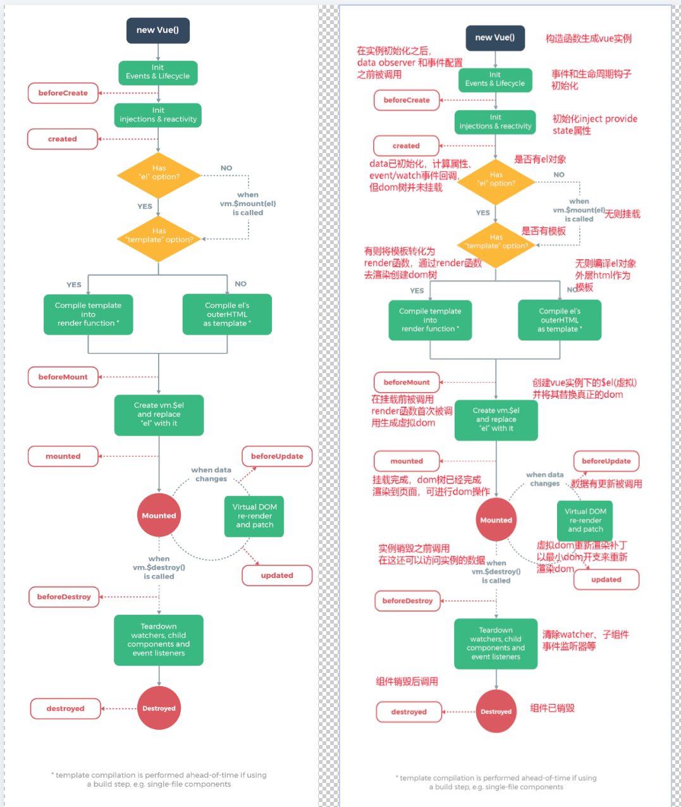


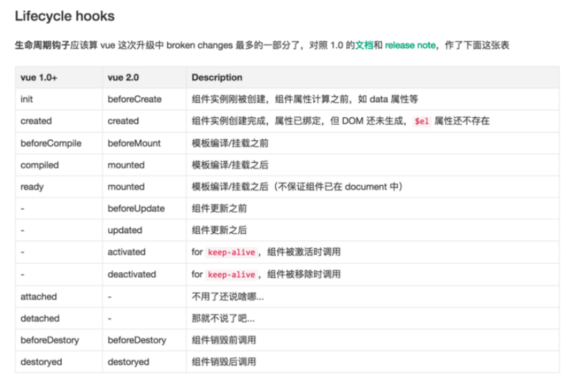

咱们从上图可以很明显的看出现在`vue2.0`都包括了哪些生命周期的函数了。


这里有一份代码，先在浏览器里面跑一遍，然后F12，打开console。方面下面一一解读钩子函数。

```html
<!DOCTYPE html>
<html lang="en">
<head>
  <meta charset="UTF-8">
  <meta name="viewport" content="width=device-width, initial-scale=1.0">
  <meta http-equiv="X-UA-Compatible" content="ie=edge">
  <title>vue生命周期学习</title>
  <script src="https://cdn.bootcss.com/vue/2.4.2/vue.js"></script>
</head>
<body>
  <div id="app">
    <h1>{{message}}</h1>
  </div>
</body>
<script>
  var vm = new Vue({
    el: '#app',
    data: {
      message: 'Vue的生命周期'
    },
    beforeCreate: function() {
      console.group('------beforeCreate创建前状态------');
      console.log("%c%s", "color:red" , "el     : " + this.$el); //undefined
      console.log("%c%s", "color:red","data   : " + this.$data); //undefined 
      console.log("%c%s", "color:red","message: " + this.message) 
    },
    created: function() {
      console.group('------created创建完毕状态------');
      console.log("%c%s", "color:red","el     : " + this.$el); //undefined
      console.log("%c%s", "color:red","data   : " + this.$data); //已被初始化 
      console.log("%c%s", "color:red","message: " + this.message); //已被初始化
    },
    beforeMount: function() {
      console.group('------beforeMount挂载前状态------');
      console.log("%c%s", "color:red","el     : " + (this.$el)); //已被初始化
      console.log(this.$el);
      console.log("%c%s", "color:red","data   : " + this.$data); //已被初始化  
      console.log("%c%s", "color:red","message: " + this.message); //已被初始化  
    },
    mounted: function() {
      console.group('------mounted 挂载结束状态------');
      console.log("%c%s", "color:red","el     : " + this.$el); //已被初始化
      console.log(this.$el);    
      console.log("%c%s", "color:red","data   : " + this.$data); //已被初始化
      console.log("%c%s", "color:red","message: " + this.message); //已被初始化 
    },
    beforeUpdate: function () {
      console.group('beforeUpdate 更新前状态===============》');
      console.log("%c%s", "color:red","el     : " + this.$el);
      console.log(this.$el);   
      console.log("%c%s", "color:red","data   : " + this.$data); 
      console.log("%c%s", "color:red","message: " + this.message); 
    },
    updated: function () {
      console.group('updated 更新完成状态===============》');
      console.log("%c%s", "color:red","el     : " + this.$el);
      console.log(this.$el); 
      console.log("%c%s", "color:red","data   : " + this.$data); 
      console.log("%c%s", "color:red","message: " + this.message); 
    },
    beforeDestroy: function () {
      console.group('beforeDestroy 销毁前状态===============》');
      console.log("%c%s", "color:red","el     : " + this.$el);
      console.log(this.$el);    
      console.log("%c%s", "color:red","data   : " + this.$data); 
      console.log("%c%s", "color:red","message: " + this.message); 
    },
    destroyed: function () {
      console.group('destroyed 销毁完成状态===============》');
      console.log("%c%s", "color:red","el     : " + this.$el);
      console.log(this.$el);  
      console.log("%c%s", "color:red","data   : " + this.$data); 
      console.log("%c%s", "color:red","message: " + this.message)
    }
  })
</script>
</html>
```

打开控制台后，我们可以看到这样的内容

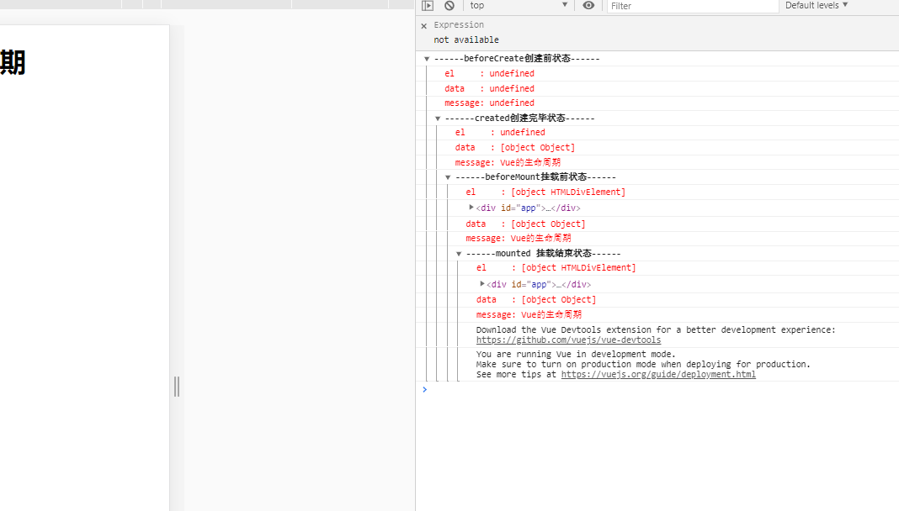

可以看到一个vue实例在创建过程中调用的几个生命周期钩子。

#### 沟子函数

##### beforeCreate( 创建前 )

在实例初始化之后，数据观测和事件配置之前被调用，此时组件的选项对象还未创建，el 和 data 并未初始化，因此无法访问methods， data， computed等上的方法和数据。

##### created ( 创建后 ）

实例已经创建完成之后被调用，在这一步，实例已完成以下配置：数据观测、属性和方法的运算，watch/event事件回调，完成了data 数据的初始化，el没有。 然而，挂在阶段还没有开始, `$el属性目前不可见`，这是一个常用的生命周期，因为你可以调用methods中的方法，改变data中的数据，并且修改可以通过vue的响应式绑定体现在页面上，，获取computed中的计算属性等等，通常我们可以在这里对实例进行预处理，也有一些童鞋喜欢在这里发ajax请求，值得注意的是，这个周期中是没有什么方法来对实例化过程进行拦截的，因此假如有某些数据必须获取才允许进入页面的话，并不适合在这个方法发请求，建议在组件路由钩子beforeRouteEnter中完成

##### beforeMount

挂载开始之前被调用，相关的render函数首次被调用（虚拟DOM），实例已完成以下的配置： 编译模板，把data里面的数据和模板生成html，完成了el和data 初始化，注意此时还没有挂在html到页面上。

##### mounted

挂载完成，也就是模板中的HTML渲染到HTML页面中，此时一般可以做一些ajax操作，`mounted只会执行一次`。

##### beforeUpdate

在数据更新之前被调用，发生在虚拟DOM重新渲染和打补丁之前，可以在该钩子中进一步地更改状态，不会触发附加地重渲染过程

##### updated（更新后）

在由于数据更改导致地虚拟DOM重新渲染和打补丁只会调用，调用时，组件DOM已经更新，所以可以执行依赖于DOM的操作，然后在大多是情况下，应该避免在此期间更改状态，因为这可能会导致更新无限循环，该钩子在服务器端渲染期间不被调用

##### beforeDestroy（销毁前）

在实例销毁之前调用，实例仍然完全可用，

1. 这一步还可以用this来获取实例，
2. 一般在这一步做一些重置的操作，比如清除掉组件中的定时器  和 监听的dom事件

##### destroyed（销毁后）

在实例销毁之后调用，调用后，所以的事件监听器会被移出，所有的子实例也会被销毁，该钩子在服务器端渲染期间不被调用

---------------


##### 分隔线

`上面是对几个沟子函数文字性的表述，下面结合刚刚的代码效果，来解释一些问题。`


---------------------


##### 1. 在beforeCreate和created钩子函数之间的生命周期---即创建时期

> 在这个生命周期之间，进行**初始化事件，进行数据的观测**，可以看到在**created**的时候数据已经和**data属性进行绑定**（放在data中的属性当值发生改变的同时，视图也会改变）。
> 注意：`此时还是没有el选项`

##### 2. created钩子函数和beforeMount间的生命周期--创建之后，挂载之前


在这一阶段发生的事情还是比较多的。

首先会判断对象是否有**el选项**。**如果有的话就继续向下编译，如果没有**el选项**，则停止编译，也就意味着停止了生命周期，直到在该vue实例上调用vm.$mount(el)。**此时注释掉代码中:

```
el: '#app',
```

然后运行可以看到到created的时候就停止了：

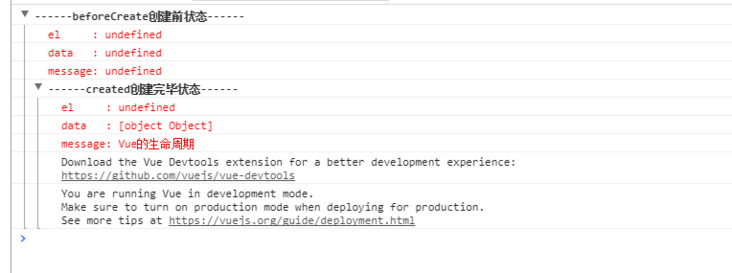

如果我们在后面继续调用vm.$mount(el),可以发现代码继续向下执行了

```
vm.$mount(el) //这个el参数就是挂在的dom接点
```

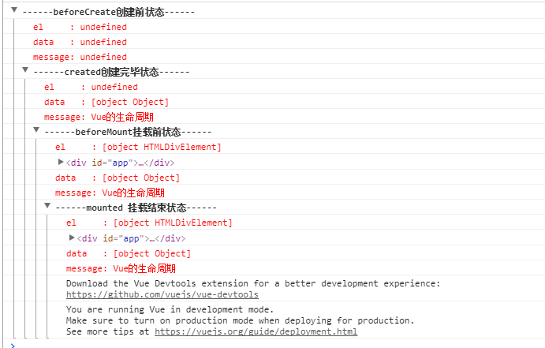

然后，我们往下看，**template**参数选项的有无对生命周期的影响。
（1）.如果vue实例对象中有template参数选项，则将其作为模板编译成render函数。
（2）.如果没有template选项，则将外部HTML作为模板编译。
（3）.可以看到template中的模板优先级要高于outer HTML的优先级。
修改代码如下, 在HTML结构中增加了一串html，在vue对象中增加了**template选项**：

```
<!DOCTYPE html>
<html lang="en">
<head>
  <meta charset="UTF-8">
  <meta name="viewport" content="width=device-width, initial-scale=1.0">
  <meta http-equiv="X-UA-Compatible" content="ie=edge">
  <title>vue生命周期学习</title>
  <script src="https://cdn.bootcss.com/vue/2.4.2/vue.js"></script>
</head>
<body>
  <div id="app">
    <!--html中修改的-->
    <h1>{{message + '这是在outer HTML中的'}}</h1>
  </div>
</body>
<script>
  var vm = new Vue({
    el: '#app',
    template: "<h1>{{message +'这是在template中的'}}</h1>", //在vue配置项中修改的
    data: {
      message: 'Vue的生命周期'
    }
</script>
</html>
```

执行后的结果可以看到在页面中显示的是：

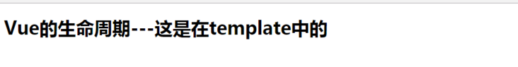

那么将vue对象中template的选项注释掉后打印如下信息：

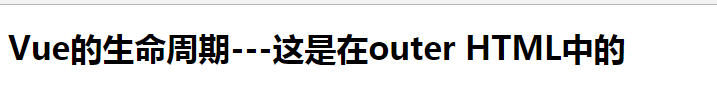

这下就可以想想为什么**el的判断**要在template之前了~是因为vue需要通过el找到对应的outer template。

在vue对象中还有一个**render函数**，它是以`createElement`作为参数，然后做渲染操作，而且我们可以直接嵌入JSX.

```
new Vue({
    el: '#app',
    render: function(createElement) {
        return createElement('h1', 'this is createElement')
    }
})
```

可以看到页面中渲染的是：


所以综合排名优先级：
`render函数选项 > template选项 > outer HTML.`

##### **3. beforeMount和mounted 钩子函数间的生命周期**

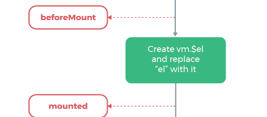

可以看到此时是给vue实例对象添加**$el成员**，并且替换掉挂在的DOM元素。因为在之前console中打印的结果可以看到**beforeMount**之前el上还是undefined。

##### **4. mounted**

注意看下面截图：


> `beforecreated`：el 和 data 并未初始化
> `created`:完成了 data 数据的初始化，el没有
> `beforeMount`：完成了 el 和 data 初始化
> `mounted` ：完成挂载
> 
>另外在标红处，我们能发现el还是 {{message}}，这里就是应用的 `Virtual DOM`（虚拟Dom）技术，先把坑占住了。到后面`mounted`挂载的时候再把值渲染进去。

##### **5. beforeUpdate钩子函数和updated钩子函数间的生命周期**

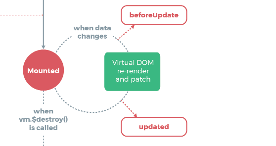

当vue发现data中的数据发生了改变，会**触发对应组件的重新渲染**，先后调用**beforeUpdate**和**updated**钩子函数。我们在console中输入：

```
vm.message = '触发组件更新'
```

发现触发了组件的更新：

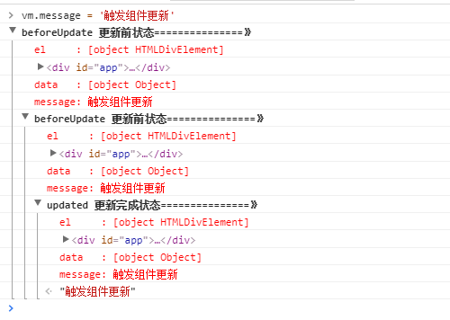

##### **6.beforeDestroy和destroyed钩子函数间的生命周期**


**beforeDestroy**钩子函数在实例销毁之前调用。在这一步，实例仍然完全可用。

**destroyed**钩子函数在Vue 实例销毁后调用。调用后，Vue 实例指示的所有东西都会解绑定，所有的事件监听器会被移除，所有的子实例也会被销毁。

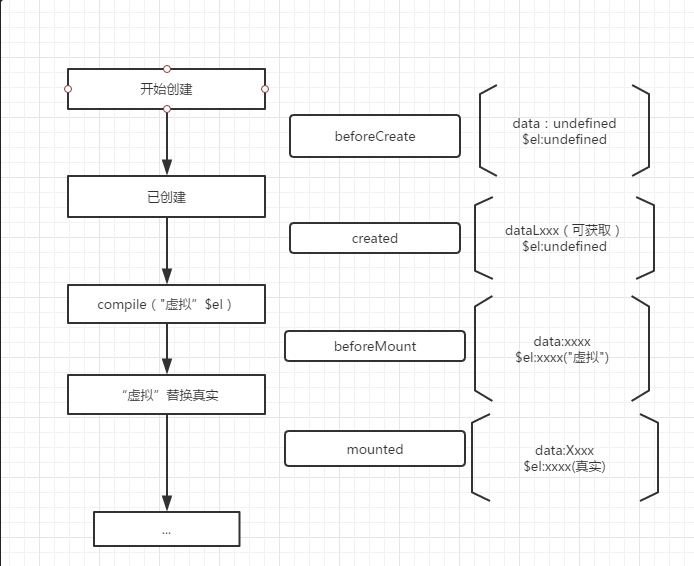

#### 总结

这么多钩子函数，我们怎么用呢，我想大家可能有这样的疑问吧，我也有，哈哈哈。

> `beforecreate` : 举个栗子：可以在这加个loading事件
> `created` ：在这结束loading，还做一些初始化，实现函数自执行
> `mounted` ： 在这发起后端请求，拿回数据，配合路由钩子做一些事情
> `beforeDestroy`： 你确认删除XX吗？ destroyed ：当前组件已被删除，清空相关内容

当然，还有更多，继续探索中......

