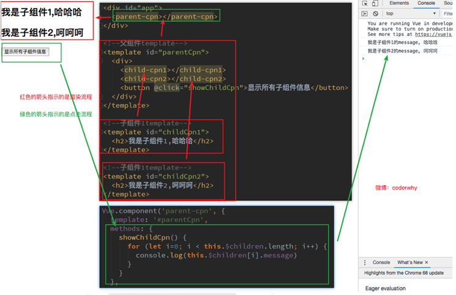
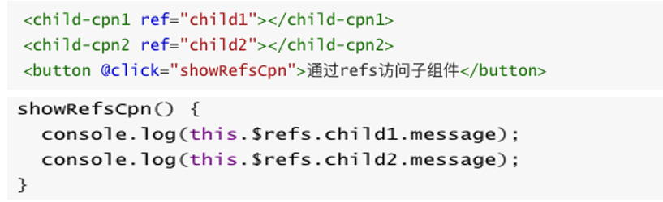

#### 简述

- 有时候我们需要父组件直接访问子组件，子组件直接访问父组件，或者是子组件访问跟组件。
  - `父组件访问子组件：使用$children或$refs`
  - `子组件访问父组件：使用$parent`

#### 父访问子

##### `$children(不推荐)`

  - this.$children是一个数组类型，它包含所有子组件对象。
  - 我们这里通过一个遍历，取出所有子组件的message状态。

  ###### $children的缺陷

  - 通过$children访问子组件时，是一个数组类型，访问其中的子组件必须通过索引值。
  - 但是当子组件过多，我们需要拿到其中一个时，往往不能确定它的索引值，甚至还可能会发生变化。
  - 有时候，我们想明确获取其中一个特定的组件，这个时候就可以使用$refs

##### **$refs的使用**

- `$refs和ref`指令通常是一起使用的。
- 首先，我们通过`ref给某一个子组件绑定一个特定的ID`。
- 其次，通过`this.$refs.ID`就可以访问到该组件了。

#### 子访问父

- 有时候我们需要父组件直接访问子组件，子组件直接访问父组件，或者是子组件访问根组件
- 子组件访问父组件：使用$ parent
- 子组件访问根组件：使用$ root

`注意`:

- 尽管在Vue开发中，我们允许通过$parent来访问父组件，但是在`真实开发中尽量不要这样做。`
- 子组件应该尽量避免直接访问父组件的数据，因为这样耦合度太高了。
- 如果我们将子组件放在另外一个组件之内，很可能该父组件没有对应的属性，往往会引起问题。
- 另外，更不好的是通过$parent直接修改父组件的状态，那么父组件中的状态将变得飘忽不定，很不利于我的调试和维护。