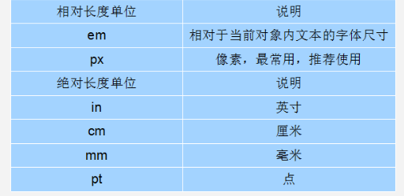

## CSS字体样式

### font字体

#### 「1. font-size」

- font-size属性用于设置字号(字体大小)
- `谷歌浏览器`默认的文字大小为16px
- 不同浏览器可能默认显示的字号大小不一致，我们尽量给一个明确值大小，不要默认大小。一般给body指定整个页面文字的大小。

```css
p { font-size:20px; }
```

##### 单位

- 相对长度单位、绝对长度单位

  

#### 「2. font-family」

- font-family属性用于设置哪一种字体。

```css
p { font-family:"微软雅黑";}
```

- 指定多个字体，如果浏览器不支持第一个字体就会尝试下一个直到找到合适的字体，如果都没有，以电脑默认字体为准。

```css
p {font-family: Arial,"Microsoft Yahei", "微软雅黑";}
```

- CSS Unicode字体

- - 在 CSS 中设置字体名称，直接写中文是可以的。但是在文件编码（GB2312、UTF-8 等）不匹配时会产生乱码的错误。
  - xp 系统不支持 类似微软雅黑的中文。
  - 解决方案：英文来替代。比如`font-family:"Microsoft Yahei"`。在 CSS 直接使用 Unicode 编码来写字体名称可以避免这些错误。使用 Unicode 写中文字体名称，浏览器是可以正确的解析的。

```css
font-family: "\5FAE\8F6F\96C5\9ED1";   表示设置字体为“微软雅黑”。
```

#### 「3. font-weight」

| 属性值  | 描述                                                        |
| :------ | :---------------------------------------------------------- |
| normal  | 默认值（不加粗的）                                          |
| bold    | 定义粗体（加粗的）                                          |
| 100~900 | 400 等同于 normal，而 700 等同于 bold  (数字表示粗细用的多) |

#### 「4. font-weight」

font-style属性用于定义字体风格，如设置斜体、倾斜或正常字体，其可用属性值如下：

| 属性   | 作用                                                    |
| :----- | :------------------------------------------------------ |
| normal | 默认值，浏览器会显示标准的字体样式  font-style: normal; |
| italic | 浏览器会显示斜体的字体样式。                            |

#### 「5. font:综合设置字体样式」

```css
选择器 { 
    font: font-style  font-weight  font-size/line-height  font-family;
}
```

- 注意：使用font属性时，必须按上面语法格式中的顺序书写，`不能更换顺序`，各个属性以`空格`隔开

- - 其中不需要设置的属性可以省略(取默认值),但必须保留`font-size`和`font-family`属性，否则font属性将不起作用。

#### 「6. font总结」

| 属性        | 表示     | 注意点                                                       |
| :---------- | :------- | :----------------------------------------------------------- |
| font-size   | 字号     | 我们通常用的单位是px 像素，一定要跟上单位                    |
| font-family | 字体     | 实际工作中按照团队约定来写字体                               |
| font-weight | 字体粗细 | 记住加粗是 700 或者 bold  不加粗 是 normal 或者  400  记住数字不要跟单位 |
| font-style  | 字体样式 | 记住倾斜是 italic   不倾斜 是 normal  工作中我们最常用 normal |
| font        | 字体连写 | 1. 字体连写是有顺序的  不能随意换位置 2. 其中字号 和 字体 必须同时出现 |


## CSS外观属性

#### 「1. color」

color属性用于定义文本的颜色
其取值方式有以下3种：

- 实际工作中，用16进制的写法是最多的，且我们更喜欢简写方式比如#f0代表红色。

| 表示表示       | 属性值                        |
| :------------- | :---------------------------- |
| 预定义的颜色值 | red，green，blue，pink        |
| 十六进制       | #FF0000，#FF6600，#29D794     |
| RGB代码        | rgb(255,0,0)或rgb(100%,0%,0%) |

#### 「2.text-align」

text-align属性用于设置文本内容的水平对齐方式，相当于html中的align对齐属性。

- 注意：是让盒子里面的`文本内容水平居中， 而不是让盒子居中对齐`

其可用属性值如下：

| 属性   |       解释       |
| :----- | :--------------: |
| left   | 左对齐（默认值） |
| right  |      右对齐      |
| center |     居中对齐     |

#### 「3. line-height」

line-height属性用于设置行间距，就是行与行之间的距离，即字符的垂直间距，一般称为行高。

- line-height常用的属性值单位有三种，分别为像素px，相对值em和百分比%，实际工作中使用最多的是像素px

```css
/*一般情况下，行距比字号大7--8像素左右就可以了。*/
line-height: 24px;
```

##### 行高测量

行高测量方法：行高  =  上距离 +  内容高度  + 下距离

`行高测量方法`行高我们利用最多的一个地方是：可以让`单行文本在盒子中垂直居中对齐`。

> **文字的行高等于盒子的高度。**行高  =  上距离 +  内容高度  + 下距离
> 上距离和下距离总是相等的，因此文字看上去是垂直居中的。

##### 行高与高度的三种关系

- 如果 行高 == 高度  文字会 垂直居中
- 如果 行高  >  高度  文字会 偏下
- 如果 行高  <  高度  文字会  偏上

```css
  /*line-height 要设置在font属性下面，否则无效，例如：*/
  height: 80px;
  text-align: center;
  font: normal bold 30px "宋体";
  line-height: 80px;
```

可以使用display:flex;布局方式让文字水平垂直居中

```css
  display: flex;
  align-items: center;     /* 侧轴对齐方式*/
  justify-content: center; /* 主轴对齐方式 */
```

#### 「4. text-indent」

text-indent属性用于设置首行文本的缩进

- 其属性值可为不同单位的数值、em字符宽度的倍数、或相对于浏览器窗口宽度的百分比%，允许使用负值。
- 建议使用em作为设置单位。
- 1em 就是一个字的宽度。如果是汉字的段落，1em 就是一个汉字的宽度

```css
p {
      /*行间距*/
      line-height: 25px;
      /*首行缩进2个字  em  1个em 就是1个字的大小*/
      text-indent: 2em;  
 }
```

#### 「5. text-decoration」

文本的装饰——text-decoration,通常我们用于给链接修改装饰效果

| 值           | 描述                                                  |
| :----------- | :---------------------------------------------------- |
| none         | 默认。定义标准的文本。取消下划线（最常用）            |
| underline    | 定义文本下的一条线。下划线 也是我们链接自带的（常用） |
| overline     | 定义文本上的一条线。（不用）                          |
| line-through | 定义穿过文本下的一条线。（不常用）                    |

#### 「6. CSS外观属性总结」

| 属性            | 表示     | 注意点                                                 |
| :-------------- | :------- | :----------------------------------------------------- |
| color           | 颜色     | 我们通常用  十六进制  比如 而且是简写形式 #fff         |
| line-height     | 行高     | 控制行与行之间的距离                                   |
| text-align      | 水平对齐 | 可以设定文字水平的对齐方式                             |
| text-indent     | 首行缩进 | 通常我们用于段落首行缩进2个字的距离  text-indent: 2em; |
| text-decoration | 文本修饰 | 记住 添加 下划线  underline  取消下划线  none          |


------

## 